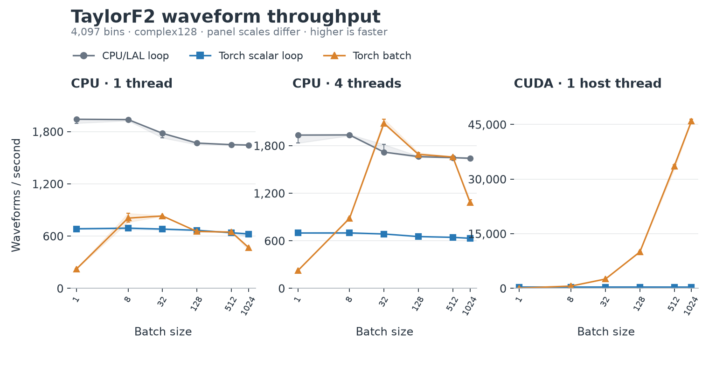
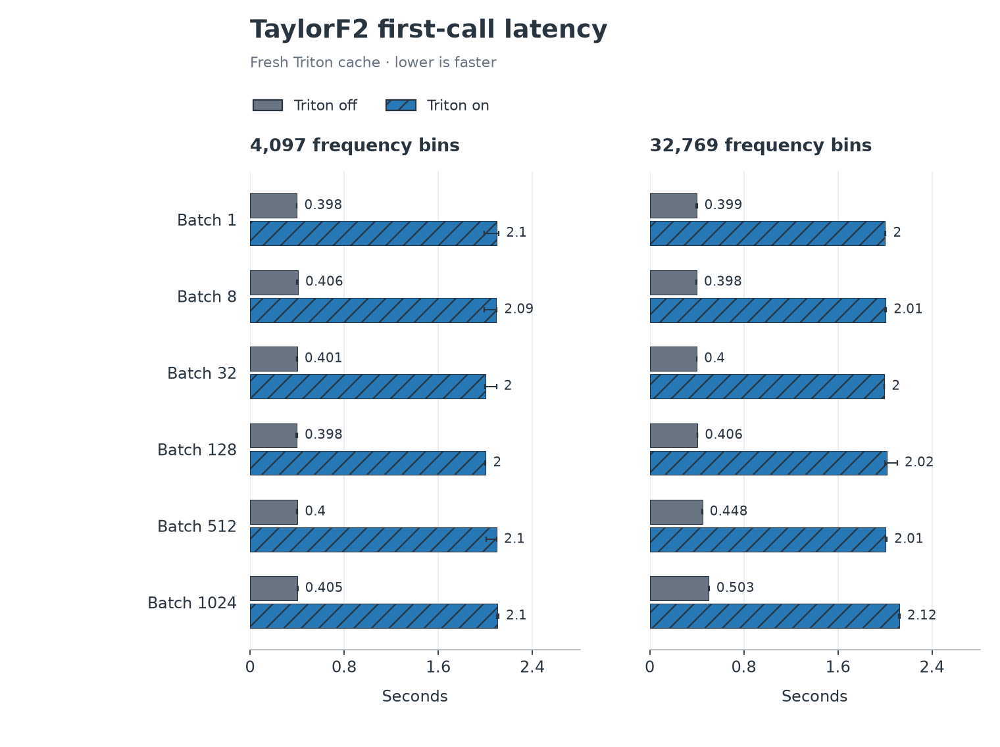
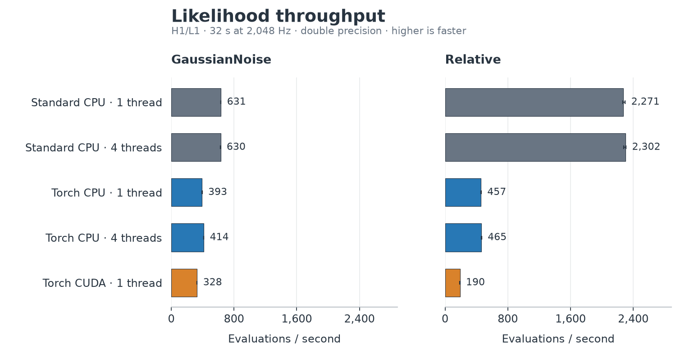
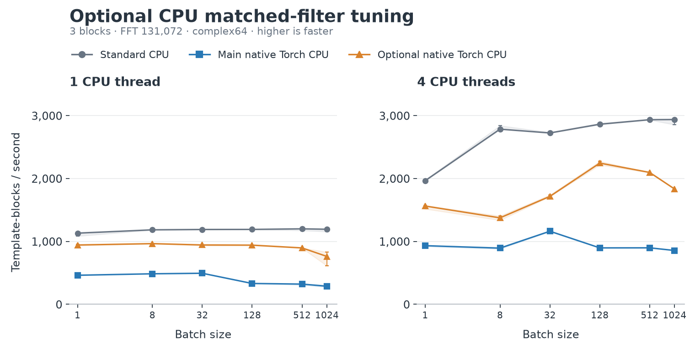

# Batch sizes through 1024

Batched campaigns cover 1, 8, 32, 128, 512 and 1024. Historical single-vector FFT and single-evaluation inference retain their original sources.

Strict reports qualified 84 live groups, 60 untimed dispatch probes, 48 waveform timing cells plus 48 unsupported cells, and 24 Triton groups.

| Correctness source | Passed | Skipped | Failures | Errors | Exit code |
| --- | ---: | ---: | ---: | ---: | ---: |
| main `efd63078f7211e7f1f428d1eaa4ec5a84a5aaf5f` | 271 | 53 | 0 | 0 | 0 |
| fft `bca6251a931fa2eaa0338485636c2cdbe6765b0b` | 344 | 53 | 0 | 0 | 0 |
| cpu `d90513f3956925b6fe368c2c57b16abb32bd822d` | 271 | 53 | 0 | 0 | 0 |

Counts above come from completed JUnit records; exact commands and outcomes are in [correctness/status.json](correctness/status.json). The external regression-file hash is retained there. [Local validation](validation/local-validation.json) keeps its original scope; [source matches](validation/source-matches.json) distinguish validated and later files.

The expanded tests exposed a crash when real chi-square calculators are disabled. Correctness sources are the measured revisions plus the archived one-condition fallback fix; their exact parents, patches and runtime file hashes are recorded separately. Earlier failed fixture and runtime attempts remain under `correctness/initial-failed/` and `correctness/disabled-veto-failed/`. Benchmark measurements retain their original sources.

[Reproduce acquisition and reports](REPRODUCE.md). Full strict tables: [live](report/live-summary.md), [dispatch](report/dispatch-summary.md), [waveforms](report/waveform-summary.md), [Triton](report/triton/report.md).

Live timing is a synthetic driver with chi-square disabled, stubbed sine-Gaussian processing and unsafe asynchronous peak copies disabled. It excludes waveform generation, PSD estimation, I/O and startup. Worker ranges are observed ranges, not confidence intervals. These results do not establish full production-search or sampler performance.

