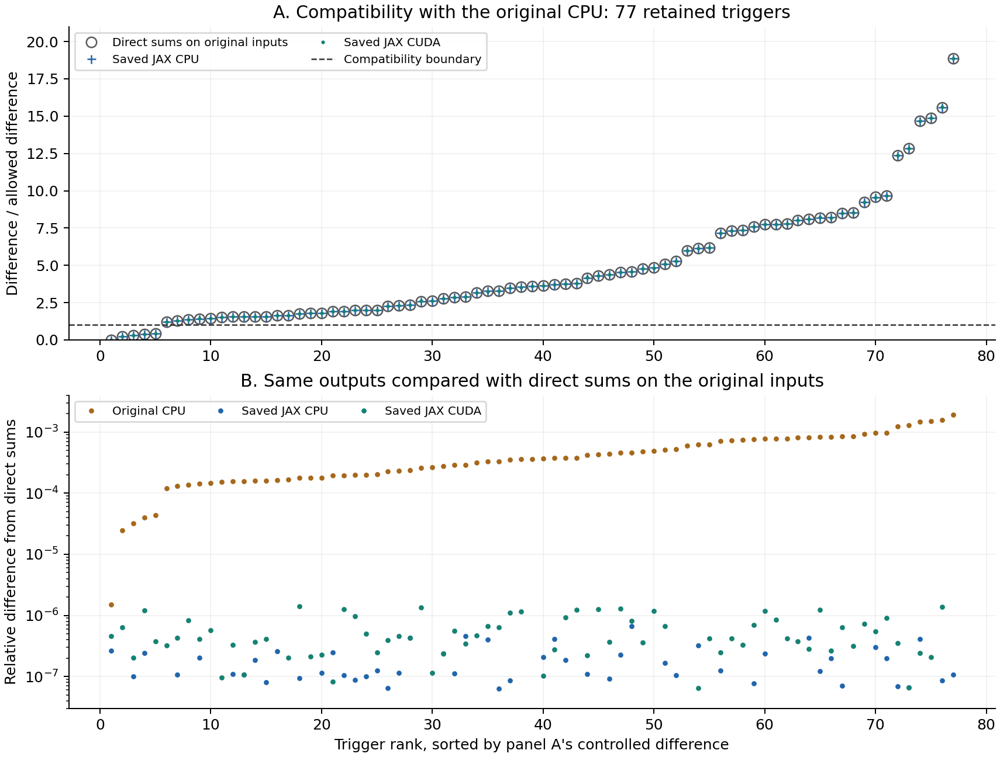
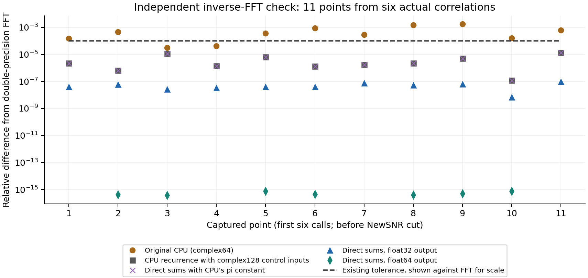
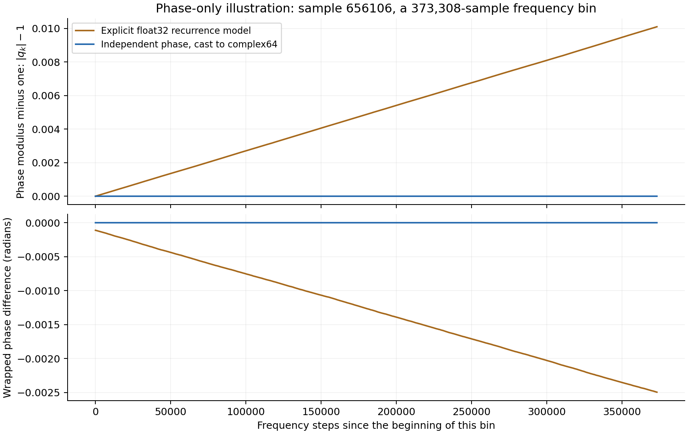
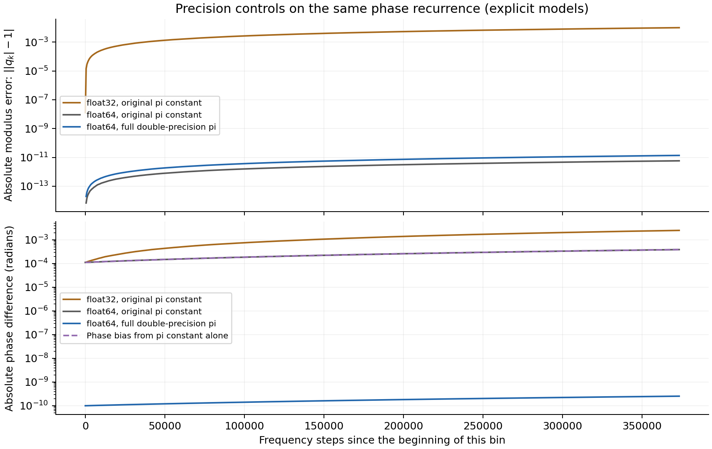

.. _jax-chisq-numerics:

Point chi-square: numerical accuracy and CPU compatibility
==========================================================

Technical report · 21 September 2026

The existing CPU recurrence and JAX direct-phase implementation evaluate
the same chi-square statistic through different floating-point operations. On the
captured search inputs, these choices produce a small but reproducible
difference that exceeds the project's CPU-compatibility tolerance. Direct
Fourier sums agree more closely with an independent double-precision inverse
FFT on the examples checked. Compatibility with existing CPU outputs remains
a separate, unchanged requirement for the JAX acceleration work.

This report describes an engineering tradeoff between established numerical
behavior and an alternative evaluation of the same formula. Both output
compatibility and numerical agreement are useful objectives. The recurrence
is an economical way to evaluate selected time samples without performing a separate transform
for every frequency bin. Its finite-precision behavior becomes relevant here
because the bins are long and the output-comparison tolerance is tight.

Scope and provenance
--------------------

The evidence comes from the 20 September qualification run of
``pycbc_inspiral`` on ``len``: 32 distinct compressed IMRPhenomD templates,
H1 strain, 2,048 Hz sampling, complex64 correlation arrays, 512-second
segments, 16 chi-square bins and a 30 Hz low-frequency cutoff. The FFT length
is 1,048,576 samples. Search GPS bounds were 1187007048–1187009080; configured
trigger bounds were 1187007160–1187009064. The SNR threshold was 5.5 and the
NewSNR threshold 5. These are qualification observations, not timing samples.

The original CPU checkout was clean at revision
``40e94792b3edf59f39b18b65102b28a4f74433a7``. The candidate was a frozen dirty
checkout based on ``379a0579b725c52177bfeb244f5fecc2289bd226``; its tracked
patch SHA-256 was
``9410032fb026ae1893a1309976d9a4ad7ef169b6431086ffff355976d607b91a``.
The campaign also records untracked-file hashes. A commit identifier alone
does not specify that candidate. Code links below refer to retained,
line-numbered snapshots of the measured source, not a moving branch.

The measurement environment used Python 3.11, NumPy 1.26.4, SciPy 1.13.0,
JAX 0.4.20 and jaxlib 0.4.20+cuda12.cudnn89, with an RTX 4090 for the CUDA
arm. The ordinary candidate CPU and original CPU produced identical retained
chi-square values. The JAX CPU and CUDA arms matched all 77 retained trigger
identities, but each exceeded the chi-square tolerance on 72 values. The
campaign stopped before timing, live qualification or profiling.

An observer replayed the original CPU command and returned its original
results unchanged, while evaluating alternative sums on copies of the same
correlations. All 77 retained CPU chi-square outputs replayed exactly. The
observer recorded 67 point-evaluation calls containing 89 points before the
NewSNR cut, and saved the first six correlation arrays, containing 11 points,
for independent checks. The six captures were selected by call order, not
by discrepancy. The illustrative example below is explicitly selected from
them for its large difference.

This is a numerical-accuracy limitation of the existing CPU point routine
under the tested conditions. It can arise in ordinary, unmodified searches:
`SingleDetPowerChisq.values, lines 385–390 <_static/jax_chisq_numerics/source/chisq.py.html#L385>`_
calls that routine. Phase drift here means accumulated rounding as the
routine traverses frequency samples within a bin, with a reset at each bin
boundary. It does not mean drift accumulating over hours of detector time.
Other chi-square paths use full FFTs and do not use this particular recurrence.
The observed output discrepancy is established; its consequences for search
sensitivity or false-alarm rates have not been measured.

The common mathematical calculation
------------------------------------

Let :math:`c_k` be the precomputed correlation spectrum, :math:`n` a selected
time-sample index, :math:`N` the full transform length, and
:math:`B_b=[l_b,u_b)` one of :math:`p` frequency bins. Its unnormalized
partial matched-filter amplitude is

.. math::

   z_b(n)=\sum_{k=l_b}^{u_b-1}c_k\exp(2\pi i kn/N).

Given the precomputed unnormalized full SNR :math:`z(n)` and normalization
:math:`A`, PyCBC evaluates

.. math::

   \chi^2(n)=A^2\left[p\sum_{b=1}^{p}|z_b(n)|^2-|z(n)|^2\right].

This is the expression in
`original chisq.py, lines 136–138 <_static/jax_chisq_numerics/source/chisq.py.html#L136>`_.
It is the unreduced chi-square statistic, not chi-square divided by its
degrees of freedom. Every controlled comparison holds the correlation,
bin edges, selected indices, saved SNR and normalization fixed. The diagnostic
therefore addresses evaluation of the bin sums, rather than a change to the
statistic, data conditioning or template physics.

How the implementations evaluate it
-----------------------------------

**Existing CPU point routine.** For each bin and selected sample, the routine
initializes a phase :math:`q_{l_b}` and a rotation :math:`r`, then advances
through the bin:

.. math::

   q_{l_b}=e^{2\pi i l_b n/N},\qquad r=e^{2\pi i n/N},\qquad
   q_{k+1}=q_k r.

The initialization uses C ``sin`` and ``cos`` with the literal
``3.141592653`` for pi. For complex64 correlations, the stored phases,
rotation, arithmetic temporaries and accumulators are float32. The phase is
reinitialized at each bin boundary. See
`precision selection, lines 9–15 and 140–155 <_static/jax_chisq_numerics/source/chisq_cpu.pyx.html#L9>`_
and `initialization, lines 83–89 <_static/jax_chisq_numerics/source/chisq_cpu.pyx.html#L83>`_.

The routine also uses a three-product form of complex multiplication.
Writing :math:`c_k=v_r+i v_i` and :math:`q_k=t_1+i t_2`, it computes

.. math::

   a=v_r(t_1+t_2),\quad b=t_1(v_i-v_r),\quad d=t_2(v_r+v_i),
   \qquad c_k q_k=(a-d)+i(a+b).

That identity is exact in real arithmetic. Its rounding need not match the
usual four-product complex multiplication. A compatibility implementation
must consider both the recurrence and these accumulation operations, shown in
`chisq_cpu.pyx, lines 91–121 <_static/jax_chisq_numerics/source/chisq_cpu.pyx.html#L91>`_.

**Current JAX direct-phase path.** Each phase is formed independently using

.. math::

   m=(kn)\bmod N,\qquad q_k=\exp(2\pi i m/N).

The product and remainder use int64 and are exact for the captured sizes;
the angle and exponential are evaluated at double precision, then the CUDA
phase is cast to the correlation dtype. This keeps the angle within one
rotation and avoids carrying a previous phase's rounding into the next.
See `chisq_jax.py, lines 85–93 <_static/jax_chisq_numerics/source/chisq_jax.py.html#L85>`_.

The CPU and CUDA paths then differ:

* Under the JAX CPU scheme, a NumPy helper sums products in complex128,
  accumulates powers in float64, and returns float32 powers for complex64
  inputs. See `chisq_numpy.py, lines 20–46 <_static/jax_chisq_numerics/source/chisq_numpy.py.html#L20>`_
  and `CPU dispatch, lines 182–190 <_static/jax_chisq_numerics/source/chisq_jax.py.html#L182>`_.
* On CUDA, complex64 products enter a cumulative sum. Bin amplitudes are
  differences between cumulative sums at the bin boundaries. This still has
  rounding and possible cancellation; it is not an exact or entirely
  double-precision calculation. See `scalar core, lines 102–113 <_static/jax_chisq_numerics/source/chisq_jax.py.html#L102>`_
  and `batched core, lines 144–165 <_static/jax_chisq_numerics/source/chisq_jax.py.html#L144>`_.

The benchmark correlation arrays are complex64 throughout. Higher-precision
temporary phase calculations do not change that input-array policy.

Measured compatibility and numerical agreement
----------------------------------------------

The existing acceptance rule is

.. math::

   |x-x_{\mathrm{ref}}|\leq 10^{-5}+10^{-4}|x_{\mathrm{ref}}|.

For compatibility, :math:`x_{\mathrm{ref}}` is always the original CPU output.
Changing only the point-sum calculation, on the original CPU inputs,
reproduces the observed disagreement:

.. list-table:: All 77 retained triggers; original CPU as denominator
   :header-rows: 1
   :widths: 52 25 23

   * - Compared value
     - Maximum relative difference
     - Outside tolerance
   * - Ordinary candidate CPU
     - 0, exact agreement
     - 0 / 77
   * - Direct sums on original CPU inputs
     - 0.189384%
     - 72 / 77
   * - Saved JAX CPU output
     - 0.189373%
     - 72 / 77
   * - Saved JAX CUDA output
     - 0.189384%
     - 72 / 77

One retained example is template hash ``8310026711724721334``, sample
``3411960`` relative to GPS 1187007048 (local segment sample ``299000``).
The original CPU and ordinary candidate CPU both give
``35.1851921081543``; direct sums on the original inputs give
``35.11855697631836``; saved JAX CPU gives ``35.118560791015625``; saved JAX
CUDA gives ``35.11855697631836``. The absolute difference is approximately
0.06664, while the allowed difference from this CPU value is approximately
0.003529. This is the retained trigger with the largest relative discrepancy.

   Figure 1. Panel A divides each absolute difference by the allowed
   difference from the original CPU. Values above one exceed compatibility
   tolerance. The three series nearly overlap. Panel B uses direct sums on
   the original inputs as the reference instead. Its log scale omits exact
   agreement for 17 JAX CPU and 5 JAX CUDA values. Both panels use the same
   trigger ordering; all values are in the accompanying CSV.

Against the direct sums, the maximum relative differences are
``6.63113e-7`` for saved JAX CPU and ``1.41661e-6`` for saved JAX CUDA
(0.0000663% and 0.0001417%). These comparisons include small differences
elsewhere in the saved JAX runs; they are not re-evaluations of JAX kernels
on the captured CPU arrays. The controlled direct-sum replay is what isolates
point arithmetic. The original CPU differs from this direct-sum reference
by at most 0.189743%; this differs slightly from the preceding table because
the denominator has changed.

Independent FFT controls
------------------------

For each of the six captured correlations, the diagnostic puts one bin into
a zero-padded complex128 array and evaluates ``N * scipy.fft.ifft(band)`` at
the saved sample indices. Multiplication by :math:`N` reverses SciPy's inverse
FFT normalization. It then applies the same chi-square expression, holding
the saved complex64 SNR term and normalization fixed. This uses a different
evaluation algorithm from the direct-phase helper.

.. list-table:: Eleven captured points; double-precision FFT as denominator
   :header-rows: 1
   :widths: 64 36

   * - Evaluation on the same captured inputs
     - Maximum relative difference
   * - Observed original CPU, complex64
     - 1.73394e-3 (0.173394%)
   * - Direct sums, returned at the original real precision
     - 9.74522e-8
   * - Original CPU routine with complex128 diagnostic inputs
     - 1.41124e-5
   * - Direct double-precision sums using the CPU's pi constant
     - 1.41124e-5
   * - Direct sums with full double-precision pi and float64 output
     - Approximately 8e-16 in local regeneration

   Figure 2. Every captured point is shown. The double-precision recurrence
   and direct sums using the CPU pi constant nearly coincide. The dashed
   curve applies the existing tolerance to FFT values for numerical scale;
   it does not replace the original CPU qualification reference. These
   points precede the NewSNR cut and are not the same population as Figure 1.
   Exact zero differences are omitted from the logarithmic plot and retained
   in the CSV. The float64-output direct sums are an additional diagnostic
   control, distinct from the float32-output sums used above.

For a concrete example, ``point-input-05.npz`` at local sample ``656106``
gives the following unreduced chi-square values. This is the largest relative
CPU/FFT discrepancy among the 11 captures and was not retained after the
original NewSNR cut; it is a diagnostic example, not an extra retained event.

.. list-table:: One captured point, identical inputs
   :header-rows: 1

   * - Evaluation
     - Chi-square
   * - Observed original CPU, complex64
     - 43.05550003051758
   * - Direct sums, original real output precision
     - 42.98097610473633
   * - Independent double-precision FFT
     - 42.98097341874312
   * - Original recurrence with complex128 control inputs
     - 42.98118821312418
   * - Direct sums with the CPU's pi constant
     - 42.98118821302735

Across all 11 points, the last two methods agree within ``2.12e-11`` relative.
Thus the pi constant explains a small residual at higher precision, while
single-precision recurrence and accumulation together account for the much
larger observed difference. These experiments do not separately measure the
contribution of every multiplication, phase update and accumulation. The
complex128 runs are diagnostic controls only, not additional benchmarks.

Why a small phase rounding can accumulate
-----------------------------------------

In exact arithmetic :math:`|r|=1`. A stored float32 rotation generally has a
slightly different modulus and angle. Repeated multiplication propagates both
that representation error and rounding from each update. For example, if
:math:`|\widetilde r|=1+\epsilon`, even exact repetition of that rounded
rotation would multiply the modulus by :math:`(1+\epsilon)^j` after
:math:`j` steps. The phase error also accumulates. Resetting the phase at a
bin boundary limits this sequence to the bin width; the widest observed bin
had 396,226 frequency samples.

   Figure 3. A phase-only illustration uses the same N and sample index as
   the preceding captured example, and its widest bin, [150980, 524288).
   Each multiplication and addition is explicitly rounded to float32 with
   no fused multiply-add. It follows the source recurrence but is not
   instrumentation of the compiled Cython routine. The direct-phase curve
   uses independent double-precision phases cast to complex64. Plotted
   samples are spaced by 512 steps, with the endpoint included.

For this example, the rounded rotation has modulus
``1.000000027152669``. After 373,307 updates, the explicit model's phase
modulus is approximately 1.0100972, and its wrapped phase difference is
approximately -0.00249489 radians. The directly formed complex64 endpoint
phase has a modulus difference of approximately ``2.72e-8`` and phase
difference ``6.37e-9`` radians. The initial recurrence phase also includes the
CPU pi constant's argument difference. The figure illustrates a mechanism;
its phase error is not a prediction of the full chi-square error.

The final chi-square also subtracts two quantities. Relative error can be
sensitive to cancellation when their difference is small. No separate
cancellation error budget was measured here. Likewise, CUDA prefix-sum
subtraction has its own precision tradeoffs. Independent phases remove the
long phase-update chain, not all floating-point error.

Complex128: precision helps, while the pi constant remains
----------------------------------------------------------

The original CPU routine supports complex128 inputs. Its
`dtype selection, lines 141–154 <_static/jax_chisq_numerics/source/chisq_cpu.pyx.html#L141>`_
then selects float64 phases, rotations, multiplication temporaries,
accumulators and output through the fused types declared at
`lines 9–15 <_static/jax_chisq_numerics/source/chisq_cpu.pyx.html#L9>`_.
The recurrence and three-product multiplication stay the same. Higher
precision reduces rounding at each step; it does not eliminate rounding or
change the phase initialization constant.

**Controlled change of arithmetic precision.** The observer passed
``corr.astype(numpy.complex128)`` to the original compiled CPU ``shift_sum``.
The saved complex64 correlation values are exactly representable after this
conversion; it adds no information to them. Bin edges, sample indices,
the saved complex64 SNR-power term and normalization were held fixed.
These controls therefore isolate the point routine's arithmetic, rather
than re-running conditioning, waveform generation or a complete search in
double precision. The source and observed outputs are retained in the
evidence bundle.

For the 11 captured points in Figure 2, the maximum relative CPU/FFT
difference falls from ``1.73394e-3`` (0.173394%) with complex64 to
``1.41124e-5`` (0.00141124%) with complex128. The first maximum is about
123 times the second. These are maxima over the same population, potentially
at different points, not a uniform per-point improvement factor or an
isolated error budget. Nine complex64 values exceed the tolerance when
compared with the FFT; none of the 11 complex128 controls do. This is a
numerical comparison to the FFT, not CPU-compatibility qualification.

**Why a residual remains.** The literal ``3.141592653`` is unchanged in
the double-precision specialization. Using more precise arithmetic cannot
recover the missing digits of that literal. If its value is denoted
:math:`\pi_c`, its contribution to the unwrapped phase difference at
frequency index :math:`k` is, in exact arithmetic,

.. math::

   \Delta\theta_k=2(\pi_c-\pi)\,kn/N.

This includes the initial phase at the bin boundary as well as subsequent
rotations. Large :math:`kn/N` can make the phase difference relevant even
though :math:`\pi_c-\pi` is small. Direct complex128 sums using the same
literal agree with the compiled complex128 recurrence to within
``2.12e-11`` relative on these 11 chi-square values. Their maximum difference
from the FFT is also ``1.41124e-5``. The paired controls support the pi
constant and associated initialization arithmetic as accounting for the
observed double-precision residual at this scale.

For an additional control, the report generator forms each phase independently
using integer modular cycles and full double-precision ``numpy.pi``, sums in
complex128, and retains float64 bin powers and the final chi-square. It
holds the same saved SNR term and normalization fixed. These direct sums
agree with the independent FFT to approximately ``8e-16`` relative in the
local regeneration. This control is not a measurement of a modified Cython
kernel or a complex128 JAX CUDA search.

   Figure 4. The same sample and frequency bin as Figure 3, with explicit
   float32 or float64 operations and no fused multiply-add. The dashed
   phase-bias curve follows the expression above and nearly coincides with
   the float64 recurrence using the original pi constant. Absolute errors
   use logarithmic axes; exact zeros are omitted. All recurrence curves are
   illustrative models, not measurements inside the compiled CPU routine.

At the final plotted frequency, the float64 model with the original pi
constant has a modulus error of approximately ``5.76e-12`` and a phase
difference of ``-3.86966e-4`` radians. The model using full double-precision
pi has modulus error ``1.36e-11`` and phase difference ``-2.52e-10`` radians.
Thus increasing precision sharply reduces modulus drift, while the pi
constant still produces an angle bias. Changing that constant alone is not
guaranteed to improve every component of every result; here the full-pi
model has a slightly larger, but still tiny, modulus error. Compiler
contraction and trigonometric-library differences may alter a compiled
recurrence's exact trace.

**Compatibility and scope.** On the 77 retained points, the compiled
complex128 control is within ``2.06086e-5`` relative of the float32-output
direct sums. However, it differs from the original complex64 CPU outputs
by up to ``1.88980e-3`` relative, exceeding the original-CPU tolerance on
72 of 77 values. Promoting the calculation to complex128 therefore does not
satisfy the established compatibility requirement. The compatible
mode therefore retains the requested original precision and recurrence.

This analysis establishes a numerical limitation and its precision
dependence for the captured inputs. It does not determine the effect on
detection sensitivity or false-alarm rates. No production CPU code or pi
constant was changed. The maintained performance benchmarks remain at
2,048 Hz with complex64 search arrays; these complex128 controls provide
neither complete-search qualification nor performance measurements.

A compatible and explicit JAX mode selection
--------------------------------------------

The JAX scheme now provides two point chi-square modes. They apply to
``pycbc_inspiral``, ``pycbc_live`` and the scalar and batched triggered-point
APIs:

.. code-block:: text

   --processing-scheme jax:cuda:0 --jax-chisq-mode cpu-compatible
   --processing-scheme jax:cuda:0 --jax-chisq-mode direct-phase

``cpu-compatible`` is the default. On both JAX CPU and CUDA,
``chisq_jax_compat.py`` implements
the CPU recurrence in JAX: phase initialization uses the CPU pi constant,
phase state and sums retain the input precision, and each frequency update
consumes the preceding state. Independent points and bins run in parallel;
bin powers are combined in order. Groups of 16 dependent frequency steps
reduce device launch overhead. Cropped correlations retain the original
absolute bin origin and phase evolution through omitted zeros. Correlations
and power results remain JAX arrays on the selected device. The JAX CPU path
uses the same JAX implementation; ordinary CPU dispatch continues to use the
existing compiled CPU routine.

``direct-phase`` selects the independently evaluated Fourier phases analyzed
above. The API spelling is ``JAXScheme("cuda:0", chisq_mode="direct-phase")``.
Mode selection is part of the scheme cache key and is recorded in benchmark
commands, scientific evidence and receipts. An explicit mode is rejected for
non-JAX schemes. Ordinary CPU dispatch and the full time-series FFT
chi-square path are unchanged.

Compatibility means agreement with the compiled CPU reference within the
established tolerance, not bitwise portability. The CPU extension uses
compiler optimizations including fast-math; JAX/XLA versions and device
instruction contraction can also affect rounding. Preserving the recurrence
is necessary here, but measured qualification remains necessary.

**Implemented-mode qualification, 21 September.** The same 32-template,
2,048 Hz, complex64 inspiral workload was rerun against the frozen original
CPU outputs. Every scientific gate passed for branch CPU, JAX CPU and JAX
CUDA, with zero missing gates and the same 77 retained trigger identities.
The ordinary branch CPU chi-square values were exactly unchanged.

.. list-table:: Maximum relative chi-square difference from original CPU
   :header-rows: 1
   :widths: 45 30 25

   * - Arm
     - Maximum relative difference
     - Scientific qualification
   * - Ordinary branch CPU
     - 0 (exact)
     - Pass
   * - JAX CPU, cpu-compatible
     - 2.13331e-6
     - Pass
   * - JAX CUDA, cpu-compatible
     - 2.07806e-5
     - Pass

The CUDA result uses the on-device JAX recurrence, with no CPU point-routine
fallback. A device-residency regression test checks that path. Separate
captured-input checks passed all 11 points in both precisions: maximum
relative bin-power differences were ``1.47966e-5`` for complex64 and
``2.48939e-12`` for complex128 against their respective compiled CPU
references. The complex128 inputs promote the captured complex64 arrays;
they are arithmetic controls, not a complex128 search qualification.

The tested CUDA environment is JAX 0.4.20 on the RTX 4090 described above.
Unit coverage includes cropped and full correlations, empty bins and points,
thresholded candidates, mode isolation and both precisions. Tests of
``cpu-compatible`` use the compiled CPU reference; tests of ``direct-phase``
use independent Fourier/FFT controls. Requiring both modes to match both
references at the same tight tolerance on the captured complex64 inputs
would conflict with the measured separation.

These results qualify this inspiral workload. Complete ``pycbc_live``
qualification and fresh full-process performance measurements remain to be
run; helper timings do not establish an executable speedup. No full
performance campaign was restarted for this implementation check.

* `Compatibility qualification and source hashes (JSON) <_static/jax_chisq_numerics/compatibility.json>`_
* `Both-precision CUDA recurrence controls (JSON) <_static/jax_chisq_numerics/compatibility_precision.json>`_

Evidence, reproduction and limits
---------------------------------

The evidence supports the narrower statement that the current direct-phase
evaluation agrees more closely with an independent FFT on these captured
inputs. It is not a claim of universal superiority, exact arithmetic,
improved detection sensitivity, a measured change in false-alarm rates, or
complete-search compatibility. The original CPU
routine and comparison tolerances are unchanged. The switch is implemented
and the qualification above is separate from the direct-phase observations
in the main numerical analysis. Full-process speed measurements remain
pending.

The repository contains ``tools/report_jax_chisq_numerics.py``. With NumPy,
SciPy, h5py, Matplotlib and docutils installed, this regenerates all four
figures, machine-readable tables, source pages and an offline HTML report:

.. code-block:: console

   python tools/report_jax_chisq_numerics.py \
     --evidence artifacts/jax-chisq-diagnosis-20260920 \
     --output docs/_static/jax_chisq_numerics \
     --render docs/jax_chisq_numerics.rst

The evidence directory contains the six ``point-input-*.npz`` arrays,
``points.json``, the earlier ``analysis.json``, four saved qualification
trigger files under ``qualification/``, and measured sources under
``source/``. It also retains the original replay scripts and
``native-probe-science.json``. Raw evidence is an artifact, not a Git-tracked
input. The local archive ``artifacts/jax-chisq-numerics-evidence-20260921.tar.gz``
preserves these files, source provenance, and the report generator. Extract
it at the repository root before running the command above. SHA-256 input
hashes and the generator hash are in the manifest.

The implemented-mode check has a separate local evidence archive,
``artifacts/jax-chisq-mode-evidence-20260921.tar.gz``. It preserves the
qualification commands, trigger outputs, comparison results, CUDA test log,
and the exact source overlay used for that check. Its README describes
``run_qualification.py``, ``verify_qualification.py`` and the captured-input
precision check. Replaying the searches requires the frozen benchmark
inputs and original CPU evidence at the paths recorded in those commands.
The compatibility JSON files linked above come from these checks; the
report generator does not rerun them.

The generator recomputes the independent inverse FFTs, direct complex128
controls, and float32/float64 phase illustrations. It reads the observed
compiled CPU and JAX outputs; it does
not pretend to rerun those kernels or the full search. It checks the
regenerated comparisons against the saved diagnostic summary, verifies
trigger identities, and checks exact CPU replay and branch CPU agreement.
The HTML embeds figures, tables and referenced source listings for offline
reading. PNG and SVG versions of the figures are also retained separately.

* `All retained trigger values (CSV) <_static/jax_chisq_numerics/retained_triggers.csv>`_
* `All FFT control values (CSV) <_static/jax_chisq_numerics/fft_controls.csv>`_
* `Phase illustration samples (CSV) <_static/jax_chisq_numerics/phase_recurrence.csv>`_
* `Computed metrics and plotting environment (JSON) <_static/jax_chisq_numerics/summary.json>`_
* `Input and source hashes (JSON) <_static/jax_chisq_numerics/manifest.json>`_

Regeneration on the local plotting host used NumPy 1.26.4, SciPy 1.10.1,
h5py 3.9.0 and Matplotlib 3.8.2. The independently recomputed FFT comparisons
agreed with the saved SciPy 1.13.0 diagnostics within the generator's check
tolerance. This is a reproduction of the numerical evidence, not a new
benchmark result.
