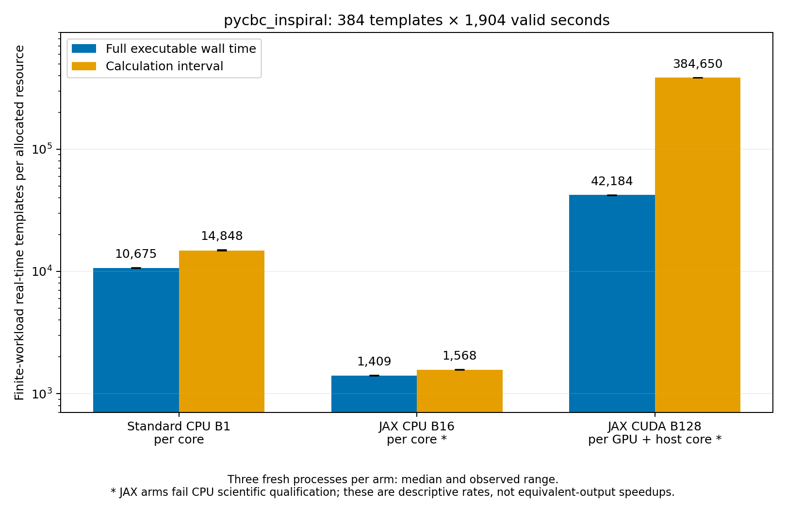
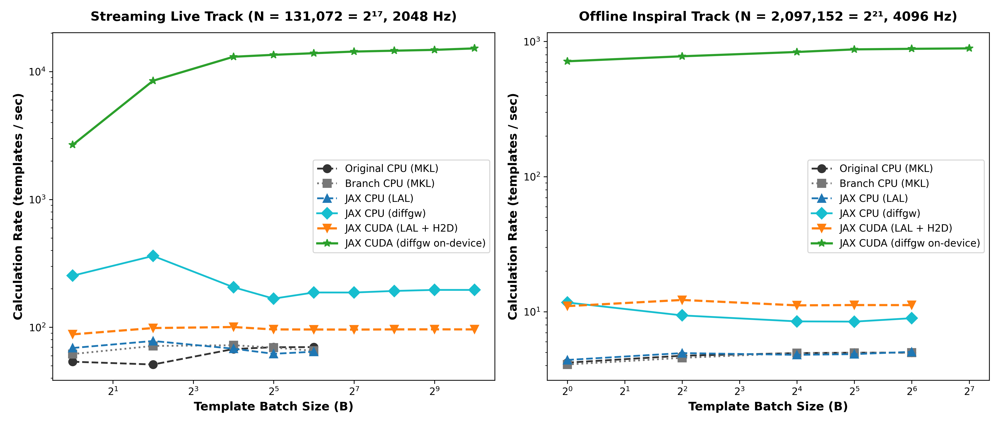
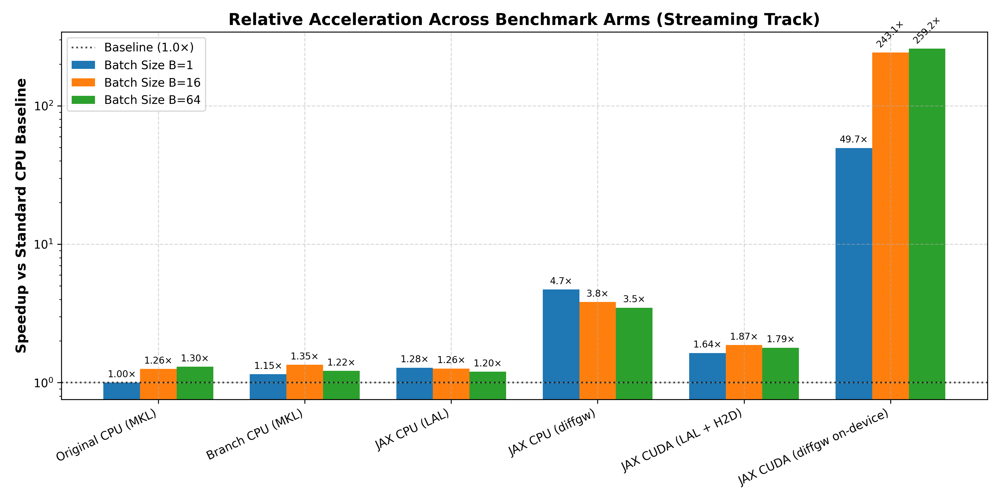
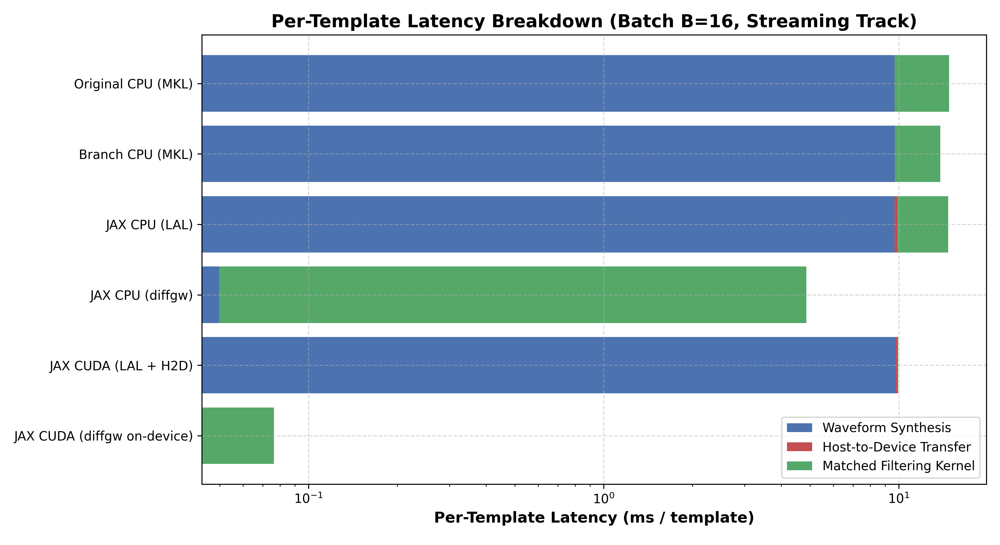
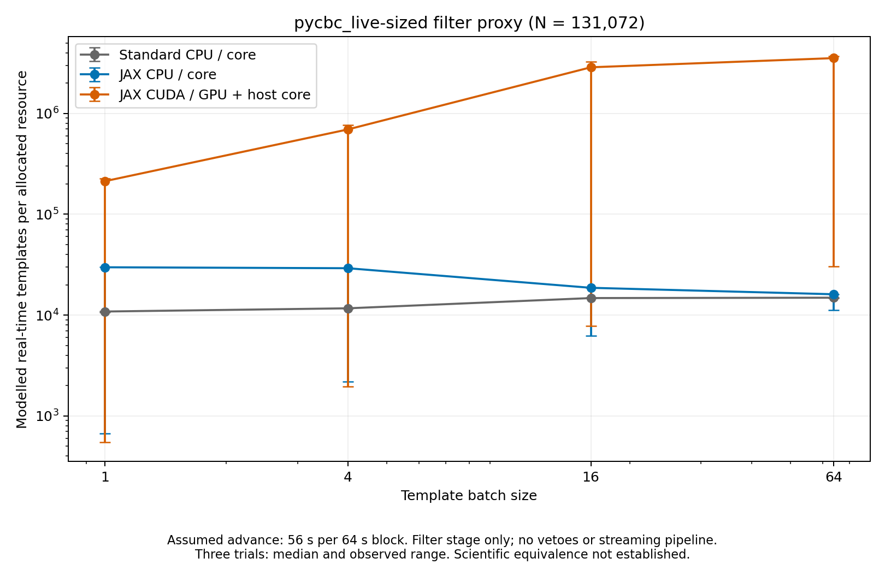
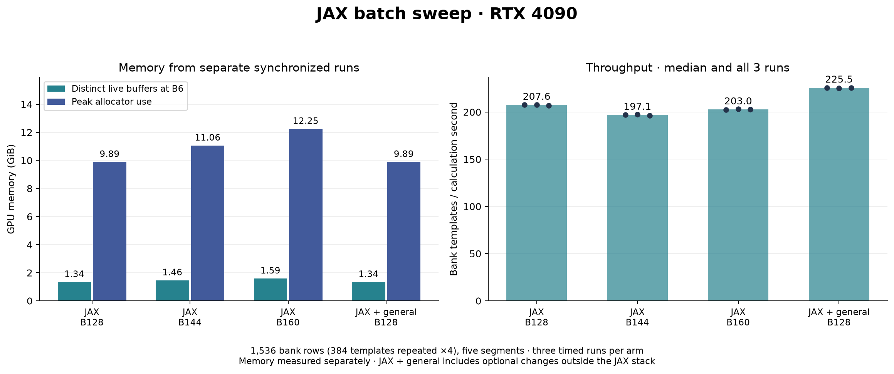
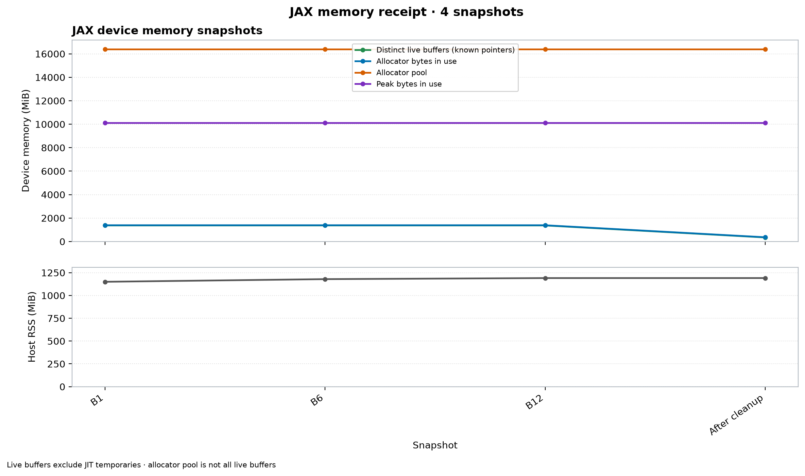
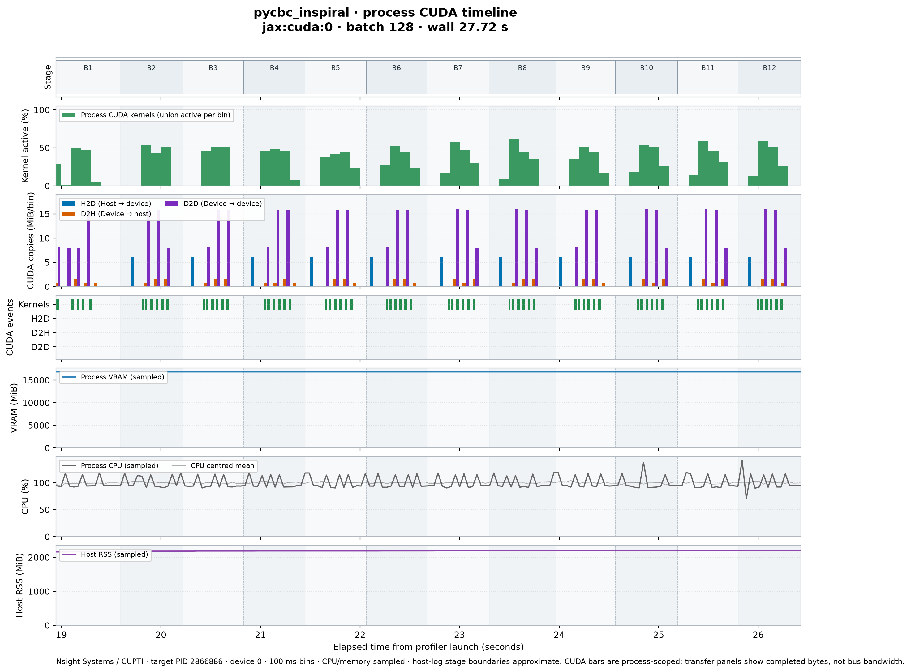
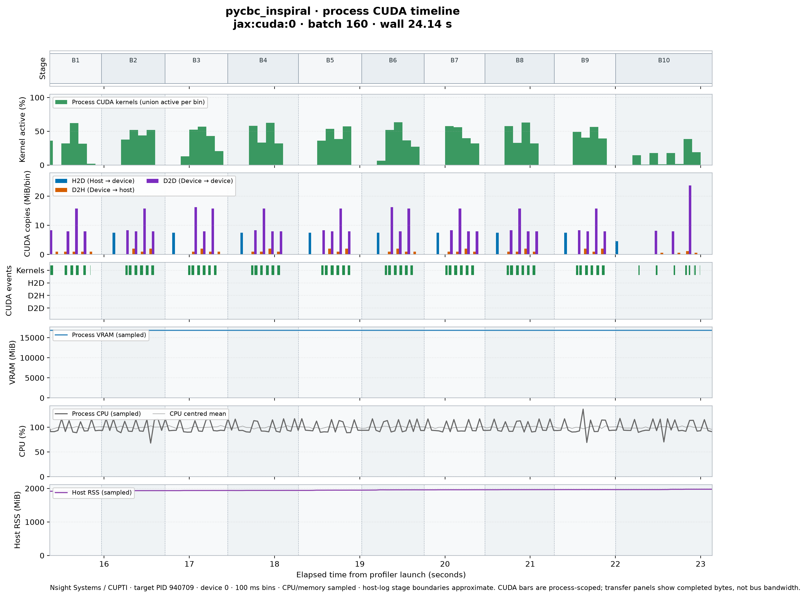

.. _jax-performance:

JAX performance measurements
============================

The executable search and the waveform/filter microbenchmark measure different
work. Executable wall time includes startup, data conditioning, bank preparation,
filtering, vetoes, clustering and output. Microbenchmark rates cover waveform
generation, array transfer and matched filtering on prepared synthetic data.
Neither rate alone establishes sustained search capacity on a different bank.

Measurement environment and source
----------------------------------

The September 2026 measurements use host ``len``, an AMD Ryzen Threadripper
PRO 3995WX and an NVIDIA GeForce RTX 4090 with 24 GiB VRAM, Python 3.11 and
JAX 0.4.20. Each worker is pinned to CPU core 8; numerical-library thread
limits are one and ``XLA_PYTHON_CLIENT_PREALLOCATE=false``. GPU runs use one
GPU in addition to the allocated host core.

The measured runtime was verified against
``594b9561f423b007367198225824944f5a6932aa``. The checkout originated from
source archive ``540363e2013675f1af2571974ed182a415fcb9a8`` with benchmark
harness updates applied before execution; the entire working tree was not
identical to that archive. Retained provenance records the measured harness
hashes separately.
The `compact batch receipt <_static/jax_batch_sweep.json>`_ records source
pins, input SHA256 hashes, commands, environment overrides and individual
measurements. Affinity and thread limits describe execution controls; they
do not by themselves establish exclusive host reservation.

The JAX stack contains the JAX execution paths and their optimizations.
General frame I/O and lazy-import optimizations are maintained separately in
``codex/general-runtime-optimizations``; the comparison below measures their
additional effect on the same JAX workload.

Complete executable searches
----------------------------

The compressed ``IMRPhenomD`` workload uses the frame and search settings in
:ref:`jax-reference-campaign`: 4096 Hz strain, a 512-second FFT segment,
five segments per template and 1904 unique valid detector seconds. The
384-template bank contains BNS and NSBH templates. The 1536-row bank repeats
that bank four times; it exercises batch scheduling and memory use without
adding independent waveforms or proving large-bank convergence.

Standard CPU uses ``cpu:1`` with MKL FFTs and scalar filtering. JAX CPU and
CUDA use JAX FFTs and their stated batch sizes. Timings come from fresh
uninstrumented processes; compilation warmups, memory captures and Nsight
captures are separate from those timing samples.

.. list-table:: 384-template search, three fresh processes per arm
   :header-rows: 1

   * - Arm and batch size
     - Wall seconds, median [range]
     - Calculation seconds, median [range]
     - Bank templates/calculation second
   * - Standard CPU, scalar (B1)
     - 68.488 [67.821, 68.805]
     - 49.242 [48.576, 49.511]
     - 7.80
   * - JAX CPU, B16
     - 518.968 [515.463, 520.537]
     - 466.368 [462.198, 467.920]
     - 0.82
   * - JAX CUDA, B128
     - 17.332 [17.314, 17.370]
     - 1.901 [1.893, 1.904]
     - 202.02

The `compact search comparison <_static/jax_search_comparison.json>`_ retains
all nine timing samples and the complete grouped scientific comparisons.
The three repetitions of each JAX arm fail the CPU-reference gates below;
these rates are descriptive measurements, not equivalent-output speedups.
JAX CPU batching is substantially slower than standard CPU on this fixture.
The 1536-row CUDA sweep is reported in :ref:`jax-gpu-investigation`.

The tables report wall and calculation medians with their observed ranges.
Bank templates per calculation second is ``bank_rows / calc_seconds``; it
counts each bank row once even though all five segments are processed. The
finite-workload real-time factor is ``1904 / wall_seconds``. Multiplying that
factor by bank rows gives template-seconds per wall second for the allocated
worker; a GPU worker must not be labelled as one CPU core of capacity.

.. _jax-search-capacity:

Real-time capacity: templates/core and templates/GPU
~~~~~~~~~~~~~~~~~~~~~~~~~~~~~~~~~~~~~~~~~~~~~~~~~~~~

For the complete ``pycbc_inspiral`` fixture, completed work is
``384 * 1904`` template-seconds. Divide by elapsed seconds and the number of
allocated physical CPU cores to obtain **templates/core at real time** for
CPU runs. For CUDA, report **templates per GPU plus its allocated host core**.
These runs each allocate one host core; CUDA additionally uses one RTX 4090.
Do not divide by CUDA core count or count the GPU as a CPU core.

.. list-table:: pycbc_inspiral finite-workload capacity (rounded medians)
   :header-rows: 1

   * - Configuration
     - Resource denominator
     - Templates at real time, full wall
     - Templates at real time, calculation
   * - Standard CPU, B1
     - One CPU core
     - 10,675
     - 14,848
   * - JAX CPU, B16
     - One CPU core
     - 1,409
     - 1,568
   * - JAX CUDA, B128
     - One GPU + one host core
     - 42,184
     - 384,650

These are the current timing samples expressed in capacity units, not new
benchmark runs. Full-wall capacity includes setup and output; calculation
capacity excludes those costs. Neither establishes sustained large-bank
capacity. Both JAX arms fail the :ref:`scientific gates
<jax-search-qualification>`, so these values are descriptive, not qualified
equivalent-output speedups.

   Capacity from three fresh processes per arm; bars show medians and error
   bars show observed ranges. CPU and GPU resource denominators differ.

The HDF field ``H1/search/templates_per_core`` instead uses the internal
``run_time`` denominator, including setup but excluding process startup and
output. It therefore differs from both columns above. The field name does
not make a CUDA worker equivalent to a CPU core. See
:ref:`jax-timing-boundaries` for all three clock boundaries.

.. _jax-search-qualification:

Scientific output comparisons
~~~~~~~~~~~~~~~~~~~~~~~~~~~~~

Scientific comparisons must state their reference, fields and tolerance.
Exact agreement of HDF datasets on this fixture is stronger than the
numerical-tolerance gate for those datasets, but does not establish bitwise
agreement for other inputs, intermediate arrays or unexamined metadata.
Runtime performance fields are excluded from scientific comparisons as listed
in :ref:`jax-reference-campaign`.

For the 1536-row campaign, all 12 timing trials, both warmups and four memory
captures produce 7984 triggers and match all 18 scientific datasets exactly
against the prior JAX 7984-trigger output. The receipt lists every
compared dataset and excludes four performance datasets. HDF attributes were
not compared. This is a regression check against that output, not a newly
established full CPU-reference or intermediate-array equivalence result.

The 384-template JAX arms fail the frozen CPU-reference qualification gates.
Against CPU replicate 1, which contains 1988 triggers, JAX CPU has 2000 and
JAX CUDA has 1996. Each shares 1955 exact ``(template_hash, end_time sample)``
identities with CPU. There are 33 CPU-only identities, 45 JAX-CPU-only and
41 JAX-CUDA-only identities. No nearest-neighbor matching is used; no
duplicate identities or off-grid times were found.

.. list-table:: CPU-reference field failures among 1955 matched triggers
   :header-rows: 1

   * - Field
     - JAX CPU failures
     - JAX CUDA failures
     - Maximum absolute difference, CPU / CUDA
   * - Power chi-square
     - 1950
     - 1952
     - 9.299955 / 9.300028
   * - SNR
     - 51
     - 112
     - 0.000837326 / 0.000999928
   * - Circular phase
     - 45
     - 151
     - 0.000156641 / 0.000188351 radians
   * - Sigmasq
     - 0
     - 0
     - 31 / 14 (within relative tolerance)

Matched times, template hashes and durations, degrees of freedom, saved
search metadata and inactive veto fields agree exactly. Complete PSD arrays
were not saved, so their separate gate remains unavailable. These failures
are material scientific differences; the executable timings describe
these implementations and do not establish equivalent-output speedups.
Neither runtime code nor tolerances were changed to obtain these results.

All three repetitions of each arm produce the same comparison results:
all six JAX runs fail, while both further standard CPU runs match CPU
replicate 1 across all 18 non-timing datasets. The compact receipt stores
per-run timing and HDF hashes, grouping repeated scientific metrics without
dropping their failed verdicts.

Both Nsight captures (batch 128 and 160) preserve the prior 1536-row JAX
output across all 18 scientific datasets exactly, with no attributes present
in either file. This separately checks that profiling preserved that JAX
output; it does not change the failed 384-template CPU qualification verdict.

Effect of the separate general optimizations
~~~~~~~~~~~~~~~~~~~~~~~~~~~~~~~~~~~~~~~~~~~~

The separate patch is ``06999c64200a3c71830abd3e6ab456f45f0fad67``. Three
fresh-process trials per configuration used reversed/rotated ordering on the
1536-row bank at batch 128:

.. list-table:: Effect of the general changes, seconds: median [minimum, maximum]
   :header-rows: 1

   * - Source
     - Full wall
     - Calculation
   * - JAX stack
     - 23.254 [23.203, 23.504]
     - 7.400 [7.391, 7.421]
   * - JAX stack + general changes
     - 15.640 [15.541, 15.891]
     - 6.812 [6.810, 6.824]

Adding the general changes reduces median wall time by 7.614 seconds
(32.7%) and median calculation time by 0.588 seconds (7.9%) on this fixture.
The runtime separation therefore has a material end-to-end timing cost.
Both configurations preserve the 18 compared scientific datasets exactly.

The paired comparison uses identical inputs, JAX settings and hardware for
the separated JAX stack and the same stack plus the general optimizations.
Wall time and calculation time have different boundaries; report both rather
than attributing the entire wall-time difference to filtering.

.. _jax-timing-boundaries:

Timing boundaries
-----------------

.. list-table:: Executable timers
   :header-rows: 1
   :widths: 22 44 34

   * - Metric
     - Included
     - Excluded
   * - External wall seconds
     - Child process launch through termination, including imports, input,
       setup, filtering, output and teardown
     - Harness preparation before process launch
   * - Internal ``run_time``
     - Work between the executable's ``tstart`` and ``tstop``, including setup,
       filtering and final event consolidation
     - Earlier process startup/imports and later HDF output/teardown
   * - Calculation seconds
     - ``run_time * (1 - setup_time_fraction)``: template processing after
       setup, including bank decompression, normalization, filtering, vetoes,
       clustering and event handling
     - Setup, JIT warmup during setup and work outside ``run_time``

Calculation time is a host-observed pipeline interval, not a sum of CUDA
kernel durations. The difference between wall and calculation time combines
several costs; it is not a measurement of Python import time alone.

Waveform and matched-filter microbenchmarks
-------------------------------------------

The retained harness runs the current checkout's standard CPU implementation,
JAX CPU and JAX CUDA with host-generated LAL ``TaylorF2`` waveforms. It does
not load a second CPU checkout or explicitly select the standard CPU FFT
backend. All three labels therefore describe the implementation tested
without assuming MKL. Optional ``diffgw`` arms are separate experiments.

Both workloads use single precision: ``complex64`` signal arrays and
``float32`` PSD arrays. The transform lengths are 131072 at 2048 Hz and
2097152 at 4096 Hz. Every timed pass includes waveform generation, array
transfer/conversion and matched filtering; prepared strain and PSD creation
are outside the clock. Warmup precedes the timed trials.

One untimed warmup precedes three timed trials for each arm and batch size.
The `compact microbenchmark receipt <_static/jax_microbenchmarks.json>`_
retains every stage sample, input definition and execution command. Strain
is seeded complex Gaussian noise and the PSD is unity; the template primary
mass is spaced from 1.4 to 2.0 solar masses within each batch. These timings
do not include an independent numerical oracle or establish search parity.

.. list-table:: Total templates per second from median pass time
   :header-rows: 1

   * - Transform length
     - Current-checkout arm
     - B1
     - B4
     - B16
     - B64
   * - 131,072
     - Standard CPU / LAL
     - 55.57
     - 60.85
     - 71.09
     - 73.31
   * - 131,072
     - JAX CPU / LAL
     - 69.13
     - 84.28
     - 76.36
     - 71.77
   * - 131,072
     - JAX CUDA / LAL
     - 85.70
     - 100.01
     - 98.61
     - 99.96
   * - 2,097,152
     - Standard CPU / LAL
     - 5.27
     - 6.31
     - 6.75
     - 6.84
   * - 2,097,152
     - JAX CPU / LAL
     - 5.41
     - 5.93
     - 5.94
     - 5.95
   * - 2,097,152
     - JAX CUDA / LAL
     - 8.80
     - 10.16
     - 11.62
     - 11.58

Across the tested batches, peak JAX CUDA total throughput is about 1.80 times
the standard CPU batch-one rate for the short transform and 2.21 times for
the long transform. Host LAL waveform generation dominates the JAX CUDA
stage timings in these cases. Isolated filter throughput is recorded
separately and must not be substituted for this total rate.

   Rates include all three measured stages and exclude complete executable
   startup and data conditioning.

   Ratios for the short-transform workload use the current checkout's CPU
   batch-one rate at the same precision.

   Stage medians at the labelled batch size. Their sum need not equal the
   median of the full-pass times.

.. _jax-live-capacity:

pycbc_live-sized filtering: rates and capacity proxy
~~~~~~~~~~~~~~~~~~~~~~~~~~~~~~~~~~~~~~~~~~~~~~~~~~~~

The short-transform receipt also retains the **filter stage alone**, which
is the scope behind the former live throughput table. It uses 131072 samples
at 2048 Hz (64 seconds), single-precision arrays, synthetic strain and
host-generated ``TaylorF2`` templates. The timed calls are ``matched_filter``
for CPU and ``batch_matched_filter_bank`` for JAX. Waveform generation and
transfer are timed separately and excluded here; trigger selection, vetoes,
coincidence, streaming input and output are not measured.

To express these rates in familiar real-time units, assume a **56-second
advance** per 64-second block, as in :ref:`jax-batch-numerics`:

.. math::

   C_{\mathrm{filter}} = \frac{B}{t_{\mathrm{filter}}}
                         \times 56\,\mathrm{s}.

For these one-core CPU runs this is a modelled templates/core figure; CUDA
uses one whole GPU plus a host core. The 56-second advance is an explicit
conversion assumption, not a measured streaming interval in this harness.
Use the actual non-overlapping advance for another configuration, not its
FFT duration. The old 64-second multiplier counted the entire FFT block.

.. list-table:: Live-sized filter proxy from the current receipt
   :header-rows: 1

   * - Configuration
     - Resource denominator
     - Filter rate B1 / B16 / B64 (templates/s)
     - Modelled capacity B1 / B16 / B64 (real-time templates)
   * - Standard CPU
     - One CPU core
     - 193.82 / 263.53 / 265.66
     - 10,854 / 14,758 / 14,877
   * - JAX CPU
     - One CPU core
     - 532.39 / 333.14 / 287.44
     - 29,814 / 18,656 / 16,097
   * - JAX CUDA
     - One GPU + one host core
     - 3,801.02 / 51,212.95 / 63,150.31
     - 212,857 / 2,867,925 / 3,536,418

   Filter-stage medians and observed ranges from three trials. These are
   synthetic filtering estimates, not measured ``pycbc_live`` search capacity.

The JAX trials have wide observed ranges despite the harness warmup. Retain
those ranges when interpreting the median; these samples do not demonstrate
stable streaming latency.

There is no complete ``pycbc_live`` executable timing or qualified
``LiveBatchMatchedFilter.process_data`` timing in the current published
receipts. The separate API fixture and its numerical gates remain documented
in :ref:`jax-batch-numerics`; its archived harness must be qualified and run
before publishing a measured live-search capacity. The microbenchmark has no
independent numerical oracle, and its input template distribution changes
with batch size, so the curve does not isolate batching alone.

.. _jax-gpu-investigation:

Batch size, memory and utilisation
----------------------------------

This experiment uses the 1536-row repeated compressed bank and hardware
specified above. Keep source revisions, input hashes,
individual trials and scientific comparisons in the compact
`batch sweep summary <_static/jax_batch_sweep.json>`_. The repeated bank tests
execution and allocation behavior; it is not a larger independent search bank.

Batch-size comparison
~~~~~~~~~~~~~~~~~~~~~

.. list-table:: Separated JAX stack, three uninstrumented trials per batch
   :header-rows: 1

   * - Batch
     - Wall seconds, median [range]
     - Calculation seconds, median [range]
     - Bank templates/calculation second
   * - 128
     - 23.254 [23.203, 23.504]
     - 7.400 [7.391, 7.421]
     - 207.6
   * - 144
     - 23.602 [23.554, 23.754]
     - 7.793 [7.777, 7.819]
     - 197.1
   * - 160
     - 23.602 [23.552, 23.603]
     - 7.566 [7.564, 7.592]
     - 203.0

Batch 128 has the shortest median calculation and wall times among these
three tested sizes. Batch 160 fits but takes 2.3% longer in calculation time;
batch 144 takes 5.3% longer. This comparison does not test every possible
size or establish the maximum fitting batch. The separate general-runtime
comparison is reported above under the effect of the general optimizations.

   Timing repetitions and memory captures use separate processes. Compare
   calculation and wall times on the same workload before selecting a batch
   size; a larger batch that fits need not be faster.

Memory measurements
~~~~~~~~~~~~~~~~~~~

The JAX path avoids unused scalar scratch arrays for batched banks, performs
template cropping inside the compiled filter, and releases segment correlation
references before allocating the next segment's workspace. These changes
reduce overlapping allocations; their effect must be measured for the chosen
shape and allocator settings.

Synchronized profiling runs group live pointers by device to avoid counting
aliases twice. At the sixth production batch, distinct live buffers use
1.338, 1.463 and 1.588 GiB for batches 128, 144 and 160. Corresponding
allocator high-water marks are 9.893, 11.062 and 12.247 GiB. The allocator's
reserved pool is 16 GiB in all three captures. The batch-128 run with general
optimizations has the same measured GPU live-buffer and allocator peaks.

The four memory runs preserve all 18 compared scientific datasets and 7984
triggers exactly. HDF attributes were not compared. These measurements do
not include a fresh pre-optimization runtime control, so they quantify the
current implementation rather than a before/after memory reduction.

   Live buffers, allocator use and reserved process memory describe different
   quantities. A settled snapshot does not capture every transient FFT or JIT
   workspace allocation and cannot alone establish the largest safe batch.

Process utilisation
~~~~~~~~~~~~~~~~~~~

The plotted window runs from the first ``filter_batch`` start to the final
``filter_batch`` end in each capture. Clipping process CUDA kernel intervals
to that window and taking their union gives:

.. list-table:: Instrumented production filtering windows
   :header-rows: 1

   * - Batch size
     - Window from process start, seconds
     - Duration, seconds
     - Batches
     - Kernel-active union, seconds
     - Kernel-active fraction
   * - 128
     - 18.9475--26.4294
     - 7.4819
     - 12
     - 1.7663
     - 23.61%
   * - 160
     - 19.0247--26.6192
     - 7.5945
     - 10
     - 1.7581
     - 23.15%

Both captures finish successfully and preserve all 18 scientific datasets
of the prior 7984-trigger JAX output exactly; neither HDF file has
attributes. This validates output preservation under profiling, not
CPU-reference equivalence. The complete 384-template CPU qualification
still fails as detailed in :ref:`jax-search-qualification`.

   Batch 128 production filtering. CUDA events belong to the search process;
   CPU and memory values are sampled. Instrumented durations are excluded
   from the uninstrumented performance table.

   Batch 160 production filtering, using this capture's own phase boundaries.

Kernel-active fraction is the union of process kernel intervals divided by
the selected production interval; it is not SM occupancy. CUDA copy totals
per time bin are not link bandwidth. Process GPU memory includes reserved
allocator space, while host RSS measures a different memory domain. Gaps in
a CUDA timeline identify periods without recorded kernels but do not, by
themselves, identify the responsible host operation.

Reproducing the measurements
----------------------------

Keep raw JSON, HDF outputs, Nsight exports and logs under ignored
``artifacts/``. Record source and input hashes, commands, versions and CPU/GPU
allocation with every campaign. See :ref:`jax-benchmark-protocol` for controls
and scientific qualification requirements.

Microbenchmark and three scaling plots
~~~~~~~~~~~~~~~~~~~~~~~~~~~~~~~~~~~~~~

.. code-block:: console

   export OMP_NUM_THREADS=1 MKL_NUM_THREADS=1 OPENBLAS_NUM_THREADS=1 NUMEXPR_NUM_THREADS=1
   export MKL_DYNAMIC=FALSE MKL_THREADING_LAYER=GNU PYTHONHASHSEED=0
   export XLA_PYTHON_CLIENT_PREALLOCATE=false
   unset XLA_FLAGS JAX_COMPILATION_CACHE_DIR
   taskset -c 8 python tools/bench_jax_performance.py \
     --device cuda:0 --arms branch_cpu jax_cpu_lal jax_cuda_lal \
     --precision single --batch-sizes 1 4 16 64 \
     --lengths 131072 2097152 --trials 3 \
     --output artifacts/jax_benchmark_results.json
   python tools/plot_jax_benchmarks.py \
     --input artifacts/jax_benchmark_results.json \
     --output-dir docs/_static/

To rerender the checked-in microbenchmark measurements without running new
benchmarks, replace the plot input with
``docs/_static/jax_microbenchmarks.json``.

Live-sized filter and complete inspiral capacity plots
~~~~~~~~~~~~~~~~~~~~~~~~~~~~~~~~~~~~~~~~~~~~~~~~~~~~~~

Rerender both capacity plots from the checked-in receipts, without executing
new benchmarks:

.. code-block:: console

   python tools/plot_jax_search_capacity.py --output-dir docs/_static

``--live-advance-seconds`` changes only the live proxy's assumed valid block
advance (default 56 seconds). The inspiral plot uses the fixed 384-template,
1904-valid-second fixture in ``jax_search_comparison.json``. Rerendering
preserves the recorded qualification failures; it does not establish parity.

.. _jax-executable-reproduction:

Complete executable campaign
~~~~~~~~~~~~~~~~~~~~~~~~~~~~

The campaign runner can compare a separately pinned CPU checkout with the
current checkout. ``--batched`` keeps standard CPU scalar and selects JAX CPU
batch 16 and JAX CUDA at ``--batch-size``. The runner's trigger comparison is
a limited SNR/time/count check; supplement it with the complete scientific
comparisons in :ref:`jax-reference-campaign` before claiming equivalence.

.. code-block:: console

   python tools/bench_jax_inspiral_campaign.py \
     --original-source . \
     --branch-source . --python /path/to/venv/bin/python \
     --frame-file /path/to/H-H1_LOSC_CLN_4_V1-1187007040-2048.gwf \
     --bank-file /path/to/bank_384_compressed.hdf \
     --track track1 --batched --batch-size 128 --replicates 3 \
     --arms branch_cpu jax_cpu_batched jax_cuda_batched \
     --output artifacts/benchmarks/receipt.json \
     --output-dir artifacts/benchmarks

Use the 1536-row input for the repeated-bank sweep and record that bank's
hash and row count. Compare ``branch_cpu`` and JAX arms from the same checkout
when evaluating the current stack; ``original_cpu`` is a separate source
comparison only when ``--original-source`` names a different pinned checkout.

Process CUDA, CPU and memory utilisation plots
~~~~~~~~~~~~~~~~~~~~~~~~~~~~~~~~~~~~~~~~~~~~~~

The maintained capture, extraction and plotting tools reproduce the timeline
panels in :ref:`jax-gpu-investigation`. Run on a Linux CUDA host with Nsight
Systems (``nsys``), NVML, ``psutil``, NumPy, Matplotlib and the JAX PyCBC
environment. The collector launches the search, records its PID, samples CPU
and memory use, and emits an NVTX marker to align telemetry with CUDA events.
The extractor selects that process's kernels and copies from the Nsight
SQLite export. Whole-device NVML activity is not substituted for
process-specific kernel activity.

Use the recorded H1 frame and the 1,536-row compressed bank (384 templates
repeated four times) to match the published workload. Supply the actual input
paths below. The collector fixes the remaining search parameters, sets one
numerical thread and disables JAX preallocation. CPU core 8 must be available
and reserved for the run; change ``--affinity-core`` for another host and
record that difference.

.. code-block:: console

   mkdir -p artifacts/utilisation
   for batch in 128 160; do
     nsys profile --trace=cuda,nvtx --sample=none --cpuctxsw=none \
       --output=artifacts/utilisation/batch-${batch} \
       python tools/profile_jax_gpu_timeline.py --nvtx-sync \
       --executable bin/pycbc_inspiral \
       --frame-file /path/to/H-H1_LOSC_CLN_4_V1-1187007040-2048.gwf \
       --bank-file /path/to/bank_1536_compressed.hdf \
       --batch-size ${batch} --affinity-core 8 \
       --output-hdf artifacts/utilisation/triggers-${batch}.hdf \
       --output-json artifacts/utilisation/telemetry-${batch}.json

     nsys export --type=sqlite \
       --output=artifacts/utilisation/batch-${batch}.sqlite \
       artifacts/utilisation/batch-${batch}.nsys-rep
     python tools/extract_jax_nsight_timeline.py \
       --sqlite artifacts/utilisation/batch-${batch}.sqlite \
       --telemetry artifacts/utilisation/telemetry-${batch}.json \
       --output artifacts/utilisation/timeline-${batch}.json --bin-ms 100
     python tools/plot_jax_gpu_timeline.py \
       --input artifacts/utilisation/timeline-${batch}.json \
       --output artifacts/utilisation/timeline-${batch}.png
   done

These commands render full-run plots. To reproduce the production-window
view, inspect ``phases`` in each new timeline JSON for the first and last
``filter_batch`` boundaries, then rerun the plotting command with
``--zoom-start <seconds> --zoom-end <seconds>``. Phase boundaries are specific to each capture; do not reuse another run's
zoom window.

The plots show process kernel-active time, directional CUDA copies, CUDA
event intervals, sampled process GPU memory, process CPU utilisation and host
RSS. Kernel-active time is not SM occupancy, GPU reserved memory is not live
buffer size, and copy totals per bin are not bus bandwidth. Keep
instrumented captures separate from unprofiled timing trials and compare
scientific HDF outputs using the gates in :ref:`jax-reference-campaign`.
Record the tested revision and input hashes with every new capture.

Batch sweep and allocation plots
~~~~~~~~~~~~~~~~~~~~~~~~~~~~~~~~

Regenerate the batch comparison from its compact summary with:

.. code-block:: console

   python tools/plot_jax_batch_sweep.py \
     --input docs/_static/jax_batch_sweep.json \
     --output artifacts/jax_batch_sweep.png

The allocation snapshot experiment used the archived standalone helpers at
``jax-evidence-archive-20260919``. To repeat it, recover the two files under ``artifacts/``:

.. code-block:: console

   mkdir -p artifacts/memory
   git show jax-evidence-archive-20260919:tools/profile_jax_memory.py > artifacts/profile_jax_memory.py
   git show jax-evidence-archive-20260919:tools/plot_jax_memory.py > artifacts/plot_jax_memory.py

Run ``profile_jax_memory.py --output-dir artifacts/memory --`` before the
same ``bin/pycbc_inspiral`` command and arguments recorded in the compact
receipt, keeping its environment and affinity. This produces
``artifacts/memory/jax_memory_profile.json``. Render it with:

.. code-block:: console

   python artifacts/plot_jax_memory.py \
     --input artifacts/memory/jax_memory_profile.json \
     --output artifacts/jax_memory_optimized.png

The maintained utilisation tools require none of these archived helpers.

Raw telemetry, CUDA events, HDF files and allocation profiles belong under
ignored ``artifacts/``. Keep the compact measurement summary and final plots
in the documentation.
