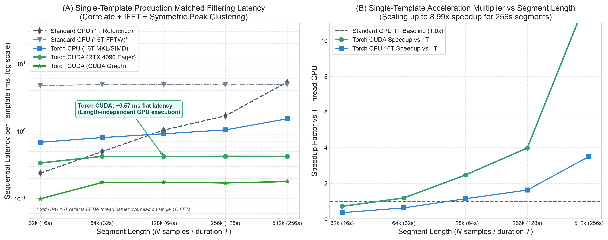
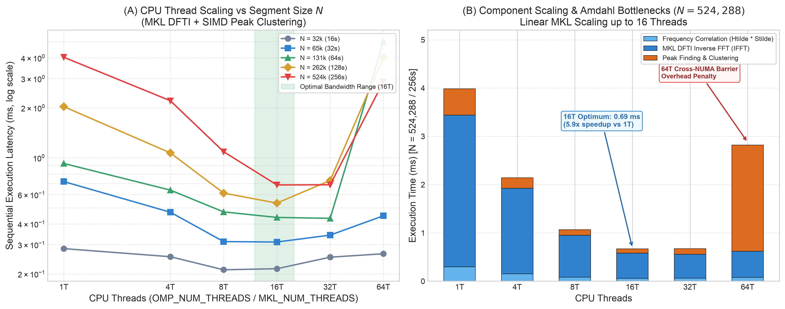

.. _torch-optimization-results:

====================================
Torch performance and parity results
====================================

This page summarizes checked-in reference snapshots for supported Torch paths.
The figures are not regenerated during a documentation build. Their original
measurement JSON is not included in this source tree, so consult
:doc:`torch_performance` before interpreting or refreshing them; validation
commands are in :doc:`torch_workflows`.

Supported scope
===============

The evidence on this page applies only to code present in this branch:

* search-side array, FFT, filtering, matched-filter, trigger, and live-batch
  work;
* shared Torch waveform infrastructure;
* the registered ``TaylorF2``, ``TaylorF2NLTides``, ``TaylorF2RedSpin``,
  ``TaylorF2RedSpinTidal``, ``TaylorF2Ecc``, and ``SpinTaylorF2`` FD and FD
  sequence interfaces; and
* inference reductions, relative-binning batches, and vectorized
  detector/network response.

The registry-derived table in :doc:`waveform` is authoritative for waveform
availability. A benchmark image does not register a model or expand its
supported parameter envelope.

Search evidence
===============

The search plots report warm, batched measurements after numerical checks.
They show the central operational result: accelerator throughput improves as
enough independent work is batched, while launch and dispatch overhead remain
visible at small batch sizes. CPU results are retained because they are the
fallback and regression baseline, not merely a denominator for GPU numbers.

.. figure:: images/torch_live_batch_scaling.png
   :width: 95%
   :alt: Live-batch search throughput and speedup by batch size

   Reference live-batch search benchmark snapshot.

.. figure:: images/torch_latency_breakdown.png
   :width: 95%
   :alt: Search latency component breakdown

   Reference component-latency snapshot used to attribute end-to-end results.

   Reference matched-filter scaling snapshot.

   Reference CPU thread-scaling snapshot. Thread counts and process placement are
   part of the benchmark configuration and must be recorded for a rerun.

.. figure:: images/torch_performance_dashboard.png
   :width: 95%
   :alt: Summary of current search performance measurements

   Reference summary of the search measurements above.

Inference and detector evidence
===============================

The supported Torch paths add batched tensor reductions to inference hot paths and vectorize
multi-detector antenna patterns and time delays. The comparison is meaningful
only for equivalent shapes, detector sets, dtypes, and devices. The focused
tests compare vectorized results with the existing scalar/per-detector routes
and check Torch gradient propagation for detector projection.

.. figure:: images/torch_inference_acceleration.png
   :width: 95%
   :alt: Inference and multi-detector response benchmark

   Reference inference and detector benchmark snapshot.

Interpretation
==============

Use the Torch route when a supported workload can keep tensors resident and
amortize setup over a batch. Keep the established CPU route for unsupported
operations, very small jobs where dispatch dominates, or environments without
a qualified accelerator. Always run the parity gate before using a new result
to justify routing or performance claims.

These plots are evidence for the recorded benchmark configurations, not a
portable speed guarantee. Results depend on hardware, Torch and dependency
versions, dtype, thread settings, warm-up, batch shape, and whether transfers
are inside the timed region.
