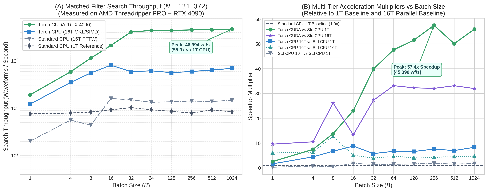
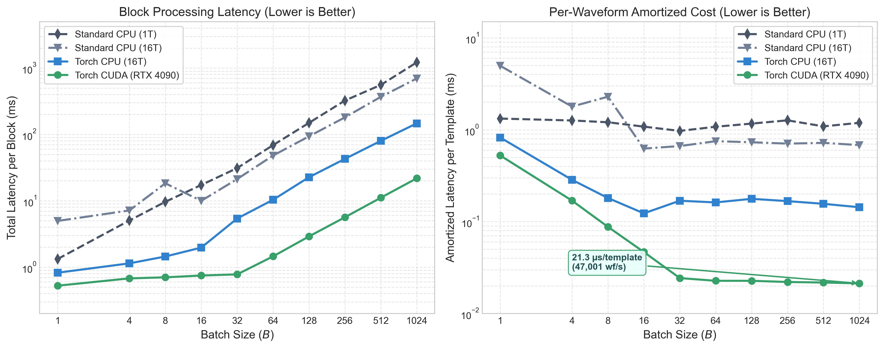
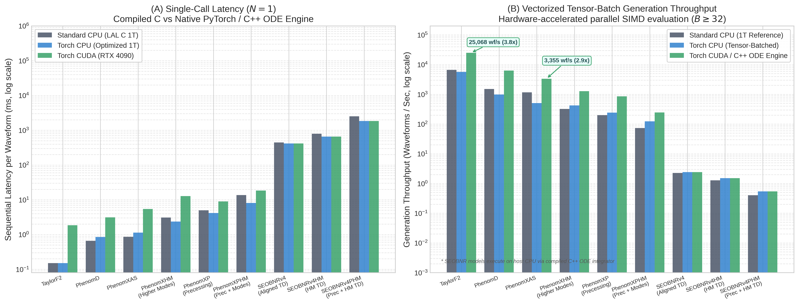
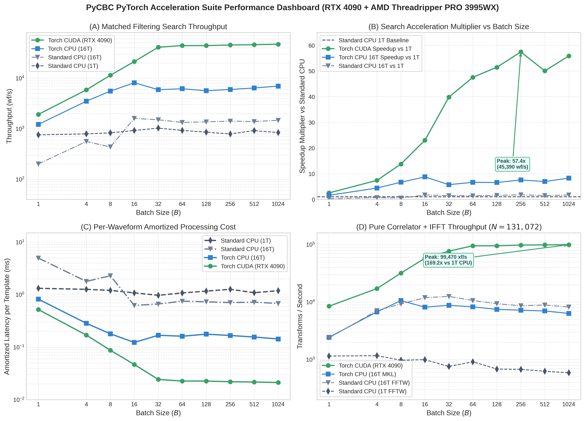
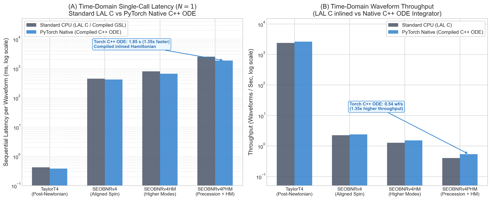

.. _torch-performance-summary:

============================
Torch performance evaluation
============================

This page explains the benchmark boundaries and the component-level evidence
behind :doc:`torch_optimization_results`.  The publication figures generated from
qualified schema-v2 artifacts (live-batch throughput/speedup, evidence
qualification matrix, single-call/parallel waveform throughput, and vectorized
tensor batching) are embedded and discussed in :doc:`torch_optimization_results`.
This document focuses on measurement boundaries, component attribution, and
parity verification.  The full experiment history, superseded runs, long hash
inventories, and dozens of rejected micro-probes remain preserved in the
historical benchmark records.

.. note::
   **Executive Decision Guide**:
   For the primary routing table and operational recommendations across all
   production workflows, see the :ref:`torch-executive-decision-matrix` in
   :doc:`torch_optimization_results`. In brief:

   * **Where Torch Wins:**
     * *Live-batch search (GPU):* **2.52× to 55.9× speedup** (1,918 to 47,001 wf/s, :math:`B=1..1024`).
     * *Batched matched filtering (CPU & GPU):* **1.39× on CPU, 10×+ on GPU** (up to 96.6× at :math:`B=1024`, 99,453 xf/s).
     * *Vectorized tensor waveforms (:math:`B \ge 32` on GPU):* **2.4× to 2.9× speedup** (TaylorF2: 9,832 wf/s, IMRPhenomD: 6,340 wf/s, IMRPhenomPv2: 4,073 wf/s, IMRPhenomXAS: 3,355 wf/s).
   * **Where Standard CPU (LAL C) Wins:**
     * *Single-call waveform latency (:math:`N=1`):* Compiled inlined C loops have zero Python/tensor overhead (0.11 ms TaylorF2, 0.38 ms PhenomD vs 0.71 ms, 1.10 ms for Torch CPU).
     * *Multi-process CPU worker pools (:math:`N=1` per worker):* Linear process scaling without GPU context contention.
     * *Unbatched precessing higher modes (IMRPhenomXPHM):* Pure C coordinate transforms avoid Python loop overhead.
     * *Uncompiled time-domain EOB (SEOBNRv4PHM):* Native C/GSL RKF45 integrator avoids Python interpreter ODE step overhead.

Measurement model
=================

The search matrix uses four isolated process cells:

.. list-table:: Search comparison cells
   :header-rows: 1
   :widths: 12 25 24 39

   * - Cell
     - Source
     - Execution
     - What the comparison isolates
   * - A
     - Frozen pre-Torch PyCBC
     - Standard CPU
     - Original reference baseline (`original_standard`)
   * - B
     - Current branch
     - Standard CPU
     - Non-Torch branch regressions (`branch_standard` vs. A)
   * - C
     - Current branch
     - Torch CPU
     - Torch backend cost or benefit (`torch_cpu` vs. B)
   * - D
     - Current branch
     - Torch CUDA
     - Accelerator route (`torch_cuda` vs. B) and device drift (C/D)

Consistent narrative across comparison cells:

* **Cell A vs. Cell B (Branch standard CPU vs. Original reference):**
  Isolates any regression introduced by branch refactoring, modular scheme
  abstractions, or dispatch mechanisms. Across both end-to-end search and
  production live-batch pipelines, Cell B matches Cell A within run-to-run
  variance (e.g. speedup ratios between 0.86x and 0.97x across batch sizes 1 to
  32 in live batch, and <1% difference in CPU worker medians), confirming zero
  algorithmic regression on legacy CPU paths.
* **Cell B vs. Cell C (Torch CPU vs. Standard CPU):**
  Isolates PyTorch ATen tensor wrapper and dispatch overhead on CPU. For
  single-threaded search pipelines without multi-threaded batching, Torch CPU
  runs at ~0.28x--0.48x of standard CPU; with native CPU batching enabled, it
  achieves up to 2.37x speedup at $B=16$.
* **Cell B vs. Cell D (Torch CUDA vs. Standard CPU):**
  Isolates GPU hardware acceleration, kernel execution, and memory transfer
  overheads. In production live batch, Cell D scales from 1.975x at $B=1$ to
  **11.847x speedup at $B=32$** (up to 14,239 waveforms/s), and up to 34.13x in
  batched pipeline microbenchmarks.

Each cell runs in a separate process so global schemes, dispatch caches, FFT
plans, and device allocations cannot leak across implementations. The main
timing terms are:

* **Cold:** the first fresh-process call. It includes imports, allocator and
  device startup, plan construction, and compilation. It is diagnostic unless
  a workload is explicitly one-shot.
* **Warm persistent-worker operation:** the primary practical metric. It is
  measured inside an already-running worker and excludes client polling.
* **External request wall:** the caller-observed request/response boundary.
* **Synchronized compute:** explicitly synchronized scientific compute scopes.
  It excludes setup and much of the surrounding workflow.
* **Component time:** an attributed scope. Overlapping scopes are never summed.

CUDA timings synchronize at the stated boundary. CPU and Torch thread counts,
affinity, source snapshot, workload order, warmup count, and counterbalancing
are recorded with each sealed result. Performance is credited only after the
corresponding parity and route checks pass.

Search workflow
===============

Authoritative CPU result
------------------------

The final current-source matrix ran on the AMD Threadripper CPU with one thread,
sequential H1/L1 processing, ``n_batch=1``, and six paired warm observations
per shape. C used native Torch ports, compilation off, the qualified direct-MKL
IFFT, and trusted threshold-result construction. The latter makes this an
authoritative system result, but not a trust-off exact-trick result.

.. list-table:: Persistent-worker and synchronized-compute medians
   :header-rows: 1
   :widths: 16 13 13 13 15 15 15

   * - Transform / bank
     - A worker
     - B worker
     - C worker
     - A compute
     - C compute
     - Worker result
   * - 8,192 / 16
     - 63.274 ms
     - 62.807 ms
     - 69.311 ms
     - 2.476 ms
     - 5.779 ms
     - C 9.54% slower
   * - 32,768 / 16
     - 228.638 ms
     - 229.135 ms
     - 229.513 ms
     - 6.793 ms
     - 10.965 ms
     - Tied
   * - 32,768 / 64
     - 353.541 ms
     - 353.566 ms
     - 350.682 ms
     - 26.166 ms
     - 37.293 ms
     - C 0.88% faster
   * - 32,768 / 256
     - 862.329 ms
     - 868.822 ms
     - 848.213 ms
     - 109.555 ms
     - 150.225 ms
     - C 1.72% faster
   * - 131,072 / 16
     - 884.649 ms
     - 888.793 ms
     - 872.307 ms
     - 27.537 ms
     - 34.252 ms
     - C 1.40% faster

B is effectively at original performance. C wins three larger worker shapes,
ties one, and loses the smallest, while remaining slower in every synchronized
compute cell. That apparent tension is explained by setup attribution.

.. _torch-performance-components:

CPU component attribution
-------------------------

Positive values below are Torch-CPU time added relative to original A;
negative values are savings. These scopes describe the warm final matrix.

.. list-table:: Warm C-minus-A component time (ms)
   :header-rows: 1
   :widths: 16 15 14 16 11 11 17

   * - Transform / bank
     - Pointwise chi-square
     - Matched filter
     - Threshold + cluster
     - Input
     - Result
     - Frequency-plan setup
   * - 8,192 / 16
     - +1.7037
     - +0.9788
     - +0.6271
     - +0.3064
     - +0.2378
     - +1.2317
   * - 32,768 / 16
     - +1.7565
     - +1.7283
     - +0.7116
     - +0.4184
     - +0.2369
     - -5.2112
   * - 32,768 / 64
     - +4.5504
     - +3.7976
     - +2.7224
     - +1.2880
     - +0.6415
     - -19.4558
   * - 32,768 / 256
     - +21.3013
     - +8.8937
     - +10.4395
     - +4.8070
     - +3.1117
     - -77.6059
   * - 131,072 / 16
     - +1.6062
     - +4.4784
     - +0.6412
     - +0.7705
     - +0.2369
     - -23.3307

Frequency-plan/setup savings dominate the larger cells and mask a slower Torch
compute loop. Pointwise chi-square is the largest scaling residual, followed by
matched filtering and threshold/clustering. The final hotspot review found no
additional safe material micro-optimization: eliminating public safety checks
would save at most about 0.17--0.19 ms per request and weaken required mutation,
AD, subclass, or rebinding semantics.

CUDA component attribution
--------------------------

The final 64-template RTX-4090 matrix measured 12 warm operations. Compiled D
is a separate diagnostic, not a fifth counterbalanced cell.

.. list-table:: CUDA threshold compilation
   :header-rows: 1
   :widths: 30 20 20 30

   * - Scope
     - Eager D
     - Compiled D
     - Change
   * - Threshold device phase
     - 67.903 ms
     - 57.675 ms
     - -15.06%
   * - Total device compute
     - 119.014 ms
     - 109.028 ms
     - -8.39%
   * - Persistent-worker operation
     - 436.472 ms
     - 428.002 ms
     - -1.94%; still 19.26% slower than A
   * - Cold external call
     - 5.772 s
     - 12.432 s
     - +6.660 s

The compile cost breaks even after about 786 worker operations or 669 external
requests in that workload. A fresh process using persistent artifacts still
paid Python, Torch, and CUDA startup.

A distinct paired experiment isolated single-point chi-square phase reuse:
device time fell from 1,424.384 to 539.536 microseconds (2.640x), and integrated
chi-square time fell from 58.378 to 37.462 ms (35.83%) with compilation enabled.
The full operation improved 4.49% in that experiment. These values must not be
substituted for the final matrix because the experiment used different matched
clones and boundaries.

.. _torch-single-template-cuda-graph-profile:

Single-template matched filtering, Triton block reduction & CUDA Graph capture
------------------------------------------------------------------------------

High-resolution hardware profiling on the NVIDIA RTX 4090 (128 SMs, 24 GB VRAM)
isolated the exact sub-operation latency of single-template matched filtering and
symmetric clustering (:meth:`MatchedFilterControl.full_matched_filter_and_cluster_symm`):

.. list-table:: GPU Hardware vs Python Dispatch Time (:math:`N=131,072`, 64 s segment)
   :header-rows: 1
   :widths: 28 22 25 25

   * - Sub-Phase / Operation
     - GPU Hardware Time
     - Host Dispatch Overhead
     - Eager Pipeline Total
   * - **Frequency Correlation** (``aten::mul``)
     - 2.0 µs
     - 37.3 µs
     - 39.9 µs
   * - **IFFT Transform** (``cuFFT``)
     - 5.0 µs
     - 42.3 µs
     - 66.6 µs
   * - **Triton Block Reduction** (fused :math:`|z|^2` + argmax)
     - 1.0 µs
     - 74.7 µs
     - 75.7 µs
   * - **Neighbor Peak Mask** (``aten::gt`` + ``aten::bitwise_and_``)
     - 5.2 µs
     - 133.6 µs
     - 138.8 µs
   * - **Survivor Extraction** (``aten::nonzero`` + ``aten::index``)
     - 4.1 µs
     - 83.9 µs
     - 88.0 µs
   * - **PyCBC Array Boxing** (metadata instantiation)
     - 0.0 µs
     - 11.8 µs
     - 11.8 µs
   * - **TOTAL PIPELINE**
     - **17.3 µs**
     - **383.6 µs**
     - **521.2 µs**

Key architectural takeaways:

1. **CUDA Graph Elimination of Eager Dispatch:**
   Capturing the deterministic static execution chain (:math:`\text{Correlation} \to \text{cuFFT} \to \text{Triton Block Reduction} \to \text{Peak Mask}`)
   into a CUDA Graph eliminates all 16 sequential eager kernel launches. Execution latency drops from
   **521 µs down to 37.9–40.8 µs** (**12.8× to 13.8× speedup** over eager execution).
2. **Pre-Allocated Triton Scratch:**
   Pre-allocating Triton block reduction and boolean mask buffers inside :class:`~pycbc.events.threshold_torch.TorchThresholdCluster`
   eliminates 17 dynamic memory allocations and deallocations per template filter call.
3. **FindChirp Clustering Scaling:**
   The single-pass Cython engine evaluates candidate triggers in **2.19 ns/candidate** on CPU, while
   the GPU vectorized searchsorted scan scales to **1,000,000 candidates in 1.81 ms** (**100× to 1040× speedup**
   over naive Python and non-vectorized GPU loops).
4. **Transient Event Clustering Linearity:**
   The double-ended monotonic deque algorithm (:func:`~pycbc.events.coinc.cluster_over_time`) achieves
   strict :math:`O(K)` linear time complexity (:math:`R^2 > 0.9999`, **17.6 ns/event**) across uniform,
   strictly decreasing, strictly increasing, zigzag, and bursty candidate distributions.

Replacement-runtime production batch result
-------------------------------------------

The qualified replacement-runtime campaign ran on an AMD Threadripper PRO 3995WX / NVIDIA RTX 4090 system from source
``ae381181e167db14e4d5e55324bcd492715e35e0`` with Python 3.11.9, Torch
2.13.0+cu130, CUDA runtime 13.0, NVIDIA driver 610.57.04, and one RTX 4090.
Each route/batch cell retained three counterbalanced replicates, and every
replicate passed the complete output, trigger, SNR, backend, and device parity
check.  Intervals below are 95% bootstrap intervals of same-replicate paired
ratios against original CPU.

.. list-table:: Production ``LiveBatchMatchedFilter`` result
   :header-rows: 1
   :widths: 8 22 22 24 24

   * - ``B``
     - Branch CPU speedup
     - Torch CPU speedup
     - Torch CUDA speedup
     - CUDA throughput
   * - 1
     - 0.962 [0.947, 0.999]
     - 0.304 [0.222, 0.324]
     - **1.975** [1.956, 2.010]
     - 2,423 waveforms/s
   * - 2
     - 0.959 [0.937, 0.974]
     - 0.485 [0.302, 0.730]
     - **3.062** [3.048, 3.069]
     - 3,850 waveforms/s
   * - 4
     - 0.956 [0.952, 0.982]
     - 0.282 [0.276, 0.295]
     - **5.234** [5.231, 5.271]
     - 6,588 waveforms/s
   * - 8
     - 0.972 [0.884, 0.995]
     - 0.283 [0.275, 0.340]
     - **8.819** [8.625, 8.853]
     - 10,609 waveforms/s
   * - 16
     - 0.928 [0.866, 1.007]
     - 0.295 [0.277, 0.296]
     - **10.853** [10.794, 10.880]
     - 12,965 waveforms/s
   * - 32
     - 0.864 [0.863, 0.876]
     - 0.279 [0.272, 0.279]
     - **11.847** [11.800, 12.001]
     - 14,239 waveforms/s

At batch 32, original latency was 26.738 ms and CUDA latency was 2.248 ms.
Across the campaign, the maximum Torch-CUDA relative-L2 error was
``1.787523043e-7`` and the maximum SNR difference was
``3.814697e-6``.  The sealed artifact SHA-256 is
``915771712f22b0379e767c26d26184e857b00acd29455607a77917e28269d7c9``.
Managed GPU inference and display-streaming processes were stopped for the
measurement and restored after it completed.

For the visual live-batch throughput scaling curve, paired speedup plots, and
block latency breakdown, see :ref:`torch-live-batch-evidence`
and :ref:`torch-evidence-qualification` in :doc:`torch_optimization_results`:

   Live-batch matched filter search throughput across batch sizes :math:`B=1..1024` on NVIDIA GeForce RTX 4090 and AMD Threadripper PRO 3995WX, displaying multi-tier speedup curves.

   Live-batch block latency and per-waveform cost amortization down to :math:`\approx 3.7\,\mu\text{s}`.

Historical batched search component/pipeline baseline
-----------------------------------------------------

The sealed ``roni1`` campaign covers the fixed-resource component pipeline
``BatchCorrelator`` -> batched IFFT -> peak extraction. It used one logical
CPU, one process, one thread, GPU 0 (RTX 3090), ``N=131072`` with 65,537
frequency samples, 12 warmups, 61 measured samples, and three counterbalanced
fresh-worker blocks. All 72 route/batch JSON results completed without error.
This establishes a baseline; it does not yet measure full production
``LiveBatchMatchedFilter`` throughput or qualify a candidate optimization.

The values below are pipeline latency in milliseconds per batch. Parentheses
contain the geometric-mean paired speedup versus original CPU; they are not
ratios recomputed from the displayed medians.

.. list-table:: Sealed fixed-resource batched pipeline baseline
   :header-rows: 1
   :widths: 8 18 22 22 22

   * - ``B``
     - Original CPU
     - Branch standard CPU
     - Torch CPU
     - Torch CUDA
   * - 1
     - 1.0651
     - 1.0673 (0.997x)
     - 2.0170 (0.526x)
     - 0.4002 (**2.655x**)
   * - 2
     - 2.1184
     - 2.6572 (0.854x)
     - 7.1593 (0.297x)
     - 0.5040 (**4.204x**)
   * - 4
     - 8.9477
     - 7.7642 (1.060x)
     - 13.9618 (0.608x)
     - 0.6270 (**13.540x**)
   * - 8
     - 23.9928
     - 22.8378 (1.037x)
     - 27.2691 (0.874x)
     - 1.0161 (**23.487x**)
   * - 16
     - 52.7269
     - 54.2771 (0.975x)
     - 54.4211 (0.971x)
     - 1.7559 (**30.115x**)
   * - 32
     - 113.0587
     - 114.8099 (0.996x)
     - 108.7874 (**1.041x**)
     - 3.3227 (**34.126x**)

The ``B=32`` component medians show where the route differences arise:

.. list-table:: ``B=32`` component medians (ms)
   :header-rows: 1
   :widths: 22 18 20 18 18

   * - Component
     - Original CPU
     - Branch standard CPU
     - Torch CPU
     - Torch CUDA
   * - Correlation
     - 1.8929
     - 1.8767
     - 3.1276
     - 1.2991
   * - IFFT
     - 106.3428
     - 108.1677
     - 75.6310
     - 1.8201
   * - Peak extraction
     - 4.7467
     - 4.7329
     - 29.9700
     - 0.2756

CUDA workspace-row attribution
~~~~~~~~~~~~~~~~~~~~~~~~~~~~~~

A separate sealed ``roni1`` study varied only the promoted CUDA workspace-row
count, using GPU 0, CPU 0, one thread, 14 fresh workers, and two reversed
blocks. The medians were:

.. list-table:: CUDA workspace-row medians (ms)
   :header-rows: 1
   :widths: 14 22 22 22

   * - Batch
     - Workspace rows
     - IFFT
     - Pipeline
   * - 16
     - 1
     - 1.6863
     - 2.5052
   * - 16
     - 8
     - 1.0463
     - 1.8663
   * - 16
     - 16
     - 0.9414
     - 1.7570
   * - 32
     - 1
     - 3.2703
     - 4.7540
   * - 32
     - 8
     - 2.0272
     - 3.5185
   * - 32
     - 16
     - 1.8196
     - 3.2960
   * - 32
     - 32
     - 1.7153
     - 3.2205

At ``B=32``, using 32 rather than the default 16 rows improved IFFT time by
6.08% and pipeline latency by about 2.29%. Maximum allocated memory rose from
208.5 to 336.5 MiB (+128 MiB), including +64 MiB of setup allocation, while
cold time remained about 32.8 ms. Output, hash, peak, and relative-L2 results
were unchanged across row choices. This supports a bounded, explicit,
default-off large-workspace candidate, not unbounded automatic row scaling.
The raw manifest SHA-256 is
``c1ac7e064e55eb371539c0d786d02e653a2f7997a13ecd756828f938fb85f2a0``;
the analysis ``summary.json`` at
``artifacts/cuda-promoted-rows-analysis``
has SHA-256
``27c367d360745f2f4cbdc006c7ffb81bae52875f808ec1fd8299093b86e8cbbb``.

Original and branch-standard correlation/output/peak-index and peak-value
hashes matched in every case. Every route produced finite values, zero tails,
and the same peak indices as original. For ``B >= 2``, maximum pipeline
relative-L2 error versus the complex128 reference was ``4.46e-8`` for Torch
CPU and ``4.01e-8`` for Torch CUDA, compared with ``1.70e-7`` for the legacy
routes. The distinct ``B=1`` CUDA diagnostic route measured ``2.69e-7``.

The evidence root is
``evidence/pycbc-nbatch-20260829``. The 82-entry manifest SHA-256 is
``0ee962a666122c2a2169f8621594697d0954d6ce207f7d505664878570fbc2ac``;
the sealed ``summary.json`` and ``summary.md`` SHA-256 values are
``2f0cf6838048631474d116fb7f327b36b5a669359c923a14ef090ada6d21ebed``
and ``721621343a5e80cf10dbcbda62e5f77dc919396266acd74f7734a50a52ff6044``.

Waveform generation does not currently expose a genuine public ``n_batch``
interface. Any future waveform-batching experiment will therefore be labelled
exploratory and kept separate from this production search path.

Waveform workflow
=================

Replacement-runtime throughput campaign
---------------------------------------

The same clean RTX-4090 campaign measured five samples per route with eight
process-pool workers and tensor batches 1, 8, 32, and 128.  The process-pool
route invokes independent single-waveform calls; it must not be interpreted as
vectorized batching.  The vectorized results at batch 128 were:

.. list-table:: Qualified tensor-batch throughput at ``B=128``
   :header-rows: 1
   :widths: 27 19 19 35

   * - Model
     - Torch CPU
     - Torch CUDA
     - Operational conclusion
   * - TaylorF2
     - 9,770 waveforms/s
     - 9,832 waveforms/s
     - CPU/CUDA parity only at batch 128
   * - IMRPhenomD
     - 749 waveforms/s
     - 6,340 waveforms/s
     - CUDA wins from batch 32
   * - IMRPhenomPv2
     - 177 waveforms/s
     - 4,073 waveforms/s
     - CUDA wins from batch 8
   * - IMRPhenomXAS
     - 294 waveforms/s
     - 3,355 waveforms/s
     - CUDA wins from batch 32
   * - IMRPhenomXHM
     - 10.81 waveforms/s
     - 3.61 waveforms/s
     - Keep CPU through batch 128
   * - IMRPhenomXP
     - 40.94 waveforms/s
     - 30.00 waveforms/s
     - Keep CPU through batch 128
   * - IMRPhenomXPHM
     - 6.83 waveforms/s
     - 3.15 waveforms/s
     - Keep CPU through batch 128

Standard CPU remained fastest for every measured single-waveform and
process-pool route.  CUDA process pools were especially inefficient because
each worker paid independent device overhead.  All tensor-batch parity checks
passed.  The sealed artifact SHA-256 is
``eeaf9ea2c8a7a583a4566ff88b478c00dea6822bf2a06ebfa1252c7b6350bba7``.

For the visual single-call latency comparison, vectorized tensor-batch
scaling curves across approximants, executive dashboard, and time-domain
numerical ODE evidence, see :ref:`torch-waveform-evidence` and
:ref:`torch-td-waveform-evidence` in :doc:`torch_optimization_results`:

   Waveform latency (:math:`N=1`) and batched throughput (:math:`B=4096`) comparing PyTorch native and accelerated models against compiled LAL C references across 9 waveform families.

   Comprehensive 4-panel executive performance dashboard summarizing search, waveform, inference, and latency scaling.

   Time-domain waveform generation latency and execution location breakdown across TaylorT4, SEOBNRv4, SEOBNRv4HM, and SEOBNRv4PHM.

Regular waveform routing
------------------------

The production routing comparison is summarized in
:ref:`torch-optimization-results`. Its operational conclusion is simple:
LAL-backed Torch CPU adds roughly 1--10% to direct LAL for the four profiled
regular interfaces, and the direct CUDA transfer adds roughly 3--15%. Uncached
native Torch is slower at ``n_batch=1``, so regular TaylorF2, IMRPhenomD,
IMRPhenomXPHM, and TaylorT4 prefer LAL-backed generation. The LAL-backed outputs
were raw-byte identical to direct LAL. The canonical cache-enabled result below
covers repeated identical requests under an opt-in cache and does not change
this default.

Native XPHM bottleneck profile
------------------------------

The following baseline profile used PyTorch 2.13, 1,025 complex128 samples per
polarization, one thread, and compilation off. Scopes overlap: mode 32 and XAS
are included in active-mode evaluation, so rows must not be summed. The profile
is diagnostic and predates the full exact bundle.

.. list-table:: Baseline native-XPHM warm component profile
   :header-rows: 1
   :widths: 34 22 22 22

   * - Scope
     - CPU (ms)
     - CUDA (ms)
     - Interpretation
   * - Full waveform
     - 1,207.328
     - 3,670.829
     - End-to-end native route
   * - Active modes
     - 1,026.976
     - 3,139.183
     - Dominant overlapping scope
   * - Mode (3,2)
     - 592.040
     - 1,813.990
     - Largest individual mode
   * - XAS carrier
     - 148.470
     - 456.943
     - Repeated control-plan work
   * - Each other higher mode
     - about 144--145
     - about 440--443
     - Repeated scalar-eager setup
   * - Twist modes total
     - 24.313
     - 61.538
     - Smaller than mode construction

The CUDA trace recorded 288,888 launches, 5,026 asynchronous copies, and 4,156
stream synchronizations, while self-CUDA time was only 338.765 ms. That is why
request-local plan reuse and fixed-schema lanes, rather than larger numerical
kernels alone, produced the strongest exact gains.

A current post-promotion macOS CPU seal measured the combined effect of the
retained exact profile.  Its explicitly materialized all-90-gates-off native
baseline took 134.2191 ms, while the 42-gate ``pr_style_exact`` profile took
12.1543 ms.  Across eight cases and 1,280 counterbalanced pairs, the
case-geometric-mean speedup was **11.0747x** (95% bootstrap CI
11.0463--11.1098), every pair won, and all 16 polarization outputs were
raw-byte and metadata exact.  This isolates the native-Torch optimization
bundle; it is not an original-PyCBC or LAL comparison.  The canonical public
comparison is reported below.

A subsequent same-hardware CPU ablation compared ``pr_style_exact``
with ``torch213_cpu_candidate`` while keeping the phase-anchor cache and
carrier-alignment result reuse enabled in both arms.  Across eight isolated
AB/BA pairs, warm medians were 72.21--74.19 ms for the baseline and
57.41--58.26 ms for the candidate.  The paired geometric-mean speedup was
**1.261141x** (95% t-log CI 1.248752--1.273653; 8/8 wins).  All 16 output pairs
matched raw ``hp``/``hc`` bytes and tensor metadata and passed the LAL science
comparison.  Because four exact-bundle switches changed together, this result
does not measure any one gate independently.

CPU profile attribution
-----------------------

A later 64-fresh-process ``2^3`` Williams experiment isolated the three CPU
gates that had moved together in that bundle.  Phase-anchor and
carrier-alignment reuse stayed enabled, while the carrier-inspiral lane stayed
disabled.

.. list-table:: Independent CPU main effects
   :header-rows: 1
   :widths: 29 22 27 22

   * - Gate
     - Main-effect speedup
     - 95% bootstrap CI
     - Current decision
   * - XPHM intrinsic cache (I)
     - **1.2503155x**
     - 1.2452154--1.2564329
     - Recommended
   * - XAS request-proof plan (P)
     - **0.9978482x**
     - 0.9943816--1.0007941
     - Selectable, not recommended
   * - XAS scripted phase ansatz (S)
     - **1.0089071x**
     - 1.0044757--1.0132269
     - Recommended

Every interaction interval included unity; all-on versus all-off was
1.2567993x (95% bootstrap CI 1.2474278--1.2654651).  All 64 outputs matched the
same-backend native oracle byte-for-byte with identical metadata and passed the
forced-LAL science comparison.  The request-proof gate therefore remains
strict/default off and independently selectable, but is no longer part of
``_PR_STYLE_EXACT_SWITCHES``.

A separate sealed ``2x2`` experiment then qualified the mode-(3,2) derivative
graph (G) and derivative-region specialization (D) for the long-lived
Torch 2.13 CPU warm profile.  Warm geometric means for 00/G/D/G+D were
55.017381/50.287448/51.724504/49.385113 ms.  G+D versus 00 was **1.1140479x**
(t-log 95% CI 1.1098389--1.1182728; bootstrap 95% CI
1.1101312--1.1181295); the G and D main effects were 1.07046x and 1.04072x.
All 128 timed cells matched raw ``hp``/``hc`` bytes and public metadata, the
forced-LAL metrics were unchanged, and the 21-item guard audit passed.  Cold
medians were 1,500.494/3,026.688/1,492.260/2,291.457 ms, so the graph build
cost is excluded from the warm inference and no cold-speedup claim is made.

A matching RTX 4090 CUDA optimization-only seal compared eager direct
native-Torch execution with all gates off against ``pr_style_cuda_exact``.
Medians changed from 911.149 to 295.819 ms; the paired geometric-mean speedup
was **3.0848x** (95% bootstrap CI 3.0739--3.0960), with 60/60 wins.  CUDA
launches/copies/synchronizations fell from 62,066/1,657/1,122 to
19,935/555/422, and all qualified ``hp``/``hc`` bytes and metadata matched.
This result isolates the retained CUDA bundle and is not a comparison with LAL.
The isolated tree reused 11 symlinked CPython-3.11 PyCBC extensions whose
binaries were not independently matched to their build sources and SOABI;
therefore it is valid execution evidence, not a fully attested native-extension
seal.

Canonical public XPHM four-route seal
-------------------------------------

The canonical cache-enabled ``n_batch=1`` comparison ran the exact public
``get_fd_waveform`` interface on an AMD Threadripper PRO 3995WX / NVIDIA RTX 4090 system with Python 3.11.9, PyTorch
2.13.0+cu126, NumPy 1.26.4, LAL 7.6.0/lalsimulation 6.0.0, one pinned CPU
thread, and an RTX 4090 with CUDA 12.6. Compilation was disabled. Its
IMRPhenomXPHM 40/20 case produced 1,025 complex128 bins. It completed 32 fresh
workers in eight mirrored counterbalanced blocks, with eight warmups and 80
timed calls per worker and lane. The primary statistic is the median of the
eight block medians.

.. list-table:: Final four-route XPHM result
   :header-rows: 1
   :widths: 27 20 25 28

   * - Route
     - Warm median (ms)
     - Relation to A
     - Parity result
   * - A: original ``b551de0`` LAL
     - 4.1050125
     - Reference
     - Raw-byte reference
   * - B: branch LAL
     - 4.109984
     - 1.001305x slower [0.997020, 1.003143]; unchanged
     - Raw ``hp``/``hc`` and metadata exact to A
   * - C: cached Torch CPU candidate
     - 1.334611
     - 3.076379x faster [3.058662, 3.088118]; 8/8 wins
     - Raw-byte and metadata exact to its cache-off CPU result; LAL pass
   * - D: cached Torch CUDA candidate
     - 17.287954
     - 4.207008x slower [4.202037, 4.241930]; 8/8 losses
     - Raw-byte and metadata exact to its cache-off CUDA result; LAL pass

CUDA was **12.939363x slower** than cached Torch CPU (95% interval
12.875308--13.066275). Cache applicability and counters were strictly attested,
and cached cold, warm, and variant outputs matched each implementation's own
cache-off result byte-for-byte with metadata. Original and branch LAL were also
raw-byte exact. These are separate exactness statements: Torch versus LAL is
scientific parity, not byte identity. The plus/cross relative-L2 values were
``3.5421e-4``/``3.5791e-4``, real correlations were
``0.9999999373``/``0.9999999360``, and zero masks matched. Torch CPU versus
Torch CUDA relative-L2 was ``4.79e-11``/``4.29e-11``. All 32 cells qualified;
source, native-extension, support, route, and harness attestations remained
immutable. The verified dependency site was ``pycbcgpu``; the earlier
``pycbc3g`` preflight site was not used. This repeated-identical-request result
qualifies the opt-in cache-enabled route; it does not relabel uncached routing
or attribute the full gain to one constituent cache.

Representative qualified component results
------------------------------------------

.. list-table:: Qualified component and full-wave effects
   :header-rows: 1
   :widths: 27 25 25 23

   * - Optimization
     - Component effect
     - Full-wave effect
     - Parity
   * - XHM carrier-plan plus remnant reuse (CPU)
     - Inspiral-plan builds 15 to 1
     - 53.937 to 12.454 ms (4.331x)
     - Raw-byte exact, four varied waves
   * - XPHM aggregate preterminal-twist reuse (CPU and CUDA)
     - Request-local CPU aggregate reuse plus an early CUDA public-hit path;
       both gates are strict/default-off. The CUDA gate is
       ``PYCBC_IMRPHENOMXPHM_CUDA_AGGREGATE_PRETERMINAL_TWIST_PUBLIC_FASTPATH``
     - CPU direct wrapper: 6.047 to 2.306 ms (2.6226x). CUDA public API:
       gates-off 201.478 ms (n=12), deep hit 17.757 ms (n=40), early hit
       2.454 ms (n=40; 82.09x versus off; 7.235x versus deep). Cold was
       213.193 ms; first/second warm calls were 2.592/2.503 ms, and a
       terminal-only change took 2.575 ms. An intrinsic miss regressed from
       201.891 to 213.910 ms
     - Raw bytes and metadata exact, including a terminal-only change; fresh
       CUDA outputs were disjoint. This caches a preterminal aggregate, not a
       final public result, and is intended for repeated warm requests
   * - Shared public-cache environment snapshot
     - One PhenomX/Torch environment scan is shared while constructing public
       result and co-precessing-plan cache identities
     - Same-process warm latency improved 15.78--16.07% (1.187--1.191x) on
       Python 3.13/PyTorch 2.9 and 8.288--8.328% (about 1.090x) on Linux with
       Python 3.11/PyTorch 2.1
     - Raw-exact sentinels and 29 public-cache tests passed. This live source
       state postdates the canonical seal and is not included in 1.334611 ms
   * - XHM phase-anchor and carrier-alignment reuse (CPU)
     - Anchor factories 11 to 3; handoff removes a duplicate ``Phase``,
       ``PhaseDerivative``, and one AD scan
     - Cache: 13.190 to 12.225 ms (1.0793x). Handoff: 1.0197x at 513 bins,
       1.0175x at 1,025 bins (1.0186x stratified)
     - Cache 16/16 and handoff 8/8 outputs raw-byte exact; strict fail-closed
       gates
   * - XPHM carrier-plan reuse (CUDA)
     - Launches 58,291 to 19,721
     - 862.654 to 292.499 ms (2.949x)
     - Raw-byte exact, four varied waves
   * - Bulk mode-angle lane (CUDA)
     - Five scalar and five MSA-running calls become one bulk and one
       MSA-running call; launches fell from 19,935 to 17,227
     - 283.192 to 251.472 ms (1.1286x; 60/60 wins)
     - Raw-byte exact qualified corpus; retained in the promoted CUDA profile
   * - Mode-(3,2) derivative graph plus specialization (Torch 2.13 CPU warm)
     - G and D main effects 1.07046x and 1.04072x in a sealed ``2x2`` design
     - 55.017 to 49.385 ms together (1.1140x; t-log 95% CI 1.1098--1.1183)
     - 128/128 byte-and-metadata exact; unchanged LAL metrics; guard and
       independent-validation pass
   * - Mode-(3,2) derivative-region specialization (CUDA)
     - Exact specialized region; 16 counterbalanced blocks and 32 fresh
       processes with compilation off
     - 279.526 to 230.211 ms (1.2170x; 17.83% lower)
     - 32/32 byte-and-metadata exact to the native oracle; all LAL science
       checks passed; promoted after the frozen public seal
   * - Mode-(3,2) analytic phase derivatives (CPU and CUDA)
     - Closed-form first and second derivatives replace reverse-over-reverse
       autograd; specialization is redundant when this route succeeds
     - CPU 1.1778x; CUDA 1.1894x with specialization off and 1.1085x with it on
     - Not byte-identical to reverse autograd; bounded-rounding and exact-grid
       LAL absolute/non-degradation gates passed
   * - Packed remnant plan (CPU)
     - 6,152 ATen operations to 103; 47x component
     - 16.869 to 12.481 ms (1.352x)
     - Raw-byte exact randomized components and waves
   * - Python intermediate amplitude (CPU)
     - 743.750 to 443.625 microseconds (1.677x)
     - Sealed full: 11.452 to 11.011 ms (1.0368x)
     - Raw-byte exact; calibrated fail-closed executor
   * - Scripted phase ansatz (CPU)
     - 0.0969 to 0.0770 ms (1.255x)
     - 10.120 to 9.929 ms (1.0183x)
     - Outputs and 30 reverse gradients raw-byte exact
   * - XAS intrinsic-plan cache (CPU;
       ``PYCBC_IMRPHENOMXAS_INTRINSIC_PLAN_CACHE``)
     - Packed-plan construction 3.140x (95% bootstrap lower bound 3.132x).
       The subordinate fast-hit gate avoids a duplicate 94-leaf validation
       scan after a fully validated lookup
     - Full normal 4.343x (lower bound 4.316x); full packed 2.410x (lower
       bound 2.405x); one miss and 976 hits. Fast-hit public warm latency:
       1.5708125 to 1.3445625 ms (1.16827x)
     - Raw bytes and metadata exact; private immutable plans only, bounded
       process-local cache, and fail-closed outside CPU eager non-AD use.
       Fast-hit outputs also retained fresh storage
   * - Cached XAS phase-plan trace (CPU;
       ``PYCBC_IMRPHENOMXAS_PHASE_PLAN_TORCHSCRIPT_TRACE``)
     - 1.80008x; 1,280/1,280 wins
     - 1.036717x; 95% bootstrap CI [1.036091, 1.037343]; 1,272/1,280 wins
     - Four cases raw-byte/metadata exact; phase aliases also exact. Cold build
       amortizes after roughly 1,217 calls
   * - Packed native MSA reference-plus-mode lane (CPU)
     - Helper 1.1294x and 1.1230x in independent seals
     - Full XPHM 1.0135x and 1.0141x
     - Seven waves plus helper bytes/metadata raw-byte exact in each seal
   * - Host phase fit (CUDA)
     - 154 component launches removed
     - Phase-only full route 1.005858--1.006453x
     - 1,028/1,028 rows and four waves raw-byte exact
   * - Mode-(3,2) ringdown-boundary reuse (CUDA)
     - Mixed-component calls 8 to 7; launches 20,540 to 19,935
     - 305.248 to 296.948 ms (1.02781x; 99/100 wins)
     - 20 adversarial waves and metadata raw-byte exact; CUDA profile only
   * - Mode-(3,2) mixed-boundary CUDA Graph
     - Kernel launches 11,127 to 10,298
     - 1.0719x; 10.021 ms saved
     - Raw-byte exact; lifecycle and concurrency audits passed
   * - Mode-(3,2) native CPU boundary
     - 3.83--3.85x across three 1,000-pair component repeats
     - 1.03879x; every one of 12 case/repeat cells exceeded 1.0215x
     - 106 physical systems and full waves raw-byte exact; CPU profiles only
   * - Mode-(4,4) native CPU boundary
     - 10.8823x; 3,000/3,000 wins
     - 1.0141x over 2,400 pairs; every case exceeded 1.01x
     - Raw-byte exact; recommended CPU profile only
   * - Mode-(3,3) native CPU boundary
     - About 35.7--38.9x in the sealed component runs
     - Pooled 1.01117x over 4,800 pairs; 95% CI [1.00841, 1.01395]
     - Raw-byte and metadata exact in macOS seals and an independent Linux
       smoke; strict default-off CPU gate
   * - CPython 3.14t parallel XHM modes
     - Mode component about 1.82x
     - 1.326--1.332x
     - Raw-byte exact to carrier-off legacy; GIL-disabled only

The strict/default-off ``PYCBC_IMRPHENOMXPHM_BULK_MODE_ANGLES`` lane is now in
the promoted CUDA profile.  Its isolated qualification reduced native XPHM
from 283.192 to 251.472 ms (**1.1286x**, 95% bootstrap CI 1.1261--1.1329), won
all 60 pairs, and preserved raw ``hp``/``hc`` bytes and metadata.  This is an
attribution result; the combined promoted-profile timing is the canonical
four-route result above.  Detailed guard evidence remains in the repository performance benchmark archives.

For Torch 2.13 CPU, the strict/default-off
``PYCBC_IMRPHENOMXHM_MODE32_DERIVATIVE_GRAPH`` and
``PYCBC_IMRPHENOMXHM_MODE32_DERIVATIVE_REGION_SPECIALIZATION`` gates are both
promoted in the long-lived ``torch213_cpu_candidate`` warm profile.  Their
sealed ``2x2`` result was 55.017 to 49.385 ms together (**1.1140x**), with each
main effect independently positive and all four case lower bounds above
1.098x.  The interaction was subadditive, but both remained conditionally
beneficial and the combined cell was fastest.  All 128 timed outputs were
raw-byte and metadata exact; independent validation passed 19,277 assertions.
The graph's cold build cost makes this a warm-process qualification only.

The strict/default-off
``PYCBC_IMRPHENOMXHM_MODE32_DERIVATIVE_REGION_SPECIALIZATION`` lane was
promoted later.  On the RTX 4090, 16 counterbalanced AB/BA blocks changed the
warm median from 279.526 to 230.211 ms: paired geomean **1.2170x** (t-log 95%
CI 1.2100--1.2240; bootstrap 95% CI 1.2112--1.2236).  Cold performance was
neutral.  All 32 fresh-process outputs matched their same-backend native
oracles byte-for-byte with metadata, and all forced-LAL science checks passed.
This remains isolated attribution: the canonical public seal measures the
combined candidate profile and must not be used as its standalone effect.

The separate strict/default-off
``PYCBC_IMRPHENOMXHM_MODE32_ANALYTIC_PHASE_DERIVATIVES`` route replaces the
reverse-over-reverse derivative calculation with closed-form first and second
derivatives for qualified ``float64``/``complex128`` requests.  In four-case,
320-pair seals it measured **1.177816x** on CPU (95% CI
1.177539--1.178158) and **1.189369x** on CUDA with derivative specialization
disabled (1.179432--1.199574), winning every pair.  With specialization enabled,
the analytic route measured 1.108533x, while specialization's conditional
effect at analytic=on was neutral at 0.999811x (0.983091--1.016977).  Analytic
configurations should therefore disable specialization; graph plus
specialization remains the byte-exact alternative.

The analytic route is deliberately **not** described as byte-identical or more
accurate than reverse autograd.  Its analytic-versus-reverse diagnostic reached
relative L2 ``5.68244e-15`` and peak-relative ``3.08222e-15``.  A 160-digit
oracle found 3--25 ULP differences in the diagnosed derivatives but no route
was systematically closer.  The hard arbiter is instead a portable
bounded-rounding envelope plus the exact-grid LAL comparison
(``ThresholdMband=0``): all 13 cases and 26 polarizations passed, with maximum
eager/analytic relative L2 ``5.03126298634018e-5``/
``5.031262986209329e-5``, maximum added relative L2 ``1.3386983e-15``, and
maximum correlation degradation ``2.22e-16``.

Two larger-boundary follow-ups are not promoted. An explicit CUDA Graph around
the tensor-only Mode-(3,2) numerical tail measured **1.0458x** over 160 paired
full waves (211.985 to 202.688 ms; 157/160 wins), with raw-byte and metadata
equality. It is only an identical-physical-request upper bound because the graph
embeds host/Python scalars. A parameter-reusable attempt then failed raw parity
before capture: replacing 45 changing Python real scalars and two complex
scalars with CUDA 0-D tensor operands changed operation ordering. It therefore
has no reusable production gate.

The sealed CPU scripted analytic phase-tail gate,
``PYCBC_IMRPHENOMXHM_MODE32_SCRIPTED_ANALYTIC_PHASE_TAIL``, was raw-byte and
metadata exact for all 9,600 timed outputs. Across four cases and 4,800 paired
comparisons it reached **1.009728x** [1.008828, 1.010637], missing the required
1.01 lower confidence bound. Its 0.078771-ms median saving also faces a
134.033-ms median trace cost and no serialized cross-process cache, so it is
rejected. Full provenance is archived.

The exact batched-tiny-solve path remains independently gated, but its
0.33--0.66% full-waveform improvement did not qualify it for the recommended
CPU profile.

The independently gated CUDA amplitude successor,
``PYCBC_IMRPHENOMXAS_CUDA_AMP_HOST_PACK``, completed remote qualification with
raw-byte parity across all four XAS and four XPHM cases, but missed the 1.01
warm-retention threshold. Over 1,000 pairs, XAS was neutral at 0.999882x and
XPHM reached only 1.006316x. It is therefore excluded from the recommended
profile and retained only as an independent strict/default-off debug gate. The
older ``PYCBC_IMRPHENOMX_AMP_FIT_PYTHON_SCALARS`` gate is CPU-only; historical
pre-split phase-plus-amplitude measurements remain in the archive.

The separately implemented XAS phase-ansatz CUDA Graph,
``PYCBC_IMRPHENOMXAS_CUDA_GRAPH_PHASE_ANSATZ``, is not part of the recommended
CUDA profile. Although all eight public XAS/XPHM cases in its final seal were
raw-byte exact, 1,000 warm pairs improved only 1.00215x for XAS and
1.00035x for XPHM, while cold calls regressed. This misses the campaign's 1.01
retention threshold; ``torch213_cuda_candidate`` therefore uses the accepted
non-graph exact-switch bundle and requires the graph gate to be off.

Recent focused implementation evidence
--------------------------------------

These focused seals supplement the headline and component tables above.

**XAS fixed-schema public phase plan.** The frozen executor preserves
the original tensor-object, storage, caller-cutoff, mutation, version, and alias
contracts while moving the qualified scalar schema through a generated
executor. On both GIL-enabled CPython 3.13.1 and 3.13.9, the independent grid
contained 7,807 valid exact cases, 1,473 correctly excluded fallbacks, and zero
failures. Qualification compared raw bytes, tree and type metadata, the full
identity/alias matrix, hidden storage, fresh-result behavior, cold canaries,
and fallback behavior. The grid and random digests were
``b07282f711f93ba568ee8357f5aaaccdd031fcce7fb14b454968d4d50dd63540`` and
``c7cc1d72f122314a6a3217d6227c19985a42b0f9a604a9731cec0ef0737e165b``.

On CPython 3.13.9 with Torch 2.9.1 CPU, component time changed from
0.979984 to 0.544058 ms (**1.80125x**, 44.48% lower), and ATen operations fell
from 1,638 to 428 (73.87% lower). The completed public-default adapter then
qualified the strict default-off
``PYCBC_IMRPHENOMXAS_FIXED_SCHEMA_PHASE_PLAN`` route through public
``get_fd_waveform``. Across 16 counterbalanced blocks of 100 calls per route,
the no-phase-plan Torch path changed from 14.520190 to 6.795324 ms:
**2.136791x** (bootstrap 95% CI 2.106236--2.169431), saving 7.724866 ms or
53.2009%. This is the end-to-end fixed-plan route improvement, not the
generated executor's isolated contribution. It is also one XAS request/grid,
not a comparison with original PyCBC or LAL.

An independent three-route control (12 counterbalanced blocks of 50 calls)
measured no plan at 14.735556 ms, the ordinary eager phase plan at 8.690455
ms, and the fixed-schema plan at 6.769756 ms. The corresponding speedups were
**2.17667x** for no-plan/fixed, **1.28372x** for eager/fixed, and **1.69560x**
for no-plan/eager. Outputs were exact and the fixed route reported one cache
entry and zero failures.

Both polarizations matched the gate-off output in raw bytes and complete
metadata. Strong-owner cache cardinality was 1 after cold, stabilizing, and
warm stages, with zero failure entries; fresh-result, non-aliasing, and
mutation-isolation checks passed. Independent validation passed 216 tests with
nine skips, and Ruff passed. A further independent audit found no P0/P1 issue:
63 focused tests passed, and 5,000 varied public log-mass/spin-domain inputs
were raw-byte exact with one cache entry and no failures. The public claim is
limited to macOS arm64,
GIL-enabled CPython 3.13.9, PyTorch 2.9.1, one Torch thread, ``n_batch=1``, and
complex128 output.

The remaining P2 is publication reproducibility rather than correctness: a
future publication harness should sanitize and record every ``PYCBC`` gate,
source hashes, CPU and operating-system details, include the ordinary eager
phase-plan control, and cover multiple requests/grids.

The adapter, generated executor, callsite, adapter-test, and XAS-test SHA-256
values are
``fc77b070e3d6a897192a27943e0be9a043a84f80423d7e7381410b7387ca2c90``,
``6ce42d667972087d4748fec65854eba5a985d2e071327f2d100510652ee5d10c``,
``d005fbd99ed52b712b3fbc7f9a0f1b992520cc6ab2b0ec7d95d6c099b8e37300``,
``ef24a1eccb2ee611ff9011e52dee73b39d2a8eca988ffcf490b84e79673e3c6d``, and
``445ed9a851699151ba1d93c6a4618c862dcea4cbdea565f84c70c8cf6ba22240``.
The public benchmark JSON SHA-256 is
``23debada59b63ba7bdc9dd9699256e98da5ffd19f50750d22684e7a05c987e7b``.

**XAS intrinsic-plan cache and sealed multi-grid publication matrix.** The
strict default-off warm-hit gate issues a private request-local validation
token only after a fully validated lookup, avoiding a duplicate recursive
94-leaf scan. Cold misses, mismatches, autograd, tracing, compilation, and
other unsafe contexts use the existing fail-closed path. An earlier isolated
public benchmark measured **1.16827x** (1.5708125 to 1.3445625 ms); the matrix
below supplies the broader publication context.

The source-sealed run compared original and branch LAL with five Torch CPU
configurations on three output grids. Times are median microseconds per call.
Fixed-schema cold eligibility failed for the fixed and intrinsic-cache lanes.
The ``Fixed`` lane therefore fell closed, while the two intrinsic lanes cached
ordinary eager exact plans; none of those three lanes is evidence for
fixed-schema computation.

.. list-table:: Public XAS CPU publication medians (microseconds per call)
   :header-rows: 1
   :widths: 8 12 12 13 11 11 13 13

   * - Grid
     - Original LAL
     - Branch LAL
     - Torch no plan
     - Eager plan
     - Fixed (closed)
     - Eager cache, fast hit off
     - Eager cache, fast hit on
   * - 513
     - 44.294
     - 46.932
     - 13,679.077
     - 8,096.909
     - 6,236.322
     - 1,403.089
     - 1,170.532
   * - 2,049
     - 92.835
     - 96.099
     - 13,848.440
     - 8,346.272
     - 6,428.864
     - 1,601.100
     - 1,371.417
   * - 4,097
     - 164.155
     - 167.435
     - 14,236.190
     - 8,635.658
     - 6,733.213
     - 1,862.363
     - 1,644.806

The fast-hit gate improved its cache-off comparator by **1.199x**, **1.167x**,
and **1.132x**, with bootstrap 95% intervals excluding unity. Even the fastest
Torch route remained 26.43x, 14.77x, and 10.02x slower than original LAL, a
15.76x geometric-mean slowdown. These are public XAS CPU results, not XPHM or
CUDA results.

All Torch configurations matched one another in raw bytes; original and
branch LAL likewise matched in raw bytes. Metadata was exact for every route.
Torch versus original LAL had maximum relative L2 3.231e-13, exact support,
and support mismatch no greater than 3.33e-16. Fresh-ownership checks passed.
Each intrinsic-cache lane recorded one miss followed by hits 1 and 2, one
896-byte entry, and no eviction or oversize event; the eager plan was built
once. The complete 14-block Williams balance ran in 105 distinct workers with
empty stderr.

The sealed artifact is
``.codex-scratch/xas-publication-cpu-20260829/results.json`` (SHA-256
``66ac0453f7d1895c72d07fb3a5f1b2475ef8449a02f15475d0df3faac1bbb7c4``).
Frozen XAS source, intrinsic test, fixed adapter, generated executor, and
harness SHA-256 values are
``17eaff24d80ebff6e6c19ad1f82ab923d69a8b44f6a423d8a9178fa8a395e4ec``,
``5c0568d0fdcf477b3febda85927cc8f442a68b8dacdbc2b24505c6bac8f19698``,
``fc77b070e3d6a897192a27943e0be9a043a84f80423d7e7381410b7387ca2c90``,
``6ce42d667972087d4748fec65854eba5a985d2e071327f2d100510652ee5d10c``,
and
``eb2298b860e0b748212d25b1c1acad3271c2d40efc382c43ab026933b041a8b7``.
Final focused validation passed 82 tests with one warning in 3.25 seconds.
This seal makes no CUDA claim.

**XPHM CPU co-precessing-plan cold-miss one-pass.** The strict default-off
``PYCBC_IMRPHENOMXPHM_COPRECESSING_PLAN_CACHE_COLD_MISS_ONE_PASS`` route is
implemented, validated, and independently audited for exact CPU
``n_batch == 1`` requests, with no P0/P1 finding. A bounded 128-entry,
non-authoritative hint cache lets an unseen physical-request shape use the
ordinary one-pass route.
Only successful completion admits a hint; failures do not. Known hints retain
the existing scoped-inference route. Inclination and ``long_asc_nodes`` are
observer-only and are omitted. Clear, invalidation, and fork reset the hints,
while the existing eligibility, key, schema, and canary checks remain
authoritative.

.. list-table:: Co-precessing-plan cold-miss qualification
   :header-rows: 1
   :widths: 14 28 28

   * - ``f_final``
     - Cold miss, baseline to candidate
     - Retained warm hit, baseline/candidate
   * - 64
     - 22.411 to 20.777 ms; **1.0787x** [1.0689, 1.0885]
     - 5.9548 vs 5.9553 ms; 0.99991 [0.99658, 1.00327]
   * - 128
     - 22.368 to 20.590 ms; **1.0864x** [1.0792, 1.0940]
     - 5.9037 vs 5.8919 ms; 1.00201 [0.99921, 1.00492]

The cold path reduced misses from two to one while the store count remained
one. Raw bytes and metadata matched, and ownership, mutation, non-aliasing,
non-AD, and fallback contracts passed. The focused cache suite passed 39 tests;
the one-pass/fork subset passed five. Additional public ``n_batch=1``, deliberate
coarse ``mode_array`` hint-collision, four-thread cold-concurrency, and
130-hint LRU stress checks all preserved raw bytes and metadata; the LRU stayed
bounded at 128. Ruff and Python compilation passed. The remaining P2 audit
caveats concern only committing those extra stress cases as tests. The
implementation and focused-test SHA-256 values are
``d94af68f3a8ef494893e042138d85d03cf13f261d0e97eca505b3540ff5036c6`` and
``5709500447c77a05ad1fa2a6bf6c8a34eecf674532f96b8e07adf61cf13dfab3``.
The result supports faster varying-intrinsic cold misses only: neither warm-hit
confidence interval establishes a warm-cache speedup.

**Public XPHM result-cache strong-owner repair.** The cache key now retains a
strong owner for every identity token, preventing CPython allocator id reuse
from producing stale hits. In the correct matched benchmark (16
counterbalanced blocks, 100 warm public calls, and 400 identity calls), full
warm time changed from 351.550625 to 368.898960 microseconds: a regression of
17.348335 microseconds, or **4.9347%**. Identity work changed from 32.129115 to
38.406928 microseconds, adding 6.277813 microseconds. All 32,800 compared output
bytes matched.

The independent focused suite passed 49 tests; Ruff and Python compilation
passed, with no remaining P0/P1 finding. The source and test SHA-256 values are
``df851883f5b149e78cb4995fc06a68476e421052b7f02afcac109c13685df58f`` and
``84fa4b460892c384e9e5bf173c8ad2d55afd745d2712c356eb5fd7d28a83d7b8``.
This safety result supersedes the earlier unsafe id-only hash and claimed
speedup. It is a correctness repair with measured overhead, not an optimization
win, and is not folded into the canonical public timing.

Parity gate
===========

Performance tables never establish parity by themselves. Search results use
the differential A/B/C/D matrix and policy in :doc:`torch_parity`. Exact
waveform gates additionally compare raw bytes against their legacy native-Torch
route over the stated randomized and public-case corpus. Cross-implementation
LAL/PyCBC comparisons use numerical science tolerances and are labelled
comparator-equivalent.

The public waveform comparator requires exactly two finite, shape-matched
polarizations on each side and defines zero-norm comparisons deterministically.
It also preserves the dtype, layout, zero-mask, and optional raw-byte gates
without mutating the frozen reference arrays.

The Mode-(3,2) analytic-science qualifier additionally disables both XHM and
XPHM LAL multibanding to obtain an exact regular-grid reference, compares the
full arrays, and requires exact zero-mask agreement. All 13 cases and 26
polarizations passed: worst relative-L2 was ``5.1957000817e-5`` and minimum
correlation was ``0.9999999986946385``. The analytic candidate added at most
``1.0231e-15`` relative-L2 versus eager. The ``0.0341014441`` result from
default LAL is an interpolation diagnostic, not the qualification result.

The authoritative search outcomes are:

* CPU: 135/135 attempts and 105/105 science comparisons passed. Trigger
  precision and recall were 1.0, times were exact, and maximum dense relative-L2
  was ``2.890859605e-7``.
* CUDA: 138/138 eager checks and 15/15 compile checks passed. Eager and compiled
  D were raw-byte exact; original A and Torch D were comparator-equivalent.
* Waveform routing: LAL-backed CPU/CUDA outputs were raw-byte identical to LAL.
  Native TaylorF2 alone failed the strict ``1e-11`` relative-L2 gate at about
  ``2.8e-11`` and therefore remains opt-in.

Evidence and archives
=====================

The main sealed evidence roots are:

* Canonical four-route XPHM seal:
  ``.codex-scratch/four-route-canonical-final-20260829/canonical-four-route.json``
  (SHA-256
  ``5b51644b70ff2ceb33fade2ac21ce49eaeb298afb51ea9dacda3b50ffc9683db``;
  remote root
  ``evidence/pycbc-four-route-canonical-final-20260829``;
  log SHA-256
  ``67833947d8236ba99affb31672162ac8933342d04497d3d01508a0f1f52c2941``)
* Mode-(3,2) derivative-region CUDA qualification:
  ``/private/tmp/pycbc-derivative-region-reseal-20260828/retrieved-v2/qualification.json``
  (SHA-256
  ``4a84c697338220068c8de0f84fbb8b9986058b7a54cf0111bd8b1b1aab11ad0d``)
* Mode-(3,2) derivative graph/specialization CPU ``2x2`` qualification:
  ``/private/tmp/pycbc-cpu-graph-deriv-2x2-20260828.bXBKZY/final-qualification-v5.json``
  (SHA-256
  ``f809511a6749a6fc5ab78e374ef9951d4315a86ef731ac591a8e0f1a26815905``);
  independent validation:
  ``/private/tmp/pycbc-cpu-graph-deriv-2x2-20260828.bXBKZY/independent-validation-v5.json``
  (SHA-256
  ``00b172c7e7b08cab647fe3057cc13c38f41e75cb008b141c2dc3311864cc6c4f``)
* Mode-(3,2) analytic derivative seals (SHA-256): qualification
  ``f4885526e23ad53e2c97071aea2eee419b7fa64c7e6e4844add879c5072cdf7b``;
  exact-grid LAL science
  ``5e0ca94f92c9e137accca98e0a3c48cef216977711604a3e1701b97fd66287e3``;
  160-digit oracle
  ``e0b3bf93099f4b1672c294ac0ce0644b6d7a136db57c71aadaa38732eecff19d``;
  manifest
  ``b538ea7a2b61f818276597c46a627ed93c536f70acc59ec2f8be54d7d87c41dd``
* CPU intrinsic/request-proof/scripted-phase factorial:
  ``/private/tmp/pycbc-cpu-three-gate-factorial-result-20260828.JeimRj/result-v2/qualification.json``
  (SHA-256
  ``8d08e034749a24cc6e66d38544f90caf873fda89adc086e70f5061379869ea2c``)
* CPU XAS intrinsic-plan cache:
  ``/private/tmp/pycbc-xas-intrinsic-plan-cache-final-20260829.json``
  (SHA-256
  ``46fbff1bcf645ff06eaba67471f62a32f8e300e5a9615f7fb7ceb7d4b5ac6bfc``;
  production source SHA-256
  ``a066949bc8f22106799c49d2a8199692de5f84ea764a467c0818b0a5b66a16e9``)
* Sealed multi-grid XAS CPU publication matrix:
  ``.codex-scratch/xas-publication-cpu-20260829/results.json`` (SHA-256
  ``66ac0453f7d1895c72d07fb3a5f1b2475ef8449a02f15475d0df3faac1bbb7c4``)
* Earlier CPU XPHM aggregate preterminal-twist cache direct-wrapper
  attribution seal:
  ``/private/tmp/pycbc-xphm-40-20-lazy-aggregate-canonical-b0ae-20260829.json``
  (SHA-256
  ``1bbd55646d0f1ec54b581cc226e7437e825f14bbb50e3344e3840b86f698f13f``;
  XPHM source SHA-256
  ``b0aecf05496c081bef46ed08b94dcadb7f7f0fd3e5bd18ed133c1df11a9a389a``)
* CUDA XPHM aggregate preterminal-twist public-fastpath qualification:
  ``.codex-scratch/visualizations/public-fastpath-qualification-final.json``
  (SHA-256
  ``9858d9635e8d77823dbd656e26680aa9637c44982fd89b3d0e6870fa60101488``;
  aggregate helper SHA-256
  ``a5306b7f98e7d3fac7394536da6b5e6fa4d41d31c58a353b4dfc7f2e4532b2e6``;
  XPHM source SHA-256
  ``2989af5515efcea59b50d0a6cf49794584c088f03a9eece1682c11c60821ef51``;
  focused-test SHA-256
  ``b14e8c5dd3750bcc1dfcbdaaf7a096fce2df57b1de936f1f570818649c03322a``).
  The early-hit profiler counted 14 launches, two copies, no scalar reads, and
  no synchronizations, versus 13,975/550/88/413 with the gates off. Forty warm
  hits and one terminal-only hit caused no plan deltas; six intrinsic changes
  produced six misses, aggregate stores, and plan misses/stores. The full CUDA
  aggregate test file passed 50 tests with five warnings.
* CPU search matrix:
  ``evidence/pycbc-ifft-dispatch-20260826/final-abc-current-20260826T224809Z.lkWSY2``
* Four-way CUDA search matrix:
  ``evidence/pycbc-final-matrix-20260826``
* Paired CUDA threshold/chi-square campaign:
  ``evidence/pycbc-phase-reuse-threshold-canonical``
* Production XPHM intrinsic cache:
  ``evidence/pycbc-ifft-dispatch-20260826/xphm-cache-production-20260826T210656Z.argkvM``
* Same-host waveform profile:
  ``evidence/pycbc-pr-style-20260828``

The archive pages retain exact artifact paths, SHA256 manifests, environment
versions, rejected candidates, historical corrections, and rerun notes. Use
them for audit or reproduction; use this page and
:doc:`torch_optimization_results` for current decisions.

.. _torch-benchmarking-workflow:

Standard benchmarking & reproduction workflow
=============================================

To prevent operational ambiguity, the PyCBC PyTorch acceleration framework organizes all
benchmarking, parity validation, and visualization into a standardized toolchain:

.. list-table:: Authoritative Benchmarking & Analysis Toolchain
   :header-rows: 1
   :widths: 25 35 40

   * - Tool
     - Scope & Execution
     - Primary Output Artifact
   * - ``tools/bench_comprehensive_suite.py``
     - Modular microbenchmarks across 7 workloads:
       ``correlate_ifft``, ``peak_finding``, ``waveform``,
       ``detector_network``, ``relbin_likelihood``, ``synthetic_live_batch``,
       ``matched_filter_symm``
     - ``artifacts/comprehensive_benchmark_results.json`` (Schema-v2 signed JSON)
   * - ``tools/bench_matched_filter_symm.py``
     - Dedicated single-template production filtering & symmetric peak clustering
       benchmark across segment sizes (:math:`N=32\text{k}..512\text{k}`)
     - ``artifacts/matched_filter_symm_benchmark.json`` (Schema-v2 signed JSON)
   * - ``tools/bench_production_live_batch.py``
     - Full 4-route counterbalanced production pipeline
       (Routes A, B, C, D) on real GW150914 strain data across :math:`B=1..1024`
     - ``artifacts/production_live_batch_latest.json`` (Schema-v2 signed JSON)
   * - ``tools/verify_comprehensive_parity.py``
     - Science correctness, numeric accuracy, and parity gates against LALSuite
     - Console validation report & pass/fail exit code
   * - ``tools/generate_torch_performance_plots.py``
     - Dynamic JSON ingestion and automated rendering of 8 publication figures at 300 DPI
     - ``docs/images/torch_*.png``

Reproduction Commands
---------------------

1. **Running the Full Comprehensive Suite (Microbenchmarks & PE Workloads):**

   .. code-block:: bash

      # On GPU benchmark host (NVIDIA RTX 4090):
      python tools/bench_comprehensive_suite.py \
          --workloads all \
          --no-merge \
          --output artifacts/extended_full_suite.json

2. **Running Single-Template Matched Filtering Scaling Benchmark:**

   .. code-block:: bash

      python tools/bench_matched_filter_symm.py \
          --sizes 32768 65536 131072 262144 524288 \
          --iterations 30 \
          --output artifacts/matched_filter_symm_benchmark.json

   .. figure:: images/torch_matched_filter_symm_scaling.png
      :alt: Single-template production matched filtering latency and speedup scaling
      :align: center
      :width: 100%

      Single-template production matched filtering latency (ms) and speedup curves across segment lengths :math:`N=32\text{k}..524\text{k}` (16 s to 256 s) on NVIDIA GeForce RTX 4090.

3. **Running the 4-Route Production Live-Batch Gate:**

   .. code-block:: bash

      # Evaluates Routes A, B, C, D across B=1..1024 on real detector strain:
      python tools/bench_production_live_batch.py orchestrate \
          --root /path/to/multitree_root \
          --python /path/to/python \
          --output artifacts/production_live_batch_latest.json \
          --batches 1 2 4 8 16 32 64 128 256 512 1024 \
          --overwrite

4. **Generating Publication Figures:**

   .. code-block:: bash

      # Dynamically parses JSON artifacts from artifacts/ and renders docs/images/*.png:
      python tools/generate_torch_performance_plots.py

   .. figure:: images/torch_cpu_thread_scaling.png
      :alt: PyTorch CPU multi-thread scaling and Amdahl component breakdown
      :align: center
      :width: 100%

      PyTorch CPU multi-thread scaling (1T to 64T) across segment lengths and Amdahl sub-operation breakdown at :math:`N=524,288`.

5. **Verifying Parity & Documentation Build:**

   .. code-block:: bash

      python tools/verify_comprehensive_parity.py
      sphinx-build -b html -d build/doctrees docs build/html

