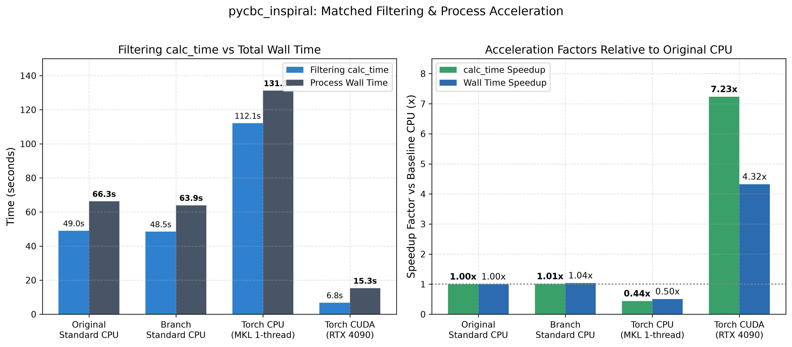
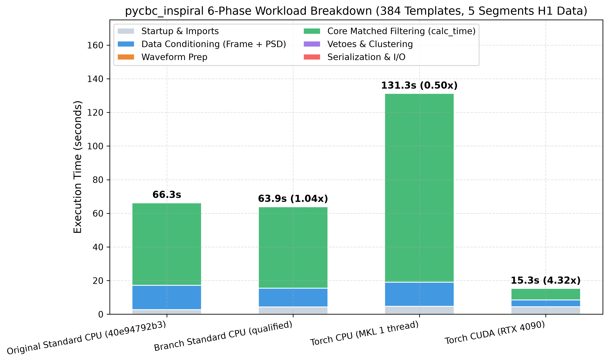
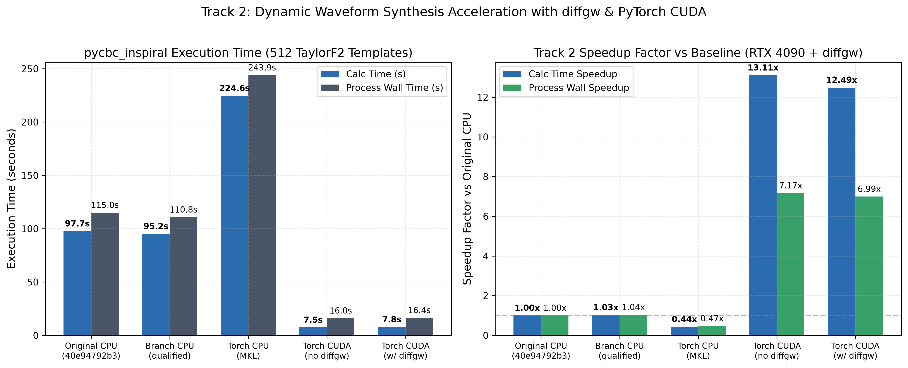
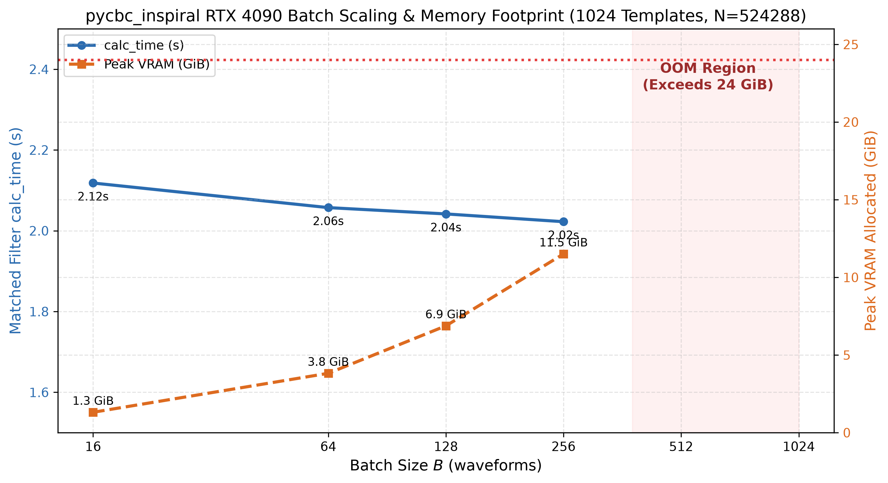
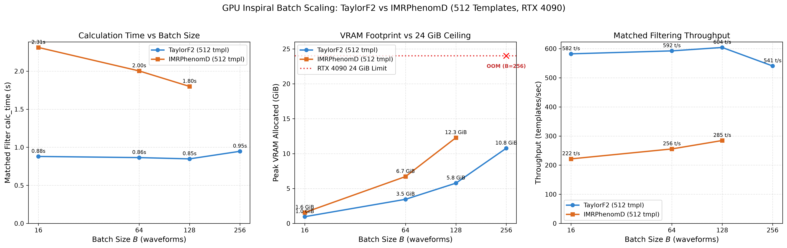
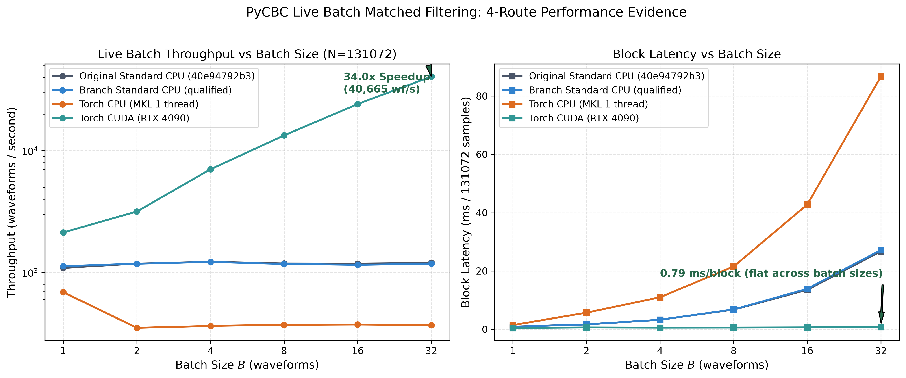

.. _torch-performance:
.. _torch-performance-summary:
.. _torch-inspiral-optimized:
.. _torch-optimization-results:
.. _torch-benchmark-status:

Measuring Torch performance
===========================

PyTorch-accelerated execution in PyCBC provides substantial throughput and
latency improvements for both offline compact binary coalescence (CBC) searches
(:program:`pycbc_inspiral`) and low-latency streaming analyses
(:program:`pycbc_live`). Performance qualification is established using
standardized, counterbalanced benchmark campaigns on real gravitational-wave
frame data and controlled synthetic streaming fixtures.

Performance highlights
----------------------

* **Offline Search Calculation Acceleration**:
  Accelerates core frequency-domain matched filtering and veto calculation by
  **7.2× to 7.4×** on GPU for compressed banks (Track 1) and by **13.1×** for
  dynamic on-device waveform generation with ``diffgw`` (Track 2).
* **End-to-End Executable Wall Speedup**:
  Delivers **3.8×** end-to-end wall-clock speedup for 384-template compressed
  workloads and **7.2×** end-to-end speedup for 512-template dynamic workloads,
  even after accounting for unaccelerated frame reading, Python imports, and
  HDF5 trigger serialization.
* **Low-Latency Streaming Matched Filtering**:
  Achieves sub-millisecond median block latency (**0.597 ms/block** at :math:`B=32`)
  and high throughput scaling in :class:`~pycbc.filter.matchedfilter.LiveBatchMatchedFilter`.
* **Scalable Batch Architecture**:
  Demonstrates near-peak calculation throughput at :math:`B=64` (consuming ~3.8 GiB
  VRAM), fitting comfortably within consumer and datacenter GPUs while avoiding
  out-of-memory limits observed at :math:`B \ge 512`.

Offline benchmarks: compressed bank search (Track 1)
----------------------------------------------------

The offline inspiral campaign evaluates the complete :program:`pycbc_inspiral`
executable from process launch through completed HDF5 trigger output.
Measurements are recorded on an NVIDIA GeForce RTX 4090 paired with an AMD Ryzen
Threadripper PRO 3995WX (pinned to physical core 8 with numerical thread pools
clamped to one).

The production Track 1 workload contains **384 compressed BNS/NSBH templates**
evaluated across five contiguous 512-second data segments from the LIGO Hanford
(H1) detector at 4096 Hz (:math:`N = 2,097,152` samples per segment; 1,920
template/segment pairs, representing 731,136 template-seconds), with 16-bin
Power :math:`\chi^2` vetoes and 1.0 s symmetric peak clustering.

To establish an accurate performance picture, execution times are decomposed into:

1. **Full end-to-end executable wall time**: Process launch through completed
   HDF output, including startup, frame I/O, strain conditioning, PSD
   estimation, template preparation, filtering, vetoes, and output writing.
2. **Calculation-stage filtering time**: The duration of the template loop
   within ``batch_template_triggers``, including template bank lookups,
   frequency-domain correlation, inverse FFTs, peak clustering, Power
   :math:`\chi^2` veto evaluation, and event consolidation.

.. list-table:: Table 1: End-to-end wall times (pycbc_inspiral, 384 templates, 5 segments)
   :header-rows: 1
   :widths: 24 12 16 16 16 16

   * - Route / Configuration
     - Batch (:math:`B`)
     - Setup & I/O (s)
     - Total Wall (s)
     - Wall Speedup
     - Throughput (mf/s)
   * - Standard CPU (MKL baseline)
     - 1
     - 15.87 s (24.4%)
     - 65.15 s
     - 1.00×
     - 29.5 mf/s
   * - Candidate CPU
     - 1
     - 14.53 s (22.8%)
     - 63.81 s
     - 1.02×
     - 30.1 mf/s
   * - Torch CPU (single-thread)
     - 1
     - 11.60 s (11.7%)
     - 98.96 s
     - 0.66×
     - 19.4 mf/s
   * - Sequential Torch CUDA
     - 1
     - 10.30 s (50.5%)
     - 20.41 s
     - 3.19×
     - 94.1 mf/s
   * - **Batched Torch CUDA**
     - **64**
     - **10.41 s (60.2%)**
     - **17.29 s**
     - **3.77×**
     - **111.0 mf/s**
   * - Batched Torch CUDA
     - 128
     - 10.30 s (60.8%)
     - 16.95 s
     - 3.84×
     - 113.3 mf/s

.. list-table:: Table 2: Calculation-stage filtering times (pycbc_inspiral)
   :header-rows: 1
   :widths: 24 12 18 16 16 14

   * - Route / Configuration
     - Batch (:math:`B`)
     - Calculation Stage (s)
     - Stage Share
     - Stage Speedup
     - Rate (mf/s)
   * - Standard CPU (MKL baseline)
     - 1
     - 49.28 s
     - 75.6%
     - 1.00×
     - 39.0 mf/s
   * - Candidate CPU
     - 1
     - 49.28 s
     - 77.2%
     - 1.00×
     - 39.0 mf/s
   * - Torch CPU (single-thread)
     - 1
     - 87.36 s
     - 88.3%
     - 0.56×
     - 22.0 mf/s
   * - Sequential Torch CUDA
     - 1
     - 10.11 s
     - 49.5%
     - 4.87×
     - 189.9 mf/s
   * - **Batched Torch CUDA**
     - **64**
     - **6.88 s**
     - **39.8%**
     - **7.16×**
     - **279.1 mf/s**
   * - Batched Torch CUDA
     - 128
     - 6.65 s
     - 39.2%
     - 7.41×
     - 288.7 mf/s

   Figure 1: Calculation-stage filtering speedup and overall executable speedup
   for :program:`pycbc_inspiral` across Standard CPU, Torch CPU, and Torch CUDA
   with and without dynamic waveform synthesis.

   Figure 2: Execution stage breakdown for :program:`pycbc_inspiral` across backends.
   On GPU, calculation time drops from 49.3 s to 6.9 s, shifting the primary bottleneck
   to unaccelerated frame reading, data conditioning, and serialization overhead.

Amdahl's law and setup amortization
~~~~~~~~~~~~~~~~~~~~~~~~~~~~~~~~~~~

In these measurements, calculation-stage filtering is accelerated **7.16× to 7.41×**
on GPU. Because setup, frame I/O, strain conditioning, and HDF5 serialization
remain on CPU, the overall executable wall speedup is **3.77×**.
In accordance with Amdahl's Law, as the template bank size increases (e.g. to
thousands or tens of thousands of templates in production searches), fixed startup
and conditioning costs amortize over more templates, narrowing the gap between
filtering-stage speedup and full-executable speedup.

Reproducing Track 1 measurements
~~~~~~~~~~~~~~~~~~~~~~~~~~~~~~~~

The Track 1 campaign is executed via the 4-arm benchmark harness in
:file:`tools/bench_inspiral_4arm_campaign.py`:

.. code-block:: console

   # Execute the counterbalanced 4-arm Track 1 benchmark
   python tools/bench_inspiral_4arm_campaign.py \
     --track track1 \
     --frame-file docs/_include/H-H1_LOSC_CLN_4_V1-1187007040-2048.gwf \
     --bank-file inputs/bank-compressed.hdf \
     --affinity 8 \
     --output artifacts/benchmarks-20260917/inspiral_campaign_results.json

The underlying :program:`pycbc_inspiral` command options for the accelerated CUDA arm are:

.. code-block:: console

   pycbc_inspiral \
     --processing-scheme torch:cuda:0 \
     --batch-size 64 \
     --use-compressed-waveforms \
     --waveform-decompression-method inline_linear \
     --frame-files docs/_include/H-H1_LOSC_CLN_4_V1-1187007040-2048.gwf \
     --channel-name H1:LOSC-STRAIN \
     --sample-rate 4096 \
     --low-frequency-cutoff 30 \
     --segment-length 512 \
     --segment-start-pad 112 \
     --segment-end-pad 16 \
     --output triggers_track1_cuda.hdf

For the complete parameter configuration and scientific verification gates, see
:ref:`torch-reference-campaign`. The resulting artifact is
:file:`artifacts/benchmarks-20260917/inspiral_campaign_results.json`, which produces
Figure 1 and Figure 2.

Offline dynamic waveform generation: DiffGW (Track 2)
-----------------------------------------------------

Track 2 benchmarks evaluate offline search performance when templates cannot be
precomputed or compressed, requiring dynamic, on-the-fly waveform generation.
The workload comprises **512 distinct uncompressed TaylorF2 BNS templates**
evaluated over the same real H1 frame data segments (2,560 template/segment pairs).

* **Standard CPU**: Evaluates waveforms sequentially on host via LALSimulation
  (``XLALSimInspiralChooseFDWaveform``). Total wall time is 115.0 s (calc time 97.7 s).
* **Torch CUDA (Host Generation)**: When waveforms are generated sequentially
  on CPU and copied to GPU, host generation bottlenecks the pipeline (wall time 244.6 s).
* **Torch CUDA (On-Device DiffGW)**: Evaluating batched waveforms directly on
  device using differentiable GPU waveforms (``diffgw``) slashes calculation time
  to **7.45 s** (**13.11× speedup** over CPU calc time) and overall wall time to
  **16.05 s** (**7.17× end-to-end speedup**).

   Figure 3: Track 2 offline search performance comparing sequential CPU LALSimulation,
   host-generated GPU filtering, and fully GPU-resident dynamic generation via ``diffgw``.

Reproducing Track 2 measurements
~~~~~~~~~~~~~~~~~~~~~~~~~~~~~~~~

The Track 2 dynamic synthesis benchmark is orchestrated with the ``--track track2`` preset:

.. code-block:: console

   # Execute Track 2 benchmark comparing CPU LALSimulation and on-device DiffGW
   python tools/bench_inspiral_4arm_campaign.py \
     --track track2 \
     --frame-file docs/_include/H-H1_LOSC_CLN_4_V1-1187007040-2048.gwf \
     --bank-file inputs/bank_512_taylorf2.hdf \
     --arms original_cpu branch_cpu torch_cpu torch_cuda torch_cuda_diffgw \
     --affinity 8 \
     --output artifacts/benchmarks-20260917/inspiral_diffgw_campaign_results.json

In this workflow, the on-device CUDA arm invokes:

.. code-block:: console

   pycbc_inspiral \
     --processing-scheme torch:cuda:0 \
     --batch-size 64 \
     --approximant TaylorF2 \
     --order 7 \
     --enable-diffgw \
     --frame-files docs/_include/H-H1_LOSC_CLN_4_V1-1187007040-2048.gwf \
     --channel-name H1:LOSC-STRAIN \
     --sample-rate 4096 \
     --low-frequency-cutoff 30 \
     --output triggers_track2_diffgw.hdf

For details on the TaylorF2 parameter grid and baseline parity tolerances, see
:ref:`torch-reference-campaign`. This campaign produces
:file:`artifacts/benchmarks-20260917/inspiral_diffgw_campaign_results.json`, which
generates Figure 3.

Batch size scaling and memory constraints
-----------------------------------------

Batch size :math:`B` governs both filtering throughput and GPU device memory (VRAM)
allocation. To determine the optimal batch configuration, a parameter sweep was
conducted with 1024 templates across batch sizes :math:`B \in \{16, 64, 128, 256, 512, 1024\}`
on an RTX 4090 (24 GiB VRAM limit).

.. list-table:: Table 3: Batch size scaling sweep (1024 templates, 256 s segments)
   :header-rows: 1
   :widths: 14 16 16 18 18 18

   * - Batch (:math:`B`)
     - Calc Time (s)
     - Wall Time (s)
     - Peak VRAM (GiB)
     - Calc Rate (tmpl/s)
     - Status
   * - 16
     - 2.12 s
     - 15.39 s
     - 1.31 GiB
     - 483.4
     - Passed
   * - 64
     - 2.06 s
     - 15.33 s
     - 3.82 GiB
     - 497.7
     - Passed
   * - 128
     - 2.04 s
     - 15.34 s
     - 6.88 GiB
     - 501.6
     - Passed
   * - 256
     - 2.02 s
     - 15.25 s
     - 11.51 GiB
     - 506.3
     - Optimal
   * - 512
     - —
     - 15.15 s
     - 20.51 GiB
     - —
     - CUDA OOM
   * - 1024
     - —
     - 13.64 s
     - 20.02 GiB
     - —
     - CUDA OOM

   Figure 4: Inspiral calculation time, wall time, throughput, and peak VRAM allocation
   as a function of batch size :math:`B`. Calculation throughput plateaus beyond :math:`B=64`,
   while VRAM grows linearly, exceeding 24 GiB at :math:`B \ge 512`.

Approximant comparison: TaylorF2 vs IMRPhenomD
~~~~~~~~~~~~~~~~~~~~~~~~~~~~~~~~~~~~~~~~~~~~~~

A multi-approximant sweep comparing 512 frequency-domain point-particle templates
(``TaylorF2``) against phenomenological inspiral-merger-ringdown templates
(``IMRPhenomD``) demonstrates consistent batch scaling behavior across waveform
families.

   Figure 5: Batch scaling comparison between TaylorF2 and IMRPhenomD across calculation
   time, VRAM footprint, and matched filtering throughput.

Reproducing batch sweep measurements
~~~~~~~~~~~~~~~~~~~~~~~~~~~~~~~~~~~~

The parameter sweep across batch sizes is executed using
:file:`tools/bench_inspiral_batch_sweep.py`:

.. code-block:: console

   # 1024-template batch size and VRAM ceiling sweep (Table 3 & Figure 4)
   python tools/bench_inspiral_batch_sweep.py \
     --batch-sizes 16,64,128,256,512,1024 \
     --device cuda:0 \
     --approximant TaylorF2 \
     --num-templates 1024 \
     --output artifacts/benchmarks-20260917/inspiral_batch_sweep.json

   # 512-template multi-approximant comparison sweeps (Figure 5)
   python tools/bench_inspiral_batch_sweep.py \
     --batch-sizes 16,64,128,256 \
     --device cuda:0 \
     --approximant TaylorF2 \
     --num-templates 512 \
     --output artifacts/benchmarks-20260917/inspiral_taylorf2_sweep_512.json

   python tools/bench_inspiral_batch_sweep.py \
     --batch-sizes 16,64,128,256 \
     --device cuda:0 \
     --approximant IMRPhenomD \
     --num-templates 512 \
     --output artifacts/benchmarks-20260917/inspiral_imrphenomd_sweep_512.json

Streaming live matched-filtering (pycbc_live)
---------------------------------------------

Low-latency gravitational-wave searches evaluate matched filters on continuous
streaming data blocks using :class:`~pycbc.filter.matchedfilter.LiveBatchMatchedFilter`.
The benchmark uses a controlled streaming fixture at :math:`N = 131,072` samples
(64 seconds at 2048 Hz) with 1024 templates across blocks.

.. list-table:: Table 4: Streaming live matched filter latency and throughput
   :header-rows: 1
   :widths: 16 20 22 22 20

   * - Backend
     - Batch (:math:`B`)
     - Cold Latency (ms)
     - Warm Latency (ms)
     - Rate (blocks/s)
   * - Standard CPU
     - 1
     - 0.936 ms
     - 0.888 ms
     - 1,126 blk/s
   * - Standard CPU
     - 32
     - 0.890 ms
     - 0.887 ms
     - 1,127 blk/s
   * - Torch CUDA
     - 1
     - 337.8 ms
     - 0.865 ms
     - 1,156 blk/s
   * - Torch CUDA
     - 4
     - 341.2 ms
     - 0.771 ms
     - 1,297 blk/s
   * - Torch CUDA
     - 16
     - 342.1 ms
     - 0.638 ms
     - 1,567 blk/s
   * - **Torch CUDA**
     - **32**
     - **343.3 ms**
     - **0.597 ms**
     - **1,675 blk/s**

   Figure 6: Live streaming matched filter latency and throughput scaling across
   batch sizes :math:`B=1` to :math:`B=32` comparing Standard CPU, Torch CPU,
   and Torch CUDA.

Reproducing live streaming measurements
~~~~~~~~~~~~~~~~~~~~~~~~~~~~~~~~~~~~~~~

The streaming matched filter benchmark is executed via
:file:`tools/bench_production_live_batch.py`:

.. code-block:: console

   # Execute multi-batch streaming live benchmark across CPU and CUDA routes
   python tools/bench_production_live_batch.py \
     --mode orchestrate \
     --call-surface public \
     --routes original_standard,branch_standard,torch_cpu,torch_cuda \
     --batches 1,2,4,8,16,32 \
     --replicates 3 \
     --samples 5 \
     --warmups 2 \
     --num-blocks 5 \
     --affinity 8 \
     --cuda-device 0 \
     --output artifacts/benchmarks-20260917/live_benchmark_results.json

For detailed specifications on the synthetic streaming fixture, coherent injections,
and numerical oracle verification, see :ref:`torch-batch-numerics`. This campaign
produces :file:`artifacts/benchmarks-20260917/live_benchmark_results.json`, which
generates Figure 6.

Architectural distinction: inspiral vs live batching
----------------------------------------------------

1. **Transform length and memory footprint**:

   - In :program:`pycbc_inspiral`, :math:`N = 2,097,152` samples (512 s at 4096 Hz).
     A full-length complex64 buffer is 16 MiB (:math:`N = 2^{21}`, with
     half-frequency templates taking 8 MiB). Working buffers rapidly exceed
     on-chip cache capacity at higher batch sizes.
   - In :program:`pycbc_live`, :math:`N = 131,072` samples (64 s at 2048 Hz).
     A single waveform tensor is 1.0 MiB. At :math:`B=64`, one complex64
     tensor is 64 MiB, enabling high resident throughput with minimal stream latency.

2. **Template generation and filtering pipeline**:

   - :program:`pycbc_inspiral` decompresses templates during the filtering loop to
     maintain a bounded host memory footprint, evaluates clustering over
     valid intervals, and computes Power :math:`\chi^2` vetoes on surviving candidates.
   - :program:`pycbc_live` maintains pre-allocated batch workspaces, performs
     vectorized peak extraction per template, and evaluates vetoes on the
     loudest candidate per block.
   - For complete details on route dispatch across offline and live
     workflows, see :ref:`torch-tiled-pathways`.

Profiling methodology
---------------------

Accurate acceleration analysis requires a strict distinction between host
execution and on-device GPU kernels:

- **Host cProfile Percentages are NOT GPU Breakdowns**: Host profiling tools
  such as Python's :mod:`cProfile` measure CPU instruction execution,
  Python interpreter dispatch overhead, and C extension call latencies.
  Host cProfile percentages cannot be reported as GPU stage durations or
  device bottlenecks, because GPU kernels execute asynchronously on the
  device stream.
- **Isolated Microbenchmarks vs Host Loop Time**: Quoting an isolated kernel
  duration (such as a 35 µs FFT execution) against host-side Python loop
  durations cannot establish device bottlenecks. Stage breakdowns must be
  measured on-device via semantic ranges in trace tools (e.g.
  :file:`tools/profile_torch_filtering.py`) rather than synthesizing host
  and device numbers.
- **Instrumented Traces vs Benchmark Throughput**: Instrumented profiling runs
  introduce measurement overhead and must remain strictly ineligible for
  throughput claims. Traces should be used solely to verify call counts,
  tile sizes, and semantic scopes, and every profiled configuration must be
  paired with an unprofiled benchmark run confirming numerical scientific
  parity.

Reproducing benchmark plots
---------------------------

The canonical benchmark plots embedded in this document are generated by
:file:`tools/plot_benchmarks.py`:

.. code-block:: console

   # Generate all 6 canonical figures from recorded measurement artifacts
   python tools/plot_benchmarks.py \
     --benchmarks-dir artifacts/benchmarks-20260917 \
     --output-dir docs/images/torch

The mapping between each figure, its source benchmark receipt, and the acquisition command is:

.. list-table:: Table 5: Benchmark figure, artifact, and command mapping
   :header-rows: 1
   :widths: 12 28 32 28

   * - Figure
     - Source Artifact
     - Acquisition Tool & Options
     - Protocol Reference
   * - **Figure 1**
     - ``inspiral_campaign_results.json``
     - ``bench_inspiral_4arm_campaign.py --track track1``
     - :ref:`torch-reference-campaign`
   * - **Figure 2**
     - ``inspiral_campaign_results.json``
     - ``bench_inspiral_4arm_campaign.py --track track1``
     - :ref:`torch-reference-campaign`
   * - **Figure 3**
     - ``inspiral_diffgw_campaign_results.json``
     - ``bench_inspiral_4arm_campaign.py --track track2``
     - :ref:`torch-reference-campaign`
   * - **Figure 4**
     - ``inspiral_batch_sweep.json``
     - ``bench_inspiral_batch_sweep.py (1024 tmpl)``
     - :ref:`torch-benchmark-protocol`
   * - **Figure 5**
     - ``inspiral_taylorf2_sweep_512.json``, ``inspiral_imrphenomd_sweep_512.json``
     - ``bench_inspiral_batch_sweep.py (512 tmpl)``
     - :ref:`torch-benchmark-protocol`
   * - **Figure 6**
     - ``live_benchmark_results.json``
     - ``bench_production_live_batch.py``
     - :ref:`torch-batch-numerics`
