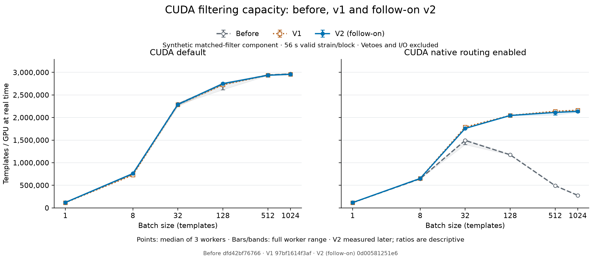

# CUDA refinement: before, v1 and later v2 measurements

Before and v1 came from the original paired campaign. V2 was measured afterward in a separate follow-on run. Ratios involving v2 match replicate labels for description; they are not paired timing estimates and do not remove possible run-period effects. The original before/v1 results remain unchanged.

| Version | Commit | Tree |
| --- | --- | --- |
| Before | `dfd42bf76766cadca0eecf609a1eaeac73534676` | `b0d5ef6e3b39bfe246b4c416528839256edadf1f` |
| V1 | `97bf1614f3afe53a6e2edb4d8c7dff79e9661782` | `d9819f6f6ebf2998ac967178778cc1911757e455` |
| V2 (follow-on) | `0d00581251e642a5d6b56b2497a9adad93069e6b` | `fa7a7c09df6d93133324f762d756842de172433d` |

Original campaign: 2026-09-06T14:42:37.468714+00:00 to 2026-09-06T15:47:33.542233+00:00.

V2 run: 2026-09-06T16:06:42.185979+00:00 to 2026-09-06T16:12:39.036084+00:00.

V2 timing began: 2026-09-06T16:08:06.956735+00:00.

Capacity cells are median [minimum, maximum] in templates/GPU at real time across three workers.

| Route | Batch | Before | V1 | V2 (follow-on) |
| --- | ---: | ---: | ---: | ---: |
| torch_cuda | 1 | 120,578.8 (119,081.9–120,643.9) | 115,652.9 (114,427.3–116,066.0) | 120,269.2 (118,702.7–121,081.3) |
| torch_cuda | 8 | 749,473.9 (746,812.3–761,471.4) | 728,223.6 (723,721.5–743,517.5) | 761,429.5 (751,835.5–761,663.4) |
| torch_cuda | 32 | 2,298,638.3 (2,277,604.2–2,309,412.3) | 2,287,623.6 (2,240,933.7–2,311,720.2) | 2,289,832.5 (2,267,470.4–2,318,534.6) |
| torch_cuda | 128 | 2,742,214.6 (2,616,437.5–2,770,674.1) | 2,725,105.7 (2,723,551.9–2,761,240.2) | 2,752,383.8 (2,725,530.9–2,756,699.7) |
| torch_cuda | 512 | 2,942,934.0 (2,930,361.6–2,947,597.6) | 2,938,440.4 (2,932,327.3–2,954,534.2) | 2,936,429.8 (2,930,892.4–2,942,436.9) |
| torch_cuda | 1024 | 2,965,339.6 (2,951,922.3–2,968,097.3) | 2,956,722.7 (2,948,978.7–2,988,596.7) | 2,958,465.8 (2,946,126.3–2,966,484.2) |
| torch_cuda_native | 1 | 117,016.1 (115,665.7–118,002.6) | 113,102.8 (111,842.3–113,831.4) | 117,691.2 (117,012.0–118,283.2) |
| torch_cuda_native | 8 | 643,704.1 (642,323.7–650,793.6) | 653,666.6 (652,785.6–659,768.2) | 651,635.1 (650,447.7–656,672.3) |
| torch_cuda_native | 32 | 1,494,216.2 (1,400,792.3–1,509,139.0) | 1,789,577.5 (1,767,121.3–1,798,792.2) | 1,759,054.1 (1,758,795.7–1,764,236.2) |
| torch_cuda_native | 128 | 1,175,811.4 (1,171,916.7–1,182,439.1) | 2,047,704.2 (2,043,300.0–2,050,645.9) | 2,046,052.4 (2,032,584.1–2,059,151.2) |
| torch_cuda_native | 512 | 490,941.7 (490,608.7–492,026.9) | 2,138,968.4 (2,132,888.3–2,157,802.9) | 2,113,857.4 (2,058,892.2–2,128,957.0) |
| torch_cuda_native | 1024 | 277,782.9 (277,133.5–278,305.4) | 2,162,886.4 (2,157,512.7–2,167,719.6) | 2,136,246.3 (2,112,434.2–2,175,096.8) |

Ratios are median [minimum, maximum] of the three replicate-matched worker ratios. V2 comparisons span separate run periods.

| Route | Batch | V1 / before | V2 / before | V2 / V1 |
| --- | ---: | ---: | ---: | ---: |
| torch_cuda | 1 | 0.959 (0.948–0.975) | 1.004 (0.984–1.010) | 1.037 (1.036–1.047) |
| torch_cuda | 8 | 0.966 (0.956–0.996) | 1.007 (1.000–1.016) | 1.046 (1.011–1.052) |
| torch_cuda | 32 | 0.991 (0.984–1.006) | 0.996 (0.996–1.004) | 1.012 (0.991–1.014) |
| torch_cuda | 128 | 1.007 (0.983–1.042) | 0.995 (0.994–1.052) | 1.010 (0.987–1.012) |
| torch_cuda | 512 | 1.001 (0.998–1.002) | 1.000 (0.996–1.000) | 1.000 (0.994–1.001) |
| torch_cuda | 1024 | 1.002 (0.994–1.007) | 0.998 (0.998–0.999) | 0.996 (0.993–1.003) |
| torch_cuda_native | 1 | 0.958 (0.956–0.984) | 1.011 (0.992–1.018) | 1.035 (1.034–1.058) |
| torch_cuda_native | 8 | 1.018 (1.003–1.025) | 1.010 (1.001–1.022) | 0.998 (0.986–1.005) |
| torch_cuda_native | 32 | 1.204 (1.171–1.278) | 1.181 (1.165–1.256) | 0.983 (0.981–0.995) |
| torch_cuda_native | 128 | 1.744 (1.732–1.744) | 1.746 (1.719–1.751) | 1.001 (0.993–1.004) |
| torch_cuda_native | 512 | 4.347 (4.347–4.395) | 4.309 (4.194–4.327) | 0.991 (0.954–0.995) |
| torch_cuda_native | 1024 | 7.804 (7.752–7.804) | 7.690 (7.590–7.849) | 0.985 (0.979–1.006) |

The complete original campaign passed its existing validation. This supplement adds 36 distinct v2 workers and 36 parity documents, with all 108 before/v1/v2 comparisons to the 18 reused standard controls passing independently recomputed trigger and aggregate norm checks.

| Parity metric | Maximum |
| --- | ---: |
| `max_snr_diff` | 2.86102295e-06 |
| `max_phase_diff` | 1.01170826e-07 |
| `max_sigmasq_relative_diff` | 2.38418551e-07 |
| `relative_output_l2_diff` | 1.53039932e-07 |

Every point is the median of three distinct worker throughput medians; ranges are the full minimum–maximum across workers, not confidence intervals. The JSON also retains each worker value and every replicate-matched ratio.

All workers use one thread, CPU affinity 8–11, the same interpreter and device, one cold iteration, one warmup and three timed iterations. Each timed iteration filters the batch against three strain blocks. Profiling is excluded.

Synthetic seeded templates and injected strain; N=131072, three strain blocks per iteration, complex64 inputs/outputs, SNR threshold 5.5. The public LiveBatchMatchedFilter.process_data API is timed with chi-square and sine-Gaussian vetoes disabled. Frame I/O, PSD estimation, bank loading, waveform generation and CLI startup are excluded. The raw unit templates/s counts one template filtered against one strain block. Native labels mean opt-in routing is enabled; admission can select a fallback for a given batch.

Real-time filtering capacity is derived from the measured template–block rate: multiply by 56 seconds of valid strain per block, then divide CPU routes by their configured 1- or 4-core budget. CUDA capacity uses one GPU and includes the timed host work. The CPU divisor is the configured thread count, not measured CPU utilization; affinity CPUs 8–11 are distinct physical cores. This is synthetic matched-filter component capacity with vetoes and I/O excluded, not complete production search capacity. Raw template–block rates and all unchanged ratios remain in JSON. The live harness's legacy throughput_wps_summary unit says waveforms/second, but its numerator is batch size times block count: template–block evaluations, not generated waveforms. That raw label is preserved; standalone waveform generation has a separate waveforms/second metric. The 56 s basis, pinned source trees, full file hashes and source excerpts are recorded in search_capacity_basis.

Each baseline and candidate is checked against the corresponding standard CPU control: trigger counts and template IDs, end times within 1e-4 s, SNR and wrapped phase differences below 1e-3, relative sigma-squared and aggregate output-norm differences below 1e-3. These checks do not establish pointwise equivalence of every matched-filter output sample. The supplement reuses the original standard controls for the same batch, seed and replicate and independently recomputes before/control, v1/control and v2/control comparisons. It does not contain newly measured contemporaneous standard controls.

This supplement covers the two CUDA matched-filter routes only. It does not replace the original full campaign report or claim new CPU or waveform timings. Native route labels indicate enabled admission gates and can include fallbacks; these records do not count native dispatches.

The input manifest preserves the hashes of the frozen original evidence, supplement status, all v2 worker/parity records and reporting scripts. JSON also retains full source identities, raw worker medians, every ratio and the separate ratio of aggregate medians.
