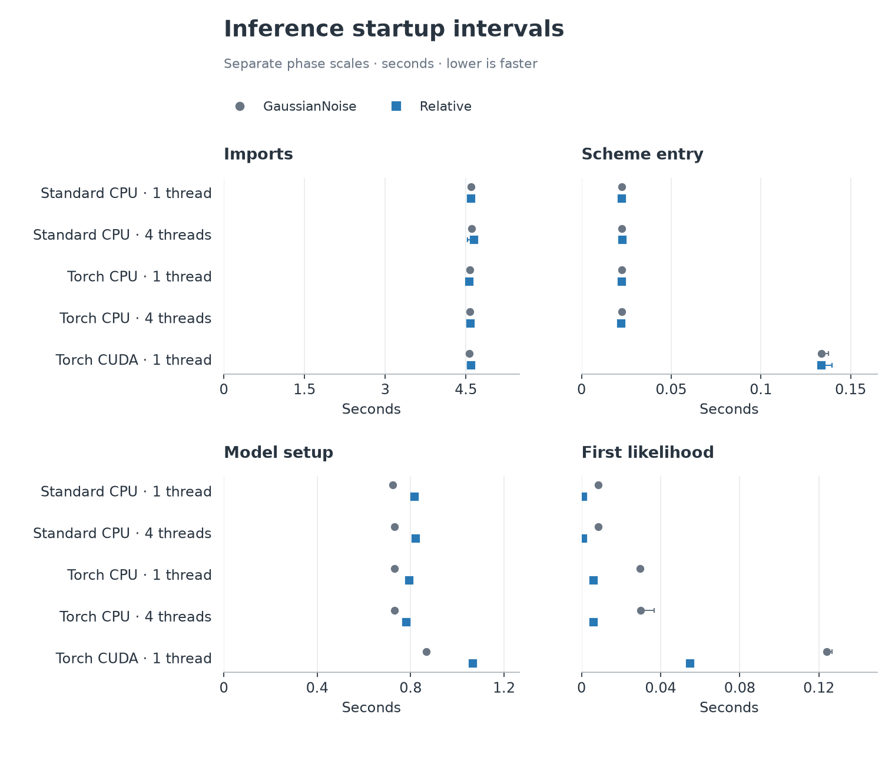
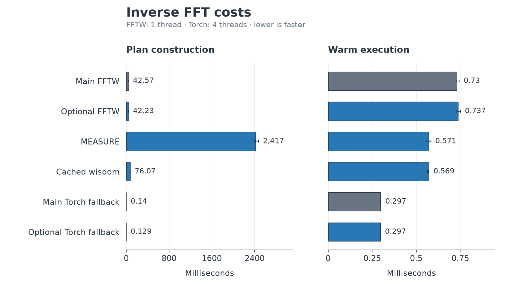

.. _torch-benchmark-details:

Benchmark details and reproduction
===================================

Start with :ref:`torch-inspiral-optimized` for executable measurements and
:ref:`torch-optimization-results` for supporting component comparisons.

Performance-fix campaign
------------------------

The paired campaign contains 252 live workers (including 36 standard CPU
controls), 108 waveform workers and 108 passing live parity records. It covers
batches 1, 8, 32, 128, 512 and 1024, CPU with one or four threads, and CUDA with
one host thread. Workers run sequentially with affinity 8--11. The second of
three replicates reverses before/after order. Profilers run separately from
the workers used for throughput claims.

Before source: ``dfd42bf76766cadca0eecf609a1eaeac73534676``.
After source: ``97bf1614f3afe53a6e2edb4d8c7dff79e9661782``.
The v1 after tree also corresponds to local fix commit
``450ab3f96ccea2783abb943b47f698578a507d59``. These are measured source revisions;
subsequent documentation and CI-selector edits do not constitute new timings.
Source files, trees and binary hashes are retained in the `fix evidence`_.

The v2 GPU follow-on measures
``0d00581251e642a5d6b56b2497a9adad93069e6b``. It repeats the two GPU routes
at all six batch sizes with three workers per configuration, after the original
campaign and postchecks finish. It reuses the earlier standard controls and
before/v1 records; the archive distinguishes these run periods. V2 leaves the
CPU reduction algorithm and waveform source unchanged. Separate main, FFT and
CPU branch test receipts identify the actual v2 qualification commits.

The optional CPU follow-up measures
``bd53914be6d2e4324cc867d52b3842b77cc6729a`` against
``1514327669fc7be125523b991c847868c3a2a17e``, with native peak
routing explicitly enabled on both. It contains 36 workers and 12 parity records.

The live-search figures convert the legacy template-blocks/s records to
templates/core at real time (CPU) or templates/GPU at real time (CUDA).
The frozen harness sets ``blocksize=56.0`` seconds and ``sample_rate=2048.0`` Hz;
the filter searches that 56-second valid segment within each 64-second FFT.
The conversion is ``rate * 56 / threads`` for CPU and ``rate * 56`` for CUDA.
Threads are the configured one/four-core compute budget, with affinity 8--11
covering four distinct physical cores. This normalization changes neither the
timings nor speed ratios. It describes this synthetic matched-filter component;
I/O, PSD estimation, waveform generation and veto costs are excluded.
The live harness's legacy ``throughput_wps_summary`` field says
``waveforms/second`` but counts template-block evaluations; the reports preserve
that raw record and use the actual numerator for the conversion.

At batch 1024, the baseline native CUDA profile spent about 1.06 s of a
1.10 s instrumented call checking overlaps, with 1,573,376 pair comparisons.
The baseline native CPU profile spent about 2.09 s of a 4.09 s call reducing
peaks and 1.01 s checking overlaps. These instrumented values attribute costs;
they are not throughput measurements. Baseline and candidate Python and Torch
operator profiles are both retained in the `fix evidence`_.

The v1 native CUDA profile reduces overlap-validation cumulative time from
1055.89 ms to
2.78 ms.
The native CPU profile reduces peak-extraction cumulative time from
2085.84 ms to
770.81 ms.
These are separate instrumented calls. The `profile attribution`_ reports all
12 before/v1 profile pairs, full operator counts and source paths. The waveform
specialization removes arithmetic involving known-zero terms while preserving
Horner order; it does not remove the logarithm evaluations.

The `fix reproduction instructions`_ describe the exact public workloads,
flags, source preparation, correctness checks and separate profiling commands.
The `paired report`_ includes three-worker ranges and all before/after ratios.
The :download:`performance figure manifest <images/torch-performance-fix-20260906/manifest.json>`
records the measured revisions, report and renderer hashes, and image hashes.
To regenerate the paired figures from the archive supplement, run:

.. code-block:: console

   python build-report.py --input comparison --out report-new

The validator requires all expected records, passing parity, matching source
identities and consistent runtime metadata. It recomputes live parity from
recorded triggers and norms. Missing or failed cells are not plotted.

Earlier campaign details
------------------------

The following startup, FFT, optional CPU and source records predate the
performance fixes. Their original revisions and immutable links are preserved.

Startup costs
~~~~~~~~~~~~~~

Median first-call costs across the TaylorF2 workloads were
**1.996--2.121 s with Triton**, versus **0.398--0.503 s without it**.
Each worker had a fresh Triton cache. Timing
includes compilation and lazy initialization; the CUDA driver cache was not
cleared. These timings are separate from warm throughput.

.. figure:: images/torch-benchmarks-20260906/taylorf2-cold.png
   :alt: First TaylorF2 call with Triton off and on; about 0.4 versus 2.0 seconds across the tested workloads.
   :width: 100%

   First-call latency; lower is faster.

Inference startup was measured in four separate intervals. They exclude some
process startup work and must not be added up as a complete startup measurement.

   Separate intervals in seconds; lower is faster. Marker shapes distinguish
   ``GaussianNoise`` from ``Relative``.

FFT planning and execution
~~~~~~~~~~~~~~~~~~~~~~~~~~

For a length-131072 ``complex64`` inverse FFT with one thread, FFTW MEASURE
reduced warm execution from **0.737 to 0.571 ms**, while plan construction
rose from **42 to 2,417 ms**. Reusing cached wisdom reduced plan construction
to **76 ms**, with **0.569 ms** execution. The four-thread Torch fallback
was faster at **0.297 ms**. This single-vector test covers cache behavior,
not every batch-layout change in the optional FFT follow-up.

   Separate planning and execution scales. `FFT records`_ include numerical,
   dispatch and cache checks.

Optional CPU tuning
~~~~~~~~~~~~~~~~~~~~

At batch 1024, the optional native CPU configuration was **2.65x** the main
native configuration with one thread and **2.14x** with four threads.
Standard CPU was still faster. The optional configuration also enables a CPU
peak kernel, so this comparison includes a flag change as well as code changes.

.. figure:: images/torch-benchmarks-20260906/optional-cpu.png
   :alt: Standard CPU, main native Torch CPU and optional native Torch CPU throughput across batch sizes and thread counts.
   :width: 100%

   Correlation and FFTW batching are requested in both native configurations;
   optional CPU also requests native batch peaks. `Dispatch probes`_ identify
   which kernels ran. `Live records`_ retain all controls and configurations.

Methods and source revisions
~~~~~~~~~~~~~~~~~~~~~~~~~~~~

Workers ran sequentially on a shared Linux host with CPU affinity 8--11.
Reported centers are medians of three worker summaries; whiskers are their
observed minimum and maximum, not confidence intervals. Repeated samples
within a worker are not independent runs. CPU threads are stated per plot;
CUDA uses one host thread.

.. list-table:: Measured revisions
   :header-rows: 1
   :widths: 35 65

   * - Measurement
     - Source commit
   * - Live filtering, waveforms and Triton (six-batch sweep)
     - ``4885b64560e9f39b740e85b6a976898869dd360e``
   * - Optional CPU follow-up (six-batch sweep)
     - ``d544420232428225c214a4be84fbe1262a6d307b``
   * - Single-evaluation inference and main FFT control
     - ``607bce53ead14f12af32552a5b2441d3bc667267``
   * - Single-vector FFT follow-up
     - ``e6073eaf1a89cfed69af53707f52321eadf129f1``

These are assembled-source measurements, not separate timings of intermediate
PRs. Live filtering includes 252 timed workers in 84 comparison groups and
60 separate dispatch probes. The
waveform sweep includes 144 timed workers and 144 unsupported
requests retained without speed claims. The Triton comparison adds 72 timed
workers. All three sweeps use batches 1, 8, 32, 128, 512 and 1024; the baseline waveform
sweep explicitly disables Triton.

The 18 FFT and 30 inference workers are earlier single-vector and
single-parameter measurements. Their original source revisions remain above.
Separate :ref:`1024-row tests <torch-large-batches>` check batched FFT and
inference correctness. These were manual runs, not GitHub Actions measurements.

The results apply to these revisions and workloads. They do not qualify MPS,
complete production searches, sampler throughput, deadline jitter or other
hardware. See :ref:`torch-performance` for broader evidence requirements and
:ref:`torch-parity` for numerical contracts.

Reproduce the results and figures
~~~~~~~~~~~~~~~~~~~~~~~~~~~~~~~~~

The `immutable archive`_ retains raw samples, commands, environment records,
logs, figures and checksums. Follow the `six-batch instructions`_ to rerun live
filtering, waveform generation and Triton in new output directories. The
`historical instructions`_ cover the earlier scalar inference and FFT runs.

The documentation figures are simplified renderings of the archive's verified
summaries. The :download:`figure manifest <images/torch-benchmarks-20260906/manifest.json>`
records input hashes, selected cells, measured revisions and image hashes.
Live-filter, waveform and Triton figures show all six measured batch sizes
through 1024. Requested routes omitted from overview plots remain in the
linked full results, including slower and unsupported cases.

To regenerate the documentation figures from a checkout of the pinned archive,
run this command from the PyCBC source tree (requires Matplotlib):

.. code-block:: console

   python tools/plot_torch_benchmark_docs.py --archive ARCHIVE_CHECKOUT --output docs/images/torch-benchmarks-20260906

The renderer checks summary hashes before plotting. Documentation edits do
not constitute new measurements. Publish raw evidence before changing result
claims, preserve slower and unsupported cases, and inspect regenerated figures.

.. _immutable archive: https://github.com/xangma/pycbc/tree/7f1ea7a7aa05b4fdafe2995a43a754984a2c5817
.. _FFT records: https://github.com/xangma/pycbc/blob/7f1ea7a7aa05b4fdafe2995a43a754984a2c5817/report/fft-summary.md
.. _Live records: https://github.com/xangma/pycbc/blob/7f1ea7a7aa05b4fdafe2995a43a754984a2c5817/batch1024/report/live-summary.md
.. _Dispatch probes: https://github.com/xangma/pycbc/blob/7f1ea7a7aa05b4fdafe2995a43a754984a2c5817/batch1024/report/dispatch-summary.md
.. _six-batch instructions: https://github.com/xangma/pycbc/blob/7f1ea7a7aa05b4fdafe2995a43a754984a2c5817/batch1024/REPRODUCE.md
.. _historical instructions: https://github.com/xangma/pycbc/blob/7f1ea7a7aa05b4fdafe2995a43a754984a2c5817/REPRODUCE.md

.. _fix evidence: https://github.com/xangma/pycbc/blob/639154f7ef359eb473db79660942a2cd88dd59e6/performance-fix/README.md
.. _fix reproduction instructions: https://github.com/xangma/pycbc/blob/639154f7ef359eb473db79660942a2cd88dd59e6/performance-fix/REPRODUCE.md
.. _paired report: https://github.com/xangma/pycbc/blob/639154f7ef359eb473db79660942a2cd88dd59e6/performance-fix/report/report.md
.. _profile attribution: https://github.com/xangma/pycbc/blob/639154f7ef359eb473db79660942a2cd88dd59e6/performance-fix/profile-summary.md
