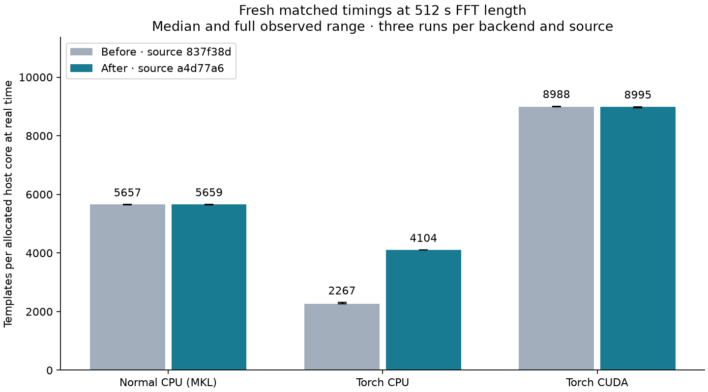
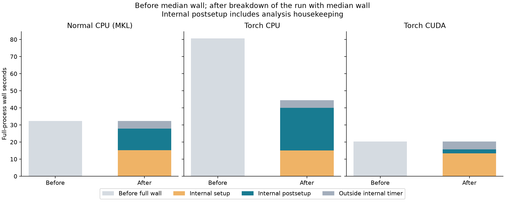
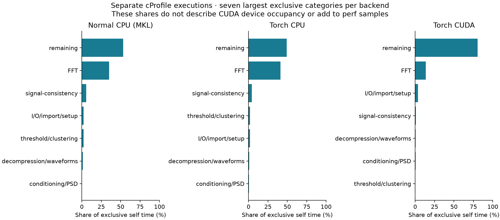

.. _torch-inspiral-optimized:

Optimized compressed-waveform search
====================================

Torch CPU completes the matched ``pycbc_inspiral`` workload in
**44.54 seconds**, down from
**80.63 seconds**: a
**1.81x** ratio of median full-process wall times.
The fresh normal CPU/MKL reference takes **32.30 seconds**.
The comparison below retains all backends, three independent unprofiled runs
per backend and source, and each observed minimum--maximum range.

The optimized source is ``a4d77a6d1863c0515e8dace64c5609b63d40b51e``; the before source is ``837f38d493420043e45fb1ad210a0ccf68bacbaa``.
The :ref:`torch-inspiral-reference` records that earlier campaign, its normal
CPU tuning and the profiles that identified the two costs addressed here.
Only the verified unchanged normal CPU tuning choice is reused. All optimized
waveform checks, triggers, matched timings and profiles were run again.
The `optimized report <https://github.com/xangma/pycbc/blob/639154f7ef359eb473db79660942a2cd88dd59e6/inspiral-reference-20260906/optimized-report-v6/report.json>`__ binds every
archived input and output to the corresponding source and execution receipt.

Matched workload and measured capacity
--------------------------------------

The workload contains 96 deterministic compressed templates: 64 BNS and 32 NSBH
parameter choices, using aligned-spin, point-particle IMRPhenomD waveforms at
30 Hz lower cutoff and 4096 Hz sample rate. It does not establish search-bank
coverage, astrophysical population throughput, tides or disruption accuracy.
The bank, data, PSD settings, vetoes, clustering and 512-second FFT segments
with 112/16-second start/end padding are identical across matched backends.
The `configuration <https://github.com/xangma/pycbc/blob/639154f7ef359eb473db79660942a2cd88dd59e6/inspiral-reference-20260906/config.json>`__ and
`bank metadata <https://github.com/xangma/pycbc/blob/639154f7ef359eb473db79660942a2cd88dd59e6/inspiral-reference-20260906/inputs/bank-metadata.json>`__ retain the exact inputs.

All runs use one allocated host core on ``len``, pinned to logical CPU 8, with
``OMP_NUM_THREADS=1`` and ``MKL_NUM_THREADS=1``. The hardware is recorded in the
`hardware inventory <https://github.com/xangma/pycbc/blob/639154f7ef359eb473db79660942a2cd88dd59e6/inspiral-reference-20260906/environment.json>`__. CUDA additionally consumes
one GPU. Its rate is normalized by the allocated host core and is not a
comparison of equal CPU-only resources or a templates/GPU measurement.

Each template searches 1904 unique valid detector seconds. Completed work is
96 x 1904 = 182784 template-seconds; capacity is ``182784 / full wall seconds``
in **templates per allocated host core at real time**. Full wall time includes
startup and successful final output writing. The finite interval does not
establish steady-state throughput or confidence intervals.

.. list-table:: Before and after; median (observed minimum--maximum)
   :header-rows: 1

   * - Backend
     - Before wall (s)
     - After wall (s)
     - After templates/core
     - After / before capacity
     - After / normal CPU capacity
   * - Normal CPU (MKL)
     - 32.31 (32.30--32.35)
     - 32.30 (32.28--32.39)
     - 5,659.49 (5,643.48--5,662.52)
     - 1.001x
     - 1.000x
   * - Torch CPU
     - 80.63 (79.11--80.72)
     - 44.54 (44.54--44.56)
     - 4,103.78 (4,101.60--4,104.24)
     - 1.810x
     - 0.725x
   * - Torch CUDA + one GPU
     - 20.34 (20.28--20.35)
     - 20.32 (20.32--20.39)
     - 8,994.65 (8,962.71--8,995.87)
     - 1.001x
     - 1.589x

   Three unprofiled processes per backend and source; error bars span the observations.

Ratios are quotients of the group medians. Before and after were measured
in separate run periods; they are descriptive comparisons and are not pooled
or treated as paired estimates. Every raw sample appears in the report tables.

What changed and how it was qualified
-------------------------------------

Torch CPU compressed-waveform linear interpolation now calls the existing
compiled CPU routine through shared array views when dtype, storage, aliasing
and differentiation constraints permit it. It retains Torch version tracking
and the generic device fallback. No compiled interpolation kernel was edited.
All 288 CPU template/grid cases are bitwise equal to normal CPU; all 288 CUDA
cases remain bitwise equal to the frozen earlier Torch CUDA implementation.

The qualified single-thread search inverse FFT sizes 1048576, 2097152 and
4194304 now use retained double-precision MKL input/output workspaces. The
108-case matrix spans three sizes, four seeds, three patterns and three scales.
Every enabled case is bitwise equal to the explicitly promoted MKL reference,
with relative L2 and maximum absolute error no worse than the original FFTW
single-precision reference. The direct single-precision route remains limited
to its previously qualified 32768 size; the larger direct-single alternative
failed the established error budget in part of the exploratory matrix.
The double-precision workspaces require extra retained memory; the full-run
peak RSS figures below include it. Other thread counts retain their fallback.

`Inverse-FFT qualification and dispatch decision <https://github.com/xangma/pycbc/blob/639154f7ef359eb473db79660942a2cd88dd59e6/inspiral-reference-20260906/large-ifft-v6-decision.json>`__, `full matrix <https://github.com/xangma/pycbc/blob/639154f7ef359eb473db79660942a2cd88dd59e6/inspiral-reference-20260906/large-ifft-v6.json>`__ and `compressed-bank parity <https://github.com/xangma/pycbc/blob/639154f7ef359eb473db79660942a2cd88dd59e6/inspiral-reference-20260906/compressed-bank-v6.json>`__ retain the checks.

.. list-table:: Optimized internal intervals and memory; medians
   :header-rows: 1

   * - Backend
     - Internal total (s)
     - Setup (s)
     - Postsetup (s)
     - Peak RSS (MiB)
   * - Normal CPU (MKL)
     - 27.78
     - 15.27
     - 12.52
     - 1204.72
   * - Torch CPU
     - 40.00
     - 15.14
     - 24.85
     - 1204.69
   * - Torch CUDA + one GPU
     - 15.65
     - 13.40
     - 2.25
     - 1469.20

   Before median wall and the after run with median wall, split using its actual internal timer.

Internal ``run_time`` excludes early imports/startup and final HDF writing.
Setup/postsetup use ``setup_time_fraction``; postsetup includes analysis
housekeeping and is not an isolated steady-filter interval.

Separate profiles
-----------------

Seven fresh profiled runs use the selected workload: cProfile and native
``perf cycles:u`` for all three backends, plus a Torch device trace for CUDA.
Their elapsed times are instrumented observations and are excluded from
capacity summaries. cProfile shares use exclusive self seconds, native shares
use sampled user-space cycles, and CUDA shares use profiler-visible device
event durations. These denominators cannot be added into one timeline or
interpreted as GPU occupancy. Nested cumulative call times are not additive.

.. list-table:: Profiling enabled; separate full-process wall times
   :header-rows: 1

   * - Backend
     - Profile
     - Wall (s)
   * - Normal CPU (MKL)
     - cprofile
     - 35.63
   * - Normal CPU (MKL)
     - perf
     - 35.15
   * - Torch CPU
     - cprofile
     - 48.20
   * - Torch CPU
     - perf
     - 47.18
   * - Torch CUDA + one GPU
     - cprofile
     - 23.99
   * - Torch CUDA + one GPU
     - perf
     - 23.14
   * - Torch CUDA + one GPU
     - torchprofile
     - 44.80

   Exclusive cProfile categories in the optimized runs; each backend has its own self-time denominator.

The `profile category table <https://github.com/xangma/pycbc/blob/639154f7ef359eb473db79660942a2cd88dd59e6/inspiral-reference-20260906/optimized-report-v6/profiles.csv>`__ and
`native symbols <https://github.com/xangma/pycbc/blob/639154f7ef359eb473db79660942a2cd88dd59e6/inspiral-reference-20260906/optimized-report-v6/native-symbols.csv>`__ retain all
categories and sample denominators. The
`optimized profile interpretation <https://github.com/xangma/pycbc/blob/639154f7ef359eb473db79660942a2cd88dd59e6/inspiral-reference-20260906/profile-interpretation-v6.md>`__ records
interpolation falling from 26.62 to 0.44 seconds and inverse FFTs from 26.84 to
17.82 seconds. These two disjoint call paths explain
98.48% of the profiled runtime
reduction. The remaining inverse-FFT gap accounts for
85.12% of the after-profile gap to
normal CPU. The qualified double-precision MKL workspace includes promotion
and conversion; their costs have not been isolated individually. The earlier
`profile interpretation <https://github.com/xangma/pycbc/blob/639154f7ef359eb473db79660942a2cd88dd59e6/inspiral-reference-20260906/profile-interpretation-v5.md>`__ attributes the
original interpolation and inverse-FFT costs to its explicitly recorded source.

Scientific validation and reproduction
--------------------------------------

All 10 report gates pass. The 19 campaign cases have 18
passing strict trigger comparisons against the selected normal CPU reference.
The unchanged trigger budgets are relative tolerance ``1e-4``, absolute tolerance
``1e-5``, phase tolerance ``1e-4`` radians and normalization relative tolerance
``1e-5``. The independent checks cover 288 waveform/PSD comparisons, 36 boundary
injections and 576 compressed-bank parity cases. The source unit run records:
470 passed, 69 skipped, 22 warnings, 8 subtests passed in 25.98s.

The `scientific acceptance <https://github.com/xangma/pycbc/blob/639154f7ef359eb473db79660942a2cd88dd59e6/inspiral-reference-20260906/scientific-validation-v6.json>`__ binds the
individual checks and their unchanged budgets. The
`unit receipt <https://github.com/xangma/pycbc/blob/639154f7ef359eb473db79660942a2cd88dd59e6/inspiral-reference-20260906/unit-tests-v6.json>`__ identifies the 22-file test command;
`source manifest <https://github.com/xangma/pycbc/blob/639154f7ef359eb473db79660942a2cd88dd59e6/inspiral-reference-20260906/source-v6.json>`__ records the four-file source change,
unchanged native binaries and the normal CPU implementation audit.
See `reproduction instructions <https://github.com/xangma/pycbc/blob/639154f7ef359eb473db79660942a2cd88dd59e6/inspiral-reference-20260906/REPRODUCE.md>`__ for reconstruction and
replay from the immutable bundles. To regenerate the optimized report into a
new directory, after restoring transported raw files:

.. code-block:: console

   python build-hotpath-report-v6.py --root . --source-manifest-sha256 f62d2e580fed9ba514a3df724546dc63c306b6805289c2ce37896325bcb95b2b --output-dir optimized-report-rebuilt

The :download:`figure manifest <images/torch-inspiral-optimized-20260906/manifest.json>`
pins the archive, before/after sources, validated report, builder and image hashes.
Earlier component, inference and Triton timings retain their original scope in
:ref:`torch-optimization-results` and :ref:`torch-benchmark-details`.
