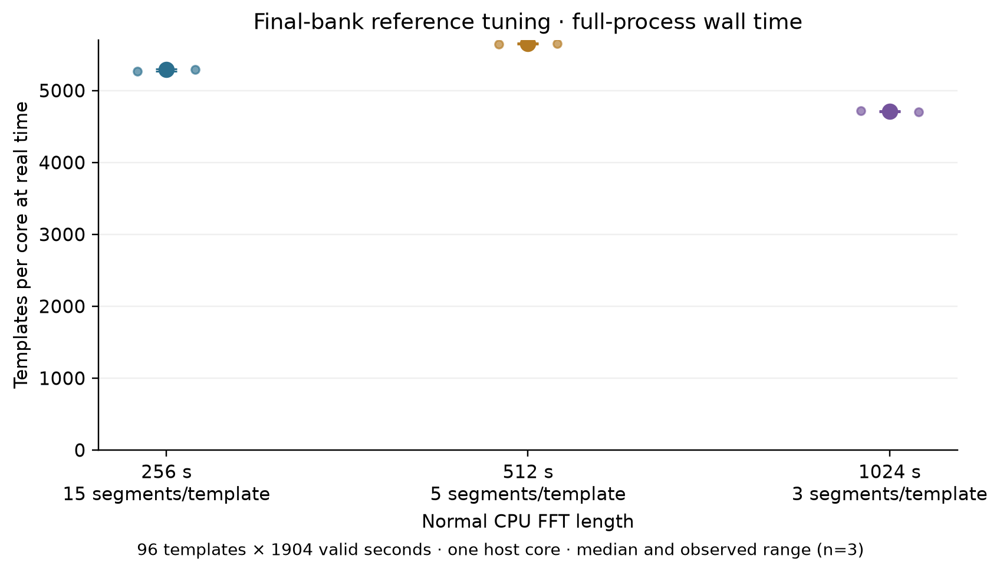
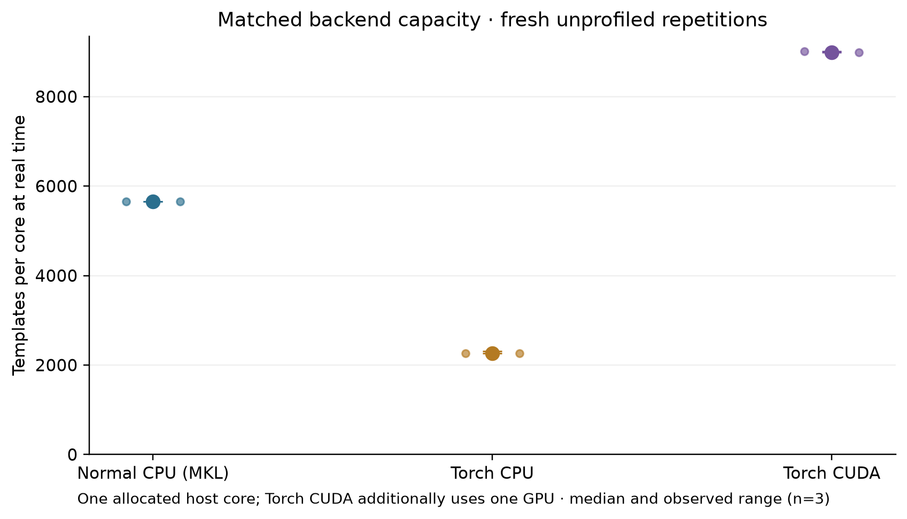
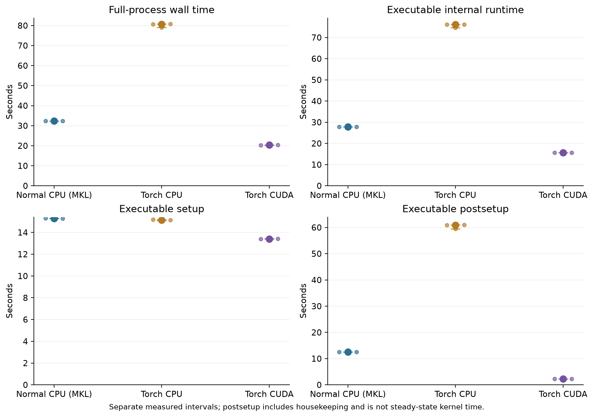
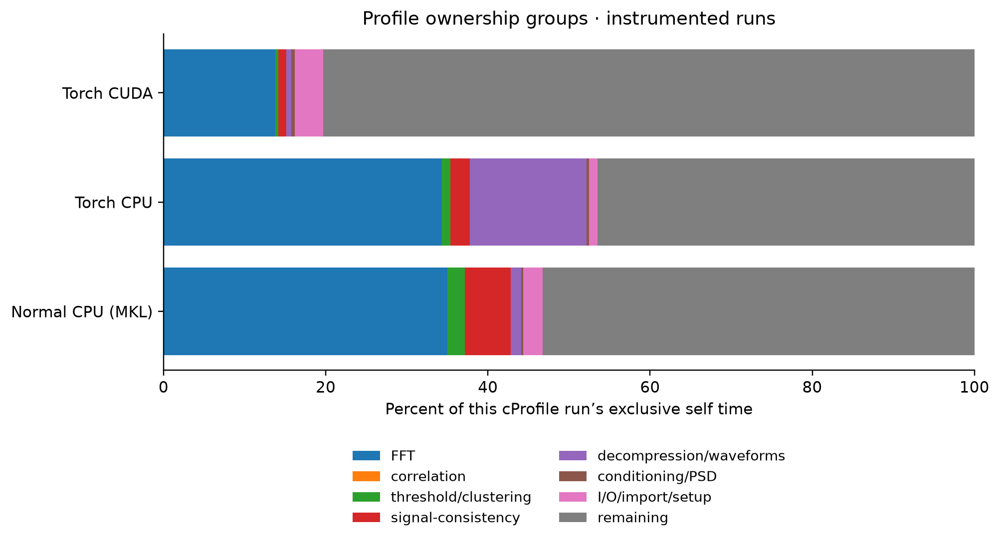
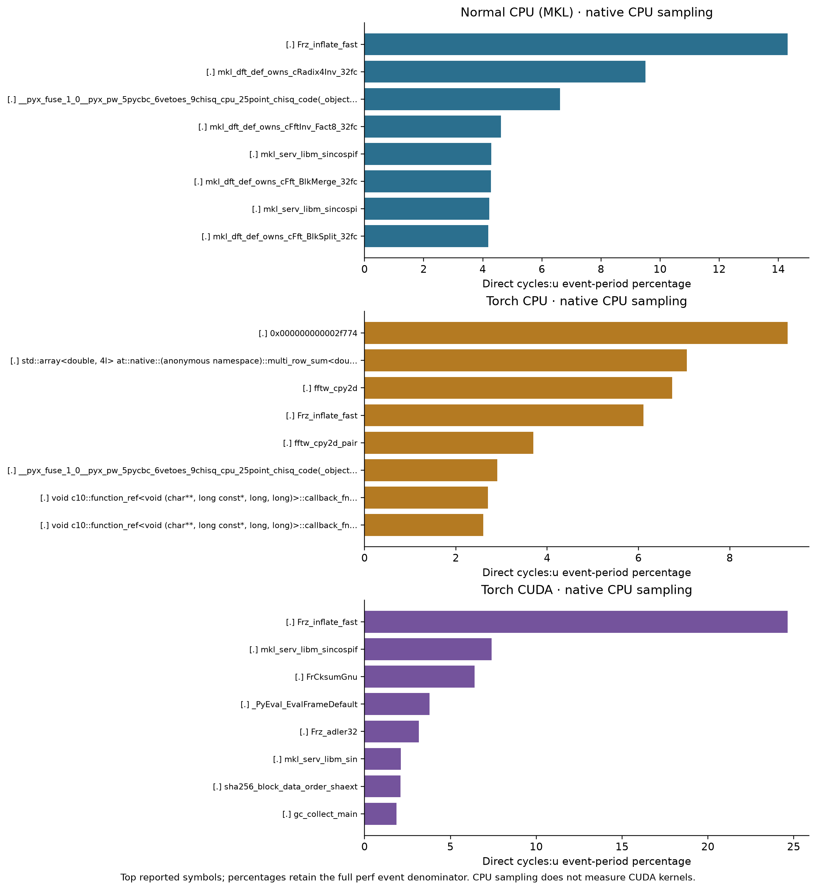
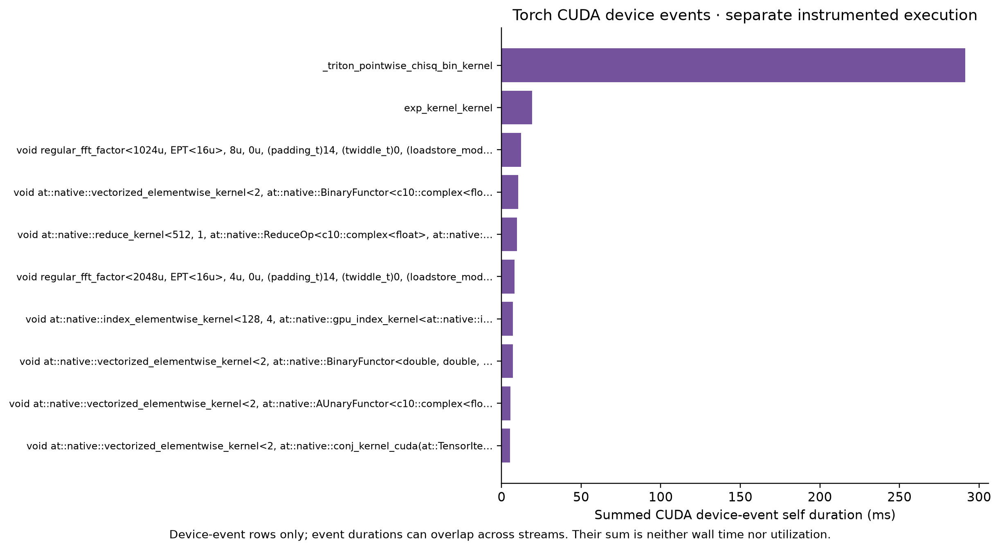

.. _torch-inspiral-reference:

Normal CPU reference and matched Torch search
===============================================

This page retains the before campaign at source ``837f38d493420043e45fb1ad210a0ccf68bacbaa``.
Start with :ref:`torch-inspiral-optimized` for the optimized search and its
fresh matched measurements. The tuning and numerical evidence below retain
their original measured source.

The reference measurement runs the normal, single-thread ``pycbc_inspiral``
executable with MKL, then Torch CPU and CUDA with the same compressed low-mass
bank, data, selected segment length and padding. The normal reference reaches
**5,656.56 templates per core at real time**,
with median full-process wall time **32.31 seconds**.
All measurements on this page use source ``837f38d493420043e45fb1ad210a0ccf68bacbaa``.

The completed campaign contains 31 cases and
28 passing trigger comparisons. Rates below
come from fresh, unprofiled processes; separate profiles explain observed costs.
The older :ref:`torch-optimization-results` are supporting component measurements.

Workload and normal reference
-----------------------------

The host is ``len``, with AMD Ryzen Threadripper PRO 3995WX 64-Cores;
CUDA uses NVIDIA GeForce RTX 4090, GPU-2e198102-8223-da7b-4944-2df0e9400916, 610.57.04, 24564 MiB.
Every run is pinned to logical CPU 8, allocating one physical
host core. ``OMP_NUM_THREADS=1`` and ``MKL_NUM_THREADS=1`` are set before
launch, with the other numerical-library thread limits retained in the
`configuration <https://github.com/xangma/pycbc/blob/639154f7ef359eb473db79660942a2cd88dd59e6/inspiral-reference-20260906/config.json>`__. The normal processing scheme is
``cpu:1`` and its requested FFT backend is ``mkl``; processing scheme,
observed FFT dispatch and thread settings are retained in each qualification.
The `hardware inventory <https://github.com/xangma/pycbc/blob/639154f7ef359eb473db79660942a2cd88dd59e6/inspiral-reference-20260906/environment.json>`__ was captured on an earlier
checkout; individual run receipts identify the final measured source.

The deterministic bank contains 64 BNS and 32 NSBH templates. Their aggregate
weights are therefore 2/3 and 1/3 by template count; these are not astrophysical
population weights. Masses below are detector-frame solar masses, spins are
dimensionless aligned components, and durations are estimator results.

.. list-table:: Bank composition
   :header-rows: 1

   * - Region
     - Templates
     - Mass 1
     - Mass 2
     - Spin 1z
     - Spin 2z
     - Duration (s)
   * - BNS
     - 64
     - 1.2--2
     - 1.2--2
     - -0.05--0.05
     - -0.05--0.05
     - 33.14--77.68
   * - NSBH
     - 32
     - 3--8
     - 1.2--2
     - -0.5--0.5
     - -0.05--0.05
     - 10.66--37.77

The approximant is ``IMRPhenomD``, with a
30 Hz lower cutoff and 4096 Hz
sample rate. This point-particle model does not include neutron-star tides or
disruption; the 96 templates are a benchmark set, not a coverage-qualified search
bank. The `bank metadata <https://github.com/xangma/pycbc/blob/639154f7ef359eb473db79660942a2cd88dd59e6/inspiral-reference-20260906/inputs/bank-metadata.json>`__ preserves every
template identity and the selection method. Regions are identifiable there;
this campaign measures their combined workload, without separate regional rates.

The executable requests ``--use-compressed-waveforms`` and
``--waveform-decompression-method inline_linear``. Successful qualification
records 96 decompressions and the actual completed template/segment work.
The compressed bank SHA256 is ``161820754117cd51b24a7bb672ea456cf7b2a3808e69690c23235d024b1a2916``. Waveform checks
independently verify successful decompression without full-generation fallback.

Normal CPU tuning
-----------------

Three FFT segment lengths, 256, 512 and 1024 seconds, were measured with
three fresh processes each. Start/end padding stayed at 112/16 seconds.
The selected length is **512 seconds**, using the lowest median CPU
full-process wall time; the decision records: Choose the lowest median full-process wall time from three unprofiled repetitions at each declared segment length, all using the corrected source and the 1e-5 compressed bank. Retain 112-second start padding and 16-second end padding; the new independent boundary model checks both 96- and 112-second starts. Earlier source timing results are not used to select this winner.
This is a measured choice within that grid. Padding was validated separately,
including 96/112-second start pads, rather than optimized by a padding timing sweep.

.. list-table:: Normal CPU tuning; median (observed minimum--maximum)
   :header-rows: 1

   * - FFT segment (s)
     - FFT samples
     - Segments/template
     - Full wall (s)
     - Templates/core at real time
   * - 256
     - 1048576
     - 15
     - 34.55 (34.48--34.69)
     - 5,289.82 (5,269.30--5,300.72)
   * - 512
     - 2097152
     - 5
     - 32.34 (32.31--32.37)
     - 5,652.54 (5,646.00--5,657.08)
   * - 1024
     - 4194304
     - 3
     - 38.79 (38.71--38.85)
     - 4,712.09 (4,704.88--4,721.95)

   Normal CPU capacity across the declared FFT-length grid; three unprofiled processes per point.

Matched Torch measurements
--------------------------

All backends retain the selected 512-second FFT segments, 112/16-second
padding, the same bank, valid strain interval, PSD settings, vetoes and clustering.
Only declared backend routing differs. Three fresh repetitions per backend
confirm the comparison after CPU tuning. The retained
`matched plan <https://github.com/xangma/pycbc/blob/639154f7ef359eb473db79660942a2cd88dd59e6/inspiral-reference-20260906/precision5-matched-backends-plan.json>`__ records run order;
the `raw runs table <https://github.com/xangma/pycbc/blob/639154f7ef359eb473db79660942a2cd88dd59e6/inspiral-reference-20260906/final-report/runs.csv>`__ retains every wall, user/system
CPU, memory and internal timing sample.

.. list-table:: Matched capacity; median (observed minimum--maximum)
   :header-rows: 1

   * - Backend
     - Full wall (s)
     - Templates/core at real time
     - Capacity / normal CPU
   * - Normal CPU (MKL)
     - 32.31 (32.30--32.35)
     - 5,656.56 (5,650.77--5,658.73)
     - 1.000x
   * - Torch CPU
     - 80.63 (79.11--80.72)
     - 2,267.00 (2,264.29--2,310.57)
     - 0.401x
   * - Torch CUDA + one GPU
     - 20.34 (20.28--20.35)
     - 8,988.27 (8,982.63--9,012.77)
     - 1.589x

Ratios are quotients of the displayed group medians, not medians of paired ratios.
Ranges show all three independent-process observations, not confidence intervals.
A ratio below one means lower capacity for this measured workload.

Each template searches the unique H1 interval [1187007160, 1187009064):
1904 seconds after excluding padding and duplicate coverage. Completed work is
**96 x 1904 = 182784 template-seconds** per run. Capacity is
``182784 / (full-process wall seconds * 1 allocated host core)``.
The denominator is allocated cores, not measured CPU utilization.
**CUDA additionally consumes one GPU**: its host-core-normalized rate is not
a comparison of equal CPU-only resources and is not a templates/GPU metric.

Full wall time includes successful final trigger-file writing. Internal
``run_time`` excludes early startup/imports and final HDF writing.
Internal setup and postsetup are derived from ``setup_time_fraction``;
postsetup includes analysis housekeeping and is not a separately isolated
steady-filter interval. This finite-duration campaign makes no steady-state claim.

.. list-table:: Internal intervals and memory; medians
   :header-rows: 1

   * - Backend
     - Internal total (s)
     - Setup (s)
     - Postsetup (s)
     - Peak RSS (MiB)
   * - Normal CPU (MKL)
     - 27.82
     - 15.29
     - 12.53
     - 1204.65
   * - Torch CPU
     - 76.06
     - 15.14
     - 60.87
     - 1236.62
   * - Torch CUDA + one GPU
     - 15.67
     - 13.39
     - 2.27
     - 1468.85

   Matched backend capacity with the normal CPU selected geometry and unprofiled repetitions.

   Full-process and internal timings; internal totals exclude early startup and final output writing.

Profiles with the same selected workload
------------------------------------------

The normal CPU reference is profiled with cProfile and native ``cycles:u``
sampling. Torch CPU and CUDA use those same tools and scientific settings;
CUDA also has a Torch operator/device trace. Profiling is enabled only in these
separate runs. Their elapsed times below are instrumented observations and
are excluded from capacity summaries.

.. list-table:: Profiling off/on; separate full-process intervals
   :header-rows: 1

   * - Backend
     - Mode
     - Wall seconds
     - Evidence
   * - Normal CPU (MKL)
     - off, median of 3
     - 32.31
     - `timings <https://github.com/xangma/pycbc/blob/639154f7ef359eb473db79660942a2cd88dd59e6/inspiral-reference-20260906/final-report/runs.csv>`__
   * - Torch CPU
     - off, median of 3
     - 80.63
     - `timings <https://github.com/xangma/pycbc/blob/639154f7ef359eb473db79660942a2cd88dd59e6/inspiral-reference-20260906/final-report/runs.csv>`__
   * - Torch CUDA + one GPU
     - off, median of 3
     - 20.34
     - `timings <https://github.com/xangma/pycbc/blob/639154f7ef359eb473db79660942a2cd88dd59e6/inspiral-reference-20260906/final-report/runs.csv>`__
   * - Normal CPU (MKL)
     - cprofile
     - 35.53
     - `reference-precision5-cpu-l512-cprofile <https://github.com/xangma/pycbc/blob/639154f7ef359eb473db79660942a2cd88dd59e6/inspiral-reference-20260906/runs/reference-precision5-cpu-l512-cprofile/receipt.json>`__
   * - Normal CPU (MKL)
     - perf
     - 35.15
     - `reference-precision5-cpu-l512-perf <https://github.com/xangma/pycbc/blob/639154f7ef359eb473db79660942a2cd88dd59e6/inspiral-reference-20260906/runs/reference-precision5-cpu-l512-perf/receipt.json>`__
   * - Torch CPU
     - cprofile
     - 83.95
     - `profile-precision5-torch-cpu-l512-cprofile <https://github.com/xangma/pycbc/blob/639154f7ef359eb473db79660942a2cd88dd59e6/inspiral-reference-20260906/runs/profile-precision5-torch-cpu-l512-cprofile/receipt.json>`__
   * - Torch CPU
     - perf
     - 84.22
     - `profile-precision5-torch-cpu-l512-perf <https://github.com/xangma/pycbc/blob/639154f7ef359eb473db79660942a2cd88dd59e6/inspiral-reference-20260906/runs/profile-precision5-torch-cpu-l512-perf/receipt.json>`__
   * - Torch CUDA + one GPU
     - cprofile
     - 23.97
     - `profile-precision5-torch-cuda-l512-cprofile <https://github.com/xangma/pycbc/blob/639154f7ef359eb473db79660942a2cd88dd59e6/inspiral-reference-20260906/runs/profile-precision5-torch-cuda-l512-cprofile/receipt.json>`__
   * - Torch CUDA + one GPU
     - perf
     - 23.14
     - `profile-precision5-torch-cuda-l512-perf <https://github.com/xangma/pycbc/blob/639154f7ef359eb473db79660942a2cd88dd59e6/inspiral-reference-20260906/runs/profile-precision5-torch-cuda-l512-perf/receipt.json>`__
   * - Torch CUDA + one GPU
     - torchprofile
     - 45.19
     - `profile-precision5-torch-cuda-l512-torchprofile <https://github.com/xangma/pycbc/blob/639154f7ef359eb473db79660942a2cd88dd59e6/inspiral-reference-20260906/runs/profile-precision5-torch-cuda-l512-torchprofile/receipt.json>`__

.. list-table:: Three largest exclusive cProfile categories per backend
   :header-rows: 1

   * - Backend
     - Category
     - Self seconds
     - Share of cProfile self time
   * - Normal CPU (MKL)
     - remaining
     - 18.354
     - 53.22%
   * - Normal CPU (MKL)
     - FFT
     - 12.079
     - 35.03%
   * - Normal CPU (MKL)
     - signal-consistency
     - 1.947
     - 5.65%
   * - Torch CPU
     - remaining
     - 38.522
     - 46.49%
   * - Torch CPU
     - FFT
     - 28.425
     - 34.31%
   * - Torch CPU
     - decompression/waveforms
     - 11.901
     - 14.36%
   * - Torch CUDA + one GPU
     - remaining
     - 18.277
     - 80.33%
   * - Torch CUDA + one GPU
     - FFT
     - 3.135
     - 13.78%
   * - Torch CUDA + one GPU
     - I/O/import/setup
     - 0.794
     - 3.49%

cProfile shares use the sum of exclusive self times, including the retained
unattributed categories. Nested cumulative times are not added. Native perf
percentages refer to sampled user-space cycles; they are not percentages of
full wall time. CUDA event shares use the sum of profiler-visible device-event
self times. CPU operators, native samples and asynchronous device events have
different denominators and cannot be combined into one elapsed-time breakdown.
The measured categories determine the explanation; no fixed FFT cost or
expected percentage speedup is assumed.

Normal CPU's FFT ownership category accounts for 35.03% of cProfile
self time, including MKL descriptor setup; it is not exclusively transform
execution. Native frame reads contribute 6.669477 seconds within ``remaining``,
so that category cannot be interpreted as Python overhead. Point chi-square
and thresholding are secondary costs in this comparison.

Torch CPU spends 26.624610 cumulative seconds decompressing 96 templates,
versus 0.421866 seconds for normal CPU, and 26.844547 seconds in 480 search
inverse FFTs, versus 7.103488 seconds. These two disjoint call subtrees account
for 45.943802 seconds, or 94.99%, of the 48.366999-second difference between
cProfile self-time totals. This is an attribution of the instrumented runs;
it neither partitions the unprofiled wall-time gap nor predicts an optimization
speedup. The `profile interpretation <https://github.com/xangma/pycbc/blob/639154f7ef359eb473db79660942a2cd88dd59e6/inspiral-reference-20260906/profile-interpretation-v5.md>`__ and
`machine-readable evidence <https://github.com/xangma/pycbc/blob/639154f7ef359eb473db79660942a2cd88dd59e6/inspiral-reference-20260906/profile-interpretation-v5.json>`__ retain
caller edges, source hashes, raw-input bindings and denominator limitations.

The measured source explains the expensive paths: Torch CPU decompression uses
generic double-precision tensor interpolation, while normal CPU uses compiled
interpolation. The 2,097,152-point complex128 search inverse FFTs use Torch's
FFTW workspace fallback; its direct MKL path is limited to lengths at most
32,768, and its reusable FFTW path to lengths at most 131,072. Normal CPU uses
the bound MKL transform path. Reductions and copies within interpolation are
already included in its cumulative time. These profiles do not separately
isolate precision, library, planning or data-layout effects.

   Exclusive cProfile categories, with each run using its own recorded self-time denominator.

   Native symbols sampled with cycles:u; percentages describe the sampled event population.

   Profiler-visible CUDA device events, using the device-event self-time sum as denominator.

Scientific checks and measured source
-------------------------------------

All 28 comparisons pass the original trigger
budgets: absolute tolerance 1e-05, relative tolerance
0.0001, phase tolerance 0.0001 radians and
normalization relative tolerance 1e-05. Comparisons
cover trigger identities, retained times, SNR, phase and signal-consistency
statistics within the same FFT geometry. Length tuning can change PSD bins and
triggers, so this does not claim identical triggers across FFT lengths.

The final source also passes 288 template/PSD
waveform comparisons and 36 boundary injection cases,
covering the longest and shortest retained templates. The report retains their
budgets and worst measured errors. Unit validation records:
369 passed, 68 skipped, 21 warnings, 8 subtests passed in 24.89s

All final tuning, qualifications, scientific validations, matched timings and
profiles use ``837f38d493420043e45fb1ad210a0ccf68bacbaa``. Its numerical corrections also change
normal CPU outputs, so earlier CPU timing and science results are not reused.
The `source provenance <https://github.com/xangma/pycbc/blob/639154f7ef359eb473db79660942a2cd88dd59e6/inspiral-reference-20260906/source-precision-provenance-v5.json>`__ records
the changed source/test blobs and unchanged native module identities.

The earlier `numerical investigation v3 <https://github.com/xangma/pycbc/blob/639154f7ef359eb473db79660942a2cd88dd59e6/inspiral-reference-20260906/numerical-investigation-v3.md>`__
diagnoses CUDA scalar narrowing using captures from parent
``f2c0abe61e787a26f41208f489c62c877bbd5667`` and records unit validation on
``837f38d493420043e45fb1ad210a0ccf68bacbaa``. That one-template replay predates the completed
campaign; its pending full-CLI status is historical. The final report supplies
the full qualification summarized here. Earlier failed attempts remain archived.

Reproduction and evidence
-------------------------

The `final report <https://github.com/xangma/pycbc/blob/639154f7ef359eb473db79660942a2cd88dd59e6/inspiral-reference-20260906/final-report/report.json>`__ binds all raw inputs,
timings, trigger files, checks and six figures. The
`tuning decision <https://github.com/xangma/pycbc/blob/639154f7ef359eb473db79660942a2cd88dd59e6/inspiral-reference-20260906/precision5-reference-tuning-decision.json>`__ preserves
every candidate and the selection rule. Complete profiling commands and raw
profiles are linked from the profiling table; all six plans retain the full
31-case order. Commands below are exact recorded unprofiled invocations,
including environment and affinity. Use fresh output locations when replaying.

Normal CPU (MKL): `recorded receipt <https://github.com/xangma/pycbc/blob/639154f7ef359eb473db79660942a2cd88dd59e6/inspiral-reference-20260906/runs/matched-precision5-cpu-l512-r1/receipt.json>`__.

.. code-block:: console

   cd /home/xangma/pycbc-torch-inspiral-reference-20260906
   env OMP_NUM_THREADS=1 MKL_NUM_THREADS=1 MKL_DYNAMIC=FALSE MKL_THREADING_LAYER=GNU OPENBLAS_NUM_THREADS=1 NUMEXPR_NUM_THREADS=1 VECLIB_MAXIMUM_THREADS=1 BLIS_NUM_THREADS=1 PYTHONHASHSEED=0 PYTHONPATH=/home/xangma/pycbc-torch-inspiral-reference-20260906/source-v5 PYTHONDONTWRITEBYTECODE=1 /usr/bin/time -v -o /home/xangma/pycbc-torch-inspiral-reference-20260906/runs/matched-precision5-cpu-l512-r1/time.txt taskset -c 8 /home/xangma/pycbc-torch-split-20260905/venv/bin/python /home/xangma/pycbc-torch-inspiral-reference-20260906/source-v5/bin/pycbc_inspiral --verbose --frame-files /home/xangma/pycbc_bench_repo/docs/_include/H-H1_LOSC_CLN_4_V1-1187007040-2048.gwf --channel-name H1:LOSC-STRAIN --gps-start-time 1187007048 --gps-end-time 1187009080 --trig-start-time 1187007160 --trig-end-time 1187009064 --sample-rate 4096 --low-frequency-cutoff 30 --strain-high-pass 25 --pad-data 8 --autogating-threshold 100 --autogating-cluster 5 --autogating-width 0.25 --autogating-taper 0.25 --autogating-pad 16 --autogating-max-iterations 1 --psd-estimation median --psd-segment-length 32 --psd-segment-stride 16 --psd-num-segments 126 --psd-inverse-length 16 --invpsd-trunc-method hann --invpsd-trunc-which-spectrum invasd --approximant IMRPhenomD --order -1 --use-compressed-waveforms --waveform-decompression-method inline_linear --snr-threshold 5.5 --newsnr-threshold 5 --chisq-bins 16 --cluster-window 1 --cluster-function symmetric --fft-backends mkl --bank-file /home/xangma/pycbc-torch-inspiral-reference-20260906/inputs/bank-compressed-1e5.hdf --processing-scheme cpu:1 --segment-length 512 --segment-start-pad 112 --segment-end-pad 16 --output /home/xangma/pycbc-torch-inspiral-reference-20260906/runs/matched-precision5-cpu-l512-r1/triggers.hdf

Torch CPU: `recorded receipt <https://github.com/xangma/pycbc/blob/639154f7ef359eb473db79660942a2cd88dd59e6/inspiral-reference-20260906/runs/matched-precision5-torch-cpu-l512-r1/receipt.json>`__.

.. code-block:: console

   cd /home/xangma/pycbc-torch-inspiral-reference-20260906
   env OMP_NUM_THREADS=1 MKL_NUM_THREADS=1 MKL_DYNAMIC=FALSE MKL_THREADING_LAYER=GNU OPENBLAS_NUM_THREADS=1 NUMEXPR_NUM_THREADS=1 VECLIB_MAXIMUM_THREADS=1 BLIS_NUM_THREADS=1 PYTHONHASHSEED=0 PYTHONPATH=/home/xangma/pycbc-torch-inspiral-reference-20260906/source-v5 PYTHONDONTWRITEBYTECODE=1 /usr/bin/time -v -o /home/xangma/pycbc-torch-inspiral-reference-20260906/runs/matched-precision5-torch-cpu-l512-r1/time.txt taskset -c 8 /home/xangma/pycbc-torch-split-20260905/venv/bin/python /home/xangma/pycbc-torch-inspiral-reference-20260906/source-v5/bin/pycbc_inspiral --verbose --frame-files /home/xangma/pycbc_bench_repo/docs/_include/H-H1_LOSC_CLN_4_V1-1187007040-2048.gwf --channel-name H1:LOSC-STRAIN --gps-start-time 1187007048 --gps-end-time 1187009080 --trig-start-time 1187007160 --trig-end-time 1187009064 --sample-rate 4096 --low-frequency-cutoff 30 --strain-high-pass 25 --pad-data 8 --autogating-threshold 100 --autogating-cluster 5 --autogating-width 0.25 --autogating-taper 0.25 --autogating-pad 16 --autogating-max-iterations 1 --psd-estimation median --psd-segment-length 32 --psd-segment-stride 16 --psd-num-segments 126 --psd-inverse-length 16 --invpsd-trunc-method hann --invpsd-trunc-which-spectrum invasd --approximant IMRPhenomD --order -1 --use-compressed-waveforms --waveform-decompression-method inline_linear --snr-threshold 5.5 --newsnr-threshold 5 --chisq-bins 16 --cluster-window 1 --cluster-function symmetric --fft-backends mkl --bank-file /home/xangma/pycbc-torch-inspiral-reference-20260906/inputs/bank-compressed-1e5.hdf --processing-scheme torch:cpu:1 --segment-length 512 --segment-start-pad 112 --segment-end-pad 16 --output /home/xangma/pycbc-torch-inspiral-reference-20260906/runs/matched-precision5-torch-cpu-l512-r1/triggers.hdf

Torch CUDA + one GPU: `recorded receipt <https://github.com/xangma/pycbc/blob/639154f7ef359eb473db79660942a2cd88dd59e6/inspiral-reference-20260906/runs/matched-precision5-torch-cuda-l512-r1/receipt.json>`__.

.. code-block:: console

   cd /home/xangma/pycbc-torch-inspiral-reference-20260906
   env OMP_NUM_THREADS=1 MKL_NUM_THREADS=1 MKL_DYNAMIC=FALSE MKL_THREADING_LAYER=GNU OPENBLAS_NUM_THREADS=1 NUMEXPR_NUM_THREADS=1 VECLIB_MAXIMUM_THREADS=1 BLIS_NUM_THREADS=1 PYTHONHASHSEED=0 PYTHONPATH=/home/xangma/pycbc-torch-inspiral-reference-20260906/source-v5 PYTHONDONTWRITEBYTECODE=1 /usr/bin/time -v -o /home/xangma/pycbc-torch-inspiral-reference-20260906/runs/matched-precision5-torch-cuda-l512-r1/time.txt taskset -c 8 /home/xangma/pycbc-torch-split-20260905/venv/bin/python /home/xangma/pycbc-torch-inspiral-reference-20260906/source-v5/bin/pycbc_inspiral --verbose --frame-files /home/xangma/pycbc_bench_repo/docs/_include/H-H1_LOSC_CLN_4_V1-1187007040-2048.gwf --channel-name H1:LOSC-STRAIN --gps-start-time 1187007048 --gps-end-time 1187009080 --trig-start-time 1187007160 --trig-end-time 1187009064 --sample-rate 4096 --low-frequency-cutoff 30 --strain-high-pass 25 --pad-data 8 --autogating-threshold 100 --autogating-cluster 5 --autogating-width 0.25 --autogating-taper 0.25 --autogating-pad 16 --autogating-max-iterations 1 --psd-estimation median --psd-segment-length 32 --psd-segment-stride 16 --psd-num-segments 126 --psd-inverse-length 16 --invpsd-trunc-method hann --invpsd-trunc-which-spectrum invasd --approximant IMRPhenomD --order -1 --use-compressed-waveforms --waveform-decompression-method inline_linear --snr-threshold 5.5 --newsnr-threshold 5 --chisq-bins 16 --cluster-window 1 --cluster-function symmetric --fft-backends mkl --bank-file /home/xangma/pycbc-torch-inspiral-reference-20260906/inputs/bank-compressed-1e5.hdf --processing-scheme torch:cuda:0 --segment-length 512 --segment-start-pad 112 --segment-end-pad 16 --output /home/xangma/pycbc-torch-inspiral-reference-20260906/runs/matched-precision5-torch-cuda-l512-r1/triggers.hdf

Regenerate the report into a new directory from the archived evidence:

.. code-block:: console

   python build-reference-report-v4.py --root . --output-dir final-report-rebuilt

The builder requires a passing complete campaign and writes a success receipt
only after all tables and figures are complete. The
:download:`figure manifest <images/torch-inspiral-reference-20260906/manifest.json>`
pins the archive commit, measured source, report, builder, inputs and figure hashes.

Scope of these results
----------------------

* Finite 1904-second valid interval; no steady-state throughput claim.
* Three FFT lengths and one final padding configuration; no global optimum claim.
* CPU-normalized CUDA capacity additionally consumes one GPU; it is not a GPU-free resource comparison.
* 96 deterministic point-particle aligned-spin templates do not establish search-bank coverage, tidal/disruption accuracy, or population-weighted throughput.
* Length changes can alter PSD bins and triggers; trigger parity is tested only within the same FFT geometry.
* All final reference tuning, scientific validation, matched timings and profiles use one corrected source. Earlier source phases are supplemental; their science and timings are not reused.
* Hardware inventory was captured on the parent checkout; each run receipt binds the actual final source revision.
* Native perf percentages, cProfile seconds and CUDA event durations must not be added or interpreted as one timeline.

See :ref:`torch-performance` for general measurement requirements,
:ref:`torch-optimization-results` for earlier supporting component results,
and :ref:`torch-benchmark-details` for their separate source attribution.
