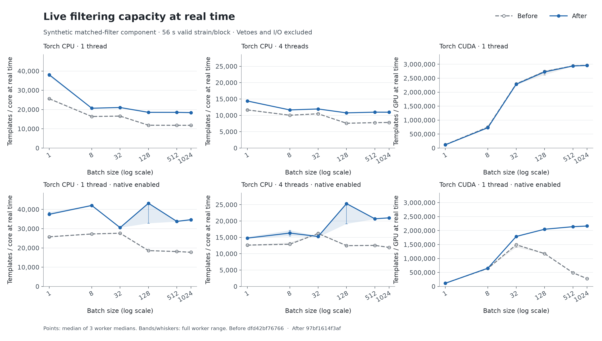
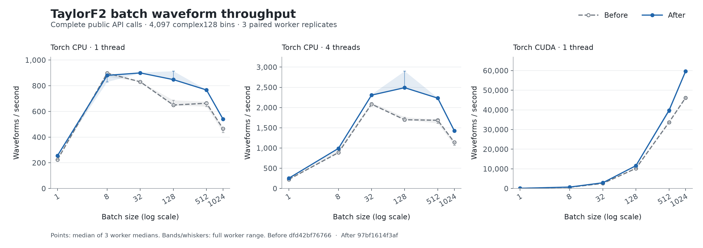
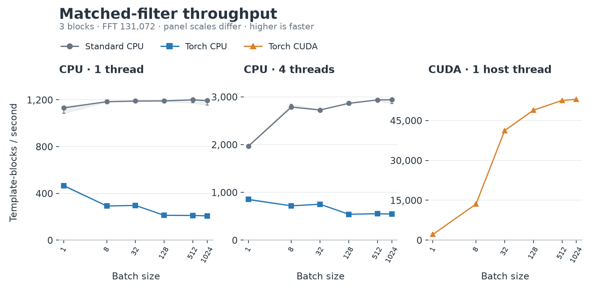
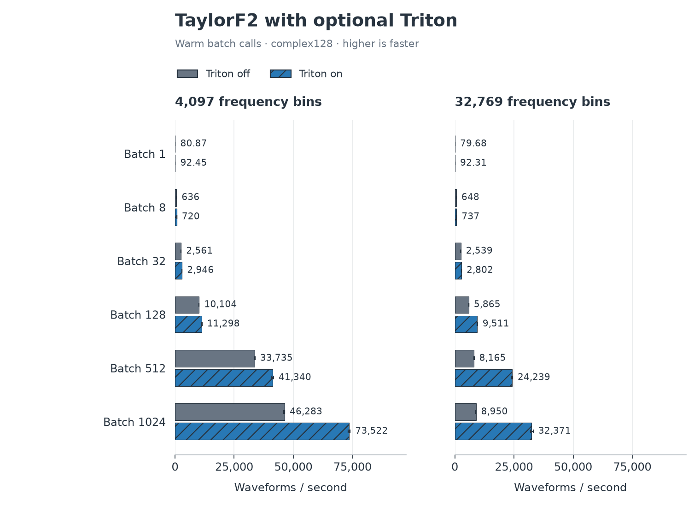

.. _torch-optimization-results:

Torch benchmark results
=======================

Start with :ref:`torch-inspiral-optimized` for the tuned normal
``pycbc_inspiral`` reference and optimized executable comparison. The results
below are supporting component diagnostics.

Fixes for large-batch slowdowns
-------------------------------

The initial paired results (v1) measure fixes for three costs found by profiling:
quadratic overlap checks in native batch correlation, large CPU peak-reduction
temporaries, and known-zero TaylorF2 phase terms. The changes use sorted memory
spans, bounded CPU peak chunks, and a specialized float64 phase evaluation
that preserves Horner order. Numerical and gradient regression tests accompany
the changes.

The final revision (v2) also restores the direct accelerator peak-reduction
path after v1 introduced unnecessary Python chunk bookkeeping there. Its GPU
follow-on is shown separately below. The CPU algorithm and waveform code are
unchanged between v1 and v2; CPU and waveform rates remain attributed to v1.

These measurements use a Threadripper PRO 3995WX and RTX 4090 on
**6 September 2026**, with Python 3.11.9 and Torch 2.13.0+cu130.
Before and after use identical workloads, flags and thread counts. Each point
summarizes three separate workers; bands show their observed range, not a
confidence interval. Larger values mean higher throughput. The tables show
medians of worker medians and median paired speed ratios; their quotients
can differ slightly.

Initial matched-filter comparison (v1)
~~~~~~~~~~~~~~~~~~~~~~~~~~~~~~~~~~~~~~

Search capacity is expressed as **templates/core at real time** for CPU and
**templates/GPU at real time** for CUDA. Each timed strain block represents
56 seconds of analyzed data. CPU capacity is the measured template-blocks/s
multiplied by 56 and divided by the configured CPU thread count (one or four);
GPU capacity is template-blocks/s multiplied by 56 for one RTX 4090. The CPU
denominator is the configured core budget, not measured CPU utilization.

.. list-table:: Batch 1024, before and v1
   :header-rows: 1

   * - Route
     - Unit
     - Before
     - V1
     - Paired speed ratio
   * - Torch CPU, 1 thread
     - templates/core
     - 11,820
     - 18,404
     - 1.56x
   * - Torch CPU, 4 threads
     - templates/core
     - 7,828
     - 10,967
     - 1.40x
   * - Torch CUDA, 1 thread
     - templates/GPU
     - 2,965,340
     - 2,956,723
     - 1.00x
   * - Torch CPU, 1 thread, native enabled
     - templates/core
     - 17,749
     - 34,682
     - 1.95x
   * - Torch CPU, 4 threads, native enabled
     - templates/core
     - 11,943
     - 20,975
     - 1.76x
   * - Torch CUDA, 1 thread, native enabled
     - templates/GPU
     - 277,783
     - 2,162,886
     - 7.80x

   Matched-filter capacity at real time, per CPU core or per GPU as labeled.
   Native routing is opt-in; admission checks can select a fallback.
   Both curves belong to the initial before/v1 campaign.

This synthetic workload calls ``LiveBatchMatchedFilter.process_data`` for
three blocks, FFT length 131072 and ``complex64``. It excludes waveform
generation, PSD estimation and I/O. Chi-square is disabled and sine-Gaussian
postprocessing is stubbed. Parity checks triggers and aggregate SNR norms;
it does not compare every SNR sample.

The full table retains slower cases: native CPU at batch 32 with four threads
is about 6% slower in the initial comparison. The separate diagnostic profile
is retained with the evidence; the batch-1024 headline is not representative
of every batch size.

Final GPU follow-on (v2)
~~~~~~~~~~~~~~~~~~~~~~~~

.. list-table:: GPU follow-on: templates/GPU at real time
   :header-rows: 1

   * - Route
     - Batch
     - Before
     - V1
     - V2
   * - CUDA default
     - 1
     - 120,579
     - 115,653
     - 120,269
   * - CUDA default
     - 1024
     - 2,965,340
     - 2,956,723
     - 2,958,466
   * - CUDA native enabled
     - 1
     - 117,016
     - 113,103
     - 117,691
   * - CUDA native enabled
     - 1024
     - 277,783
     - 2,162,886
     - 2,136,246

.. figure:: images/torch-performance-fix-20260906/cuda-before-v1-v2.png
   :alt: CUDA throughput for baseline, v1 and the separate v2 follow-on, across six batch sizes for default and native routing.
   :width: 100%

   V2 uses 36 new workers, measured after the original campaign. Before/v1
   measurements and standard CPU parity controls are reused from that campaign.
   Ratios spanning these run periods are descriptive, not paired estimates.

The `GPU refinement report`_ retains all six batch sizes, worker ranges and
independently recomputed trigger and norm parity against the original controls.

Optional CPU follow-up
~~~~~~~~~~~~~~~~~~~~~~

.. list-table:: Optional CPU native peak route: templates/core at real time
   :header-rows: 1

   * - CPU cores
     - Batch
     - Before
     - V1
     - Paired speed ratio
   * - 1
     - 32
     - 52,659
     - 52,570
     - 1.00x
   * - 1
     - 1024
     - 46,413
     - 53,086
     - 1.15x
   * - 4
     - 32
     - 24,036
     - 24,569
     - 1.03x
   * - 4
     - 1024
     - 25,539
     - 35,544
     - 1.39x

This separate 36-worker comparison explicitly enables
``PYCBC_TORCH_CPU_NATIVE_BATCH_PEAK=1`` on both revisions of the optional CPU
branch. It covers batches 32/1024 with one/four threads and three replicates,
including 12 standard controls. The `optional CPU report`_ records the measured
source identities and all parity checks. It measures the inherited v1 fixes;
v2 does not change the CPU algorithm.

Waveform generation after the fixes
~~~~~~~~~~~~~~~~~~~~~~~~~~~~~~~~~~~~

This separate component benchmark reports **waveforms/s**: complete TaylorF2
templates generated per wall-clock second, including both polarizations.
It has no analyzed strain duration and does not measure search capacity.

.. list-table:: Batch 1024, before and v1
   :header-rows: 1

   * - Route
     - Unit
     - Before
     - V1
     - Paired speed ratio
   * - Torch CPU, 1 thread
     - waveforms/s
     - 465
     - 540
     - 1.16x
   * - Torch CPU, 4 threads
     - waveforms/s
     - 1,140
     - 1,426
     - 1.26x
   * - Torch CUDA, 1 thread
     - waveforms/s
     - 46,166
     - 59,644
     - 1.29x

   Complete public batch API calls, both polarizations, 4097 bins and
   ``complex128`` output retained on the selected device. Triton is disabled.

Every waveform row and both polarizations pass native scalar pointwise
relative error at most ``2e-10`` and native scalar versus CPU/LAL relative L2
below ``1e-11``. These figures measure library calls; they do not establish
whole-search or sampler speedups.
At batch 8 with one CPU thread, the median paired generation rate is about
3% lower, with overlapping before/after worker ranges.

The `paired comparison`_ retains every route, thread count, batch size,
raw worker summary and numerical check. See :ref:`torch-benchmark-details`
for profiles, source revisions and reproduction.

Earlier comparison campaign
---------------------------

The figures and rates below predate these fixes. They retain the original
comparison with standard CPU and optional configurations. Inference,
Triton and FFT timing claims here have not been remeasured after the fixes.
Historical live-filter charts retain template-blocks/s: multiply by 56 and
divide by the CPU thread count for templates/core at real time, or multiply
by 56 for templates/GPU. Standalone waveform and inference rates have
different workloads and are not search-capacity figures.

**CUDA helped batched matched filtering; CPU was faster for the tested
likelihoods.** Waveform gains depended on the interface and batch size.
The optional Triton evaluator improved warm TaylorF2 calls but added about
1.6 seconds to the first call.

These measurements are from **6 September 2026**, on Linux with a Threadripper
PRO 3995WX and RTX 4090, Python 3.11.9 and Torch 2.13.0+cu130. They cover the
specific library workloads below, without measuring complete searches,
sampler throughput or MPS.

**Reading the plots:** higher throughput is faster. Values summarize three
fresh worker processes; whiskers and shaded bands show their observed range,
not a confidence interval. CPU thread counts are explicit; CUDA used one host thread.
Startup is excluded from warm rates. See :ref:`torch-benchmark-details` for
cold costs, optional tuning, exact revisions and reproduction.

Matched filtering
~~~~~~~~~~~~~~~~~

Default Torch CUDA rose from **41,245 template-blocks/s at batch 32** to
**52,984 at batch 1024**. At batch 1024, that was **44.4x** standard CPU with
one thread, or **18.0x** with four threads.
Every measured Torch CPU configuration was slower than its standard CPU
baseline. A template-block is one template evaluated against one data block.

   Batches 1, 8, 32, 128, 512 and 1024. The `full live results`_ also include
   the optional native configurations and all controls.

The workload calls ``LiveBatchMatchedFilter.process_data`` for three blocks,
FFT length 131072 and ``complex64``. It excludes waveform generation, PSD
estimation and I/O; chi-square is off and sine-Gaussian postprocessing is
stubbed. The asynchronous peak-copy path is disabled. Parity checks triggers
and aggregate SNR norms, not every SNR sample.

Waveform generation
~~~~~~~~~~~~~~~~~~~

Torch CUDA's TaylorF2 batch API rose from **2,560 waveforms/s at batch 32**
to **45,960 at batch 1024**, or **27.9x** the one-thread CPU/LAL loop at
batch 1024. CUDA's scalar interface stayed slower than CPU/LAL. Torch CPU
results depended on batch size and thread count; four threads helped at
batch 32, but CPU/LAL was faster at batch 1024.

.. figure:: images/torch-benchmarks-20260906/waveform.png
   :alt: TaylorF2 generation rates through batch 1024, with separate CPU and CUDA panels and scalar and batch interfaces.
   :width: 100%

   Both polarizations, 4097 frequency bins, ``complex128`` output retained on
   the selected device, across batches 1, 8, 32, 128, 512 and 1024.
   The `full waveform results`_ retain cold calls and unsupported requests.

Optional Triton evaluator
~~~~~~~~~~~~~~~~~~~~~~~~~

``PYCBC_TAYLORF2_TRITON=1`` made warm TaylorF2 batch calls **1.10--3.62x faster**
than ordinary Torch CUDA across twelve tested binary-neutron-star workloads.
At 32,769 bins and batch 1024, throughput rose from **8,950 to 32,371 waveforms/s**.
The first call cost about **2.0 seconds**, versus **0.4 seconds** without Triton.

   Same source revision with the flag off and on. All 72 workers passed
   numerical and route checks. `Full Triton results`_ retain the error metrics.

Timing includes validation, coefficient generation, allocation, both
polarizations and CUDA synchronization, with ``complex128`` outputs left on
device. It does not establish whole-search or inference gains. See
:ref:`torch-optimizations` for supported inputs and fallback behavior.

Single-evaluation inference
~~~~~~~~~~~~~~~~~~~~~~~~~~~

**Standard CPU was faster for both tested models.** CUDA reached
328 likelihood evaluations/s for ``GaussianNoise`` and 190 for ``Relative``;
the one-thread CPU rates were 631 and 2,271, respectively.

.. figure:: images/torch-benchmarks-20260906/inference.png
   :alt: GaussianNoise and Relative likelihood throughput; standard CPU is faster than Torch CPU and CUDA for both models.
   :width: 100%

   Warm ``model.update(**parameters)`` plus ``float(model.loglikelihood)``
   calls. The `full inference results`_ include inputs and numerical checks.

The test uses synthetic H1/L1 data, 32 seconds at 2048 Hz, TaylorF2 and double
precision. Timing includes waveform generation, detector projection, likelihood
reduction and the returned host scalar. Each model is checked against its own
CPU reference; this comparison does not test the relative-binning approximation
against ``GaussianNoise``.

This measures one parameter point per call. The separate
:ref:`1024-row correctness tests <torch-large-batches>` exercise batched
likelihoods; they do not measure batched inference throughput.

.. toctree::
   :maxdepth: 1

   torch_benchmark_details

.. _full live results: https://github.com/xangma/pycbc/blob/7f1ea7a7aa05b4fdafe2995a43a754984a2c5817/batch1024/report/live-summary.md
.. _full waveform results: https://github.com/xangma/pycbc/blob/7f1ea7a7aa05b4fdafe2995a43a754984a2c5817/batch1024/report/waveform-summary.md
.. _full Triton results: https://github.com/xangma/pycbc/blob/7f1ea7a7aa05b4fdafe2995a43a754984a2c5817/batch1024/report/triton/report.md
.. _full inference results: https://github.com/xangma/pycbc/blob/7f1ea7a7aa05b4fdafe2995a43a754984a2c5817/report/inference-summary.md

.. _paired comparison: https://github.com/xangma/pycbc/blob/639154f7ef359eb473db79660942a2cd88dd59e6/performance-fix/report/report.md
.. _GPU refinement report: https://github.com/xangma/pycbc/blob/639154f7ef359eb473db79660942a2cd88dd59e6/performance-fix/cuda-v2-followup-report/report.md
.. _optional CPU report: https://github.com/xangma/pycbc/blob/639154f7ef359eb473db79660942a2cd88dd59e6/performance-fix/cpu-followup-report/report.md
