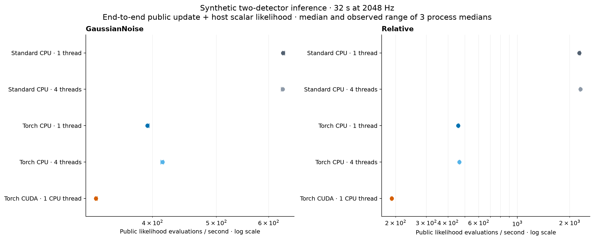
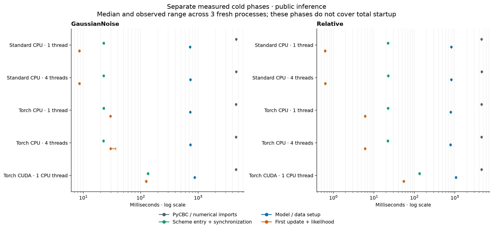

# Public inference benchmark

End-to-end public model.update(**varied_parameters) + float(model.loglikelihood), including waveform generation, detector projection, likelihood reduction and host scalar return. CUDA is synchronized before and after every timed group. Setup, parity and warmup are outside steady-state timing.

Required checkout: `607bce53ead14f12af32552a5b2441d3bc667267`, clean before and after every worker.

Synthetic H1/L1, 32 s at 2048 Hz, TaylorF2, float64/complex128. These measurements concern public likelihood calls; no sampler evidence is provided.

Median of three per-process medians of five group mean latencies; evaluations/s = 1e9 / that latency. Whiskers invert the observed minimum/maximum process median latencies. No confidence intervals.

Parity requires all 12 points in all three processes for each model/configuration; both loglikelihood and loglr use `abs(actual - CPU_reference) <= 2e-5 + 2e-7 * abs(CPU_reference)`.

Qualified configurations: 10/10.

| Model | Route | Qualified workers | Evaluations/s | Process range, evals/s | Median latency, ms | Ratio vs CPU 1 | Ratio vs CPU same threads |
|---|---|---:|---:|---:|---:|---:|---:|
| GaussianNoise | Standard CPU · 1 thread | 3/3 | 630.6 | 630–634.5 | 1.586 | 1 | 1 |
| GaussianNoise | Standard CPU · 4 threads | 3/3 | 630 | 626.6–630.1 | 1.587 | 0.9991 | 1 |
| GaussianNoise | Torch CPU · 1 thread | 3/3 | 392.8 | 392.5–395 | 2.546 | 0.6229 | 0.6229 |
| GaussianNoise | Torch CPU · 4 threads | 3/3 | 414.4 | 411.7–415.5 | 2.413 | 0.6572 | 0.6578 |
| GaussianNoise | Torch CUDA · 1 CPU thread | 3/3 | 328.2 | 327.6–329.6 | 3.047 | 0.5205 | 0.5205 |
| Relative | Standard CPU · 1 thread | 3/3 | 2271 | 2266–2298 | 0.4402 | 1 | 1 |
| Relative | Standard CPU · 4 threads | 3/3 | 2302 | 2281–2308 | 0.4345 | 1.013 | 1 |
| Relative | Torch CPU · 1 thread | 3/3 | 457.2 | 455.2–462 | 2.187 | 0.2013 | 0.2013 |
| Relative | Torch CPU · 4 threads | 3/3 | 464.7 | 462.5–467.5 | 2.152 | 0.2046 | 0.2019 |
| Relative | Torch CUDA · 1 CPU thread | 3/3 | 190 | 188.3–190.8 | 5.264 | 0.08364 | 0.08364 |

Ratios require a qualified route and CPU baseline with matching runtime identity. CUDA uses the one-thread CPU baseline. A qualified worker count can still fail the shared case or runtime checks; unqualified cells have no published rates.

## Cold phases

| Model | Route | Phase | Median ms | Process range ms |
|---|---|---|---:|---:|
| GaussianNoise | Standard CPU · 1 thread | PyCBC / numerical imports | 4599 | 4555–4599 |
| GaussianNoise | Standard CPU · 1 thread | Scheme entry + synchronization | 22.6 | 22.45–23.18 |
| GaussianNoise | Standard CPU · 1 thread | Model / data setup | 724.7 | 721.9–731.1 |
| GaussianNoise | Standard CPU · 1 thread | First update + likelihood | 8.514 | 8.412–8.574 |
| GaussianNoise | Standard CPU · 4 threads | PyCBC / numerical imports | 4608 | 4587–4621 |
| GaussianNoise | Standard CPU · 4 threads | Scheme entry + synchronization | 22.52 | 22.49–22.55 |
| GaussianNoise | Standard CPU · 4 threads | Model / data setup | 731.6 | 723.1–734.9 |
| GaussianNoise | Standard CPU · 4 threads | First update + likelihood | 8.538 | 8.509–8.666 |
| GaussianNoise | Torch CPU · 1 thread | PyCBC / numerical imports | 4570 | 4535–4589 |
| GaussianNoise | Torch CPU · 1 thread | Scheme entry + synchronization | 22.52 | 22.38–23.23 |
| GaussianNoise | Torch CPU · 1 thread | Model / data setup | 730.3 | 729.4–734.5 |
| GaussianNoise | Torch CPU · 1 thread | First update + likelihood | 29.76 | 29.74–29.9 |
| GaussianNoise | Torch CPU · 4 threads | PyCBC / numerical imports | 4579 | 4575–4597 |
| GaussianNoise | Torch CPU · 4 threads | Scheme entry + synchronization | 22.42 | 22.26–22.66 |
| GaussianNoise | Torch CPU · 4 threads | Model / data setup | 732 | 728.2–744.7 |
| GaussianNoise | Torch CPU · 4 threads | First update + likelihood | 29.82 | 29.66–36.69 |
| GaussianNoise | Torch CUDA · 1 CPU thread | PyCBC / numerical imports | 4562 | 4549–4596 |
| GaussianNoise | Torch CUDA · 1 CPU thread | Scheme entry + synchronization | 133.7 | 133.2–137.8 |
| GaussianNoise | Torch CUDA · 1 CPU thread | Model / data setup | 867.6 | 866.8–869.7 |
| GaussianNoise | Torch CUDA · 1 CPU thread | First update + likelihood | 124 | 123.5–126.7 |
| Relative | Standard CPU · 1 thread | PyCBC / numerical imports | 4598 | 4569–4600 |
| Relative | Standard CPU · 1 thread | Scheme entry + synchronization | 22.47 | 22.32–22.66 |
| Relative | Standard CPU · 1 thread | Model / data setup | 816.3 | 815–831.6 |
| Relative | Standard CPU · 1 thread | First update + likelihood | 0.6251 | 0.6063–0.6258 |
| Relative | Standard CPU · 4 threads | PyCBC / numerical imports | 4647 | 4525–4656 |
| Relative | Standard CPU · 4 threads | Scheme entry + synchronization | 22.69 | 22.4–23.14 |
| Relative | Standard CPU · 4 threads | Model / data setup | 821 | 816.5–825.5 |
| Relative | Standard CPU · 4 threads | First update + likelihood | 0.6311 | 0.6112–0.6344 |
| Relative | Torch CPU · 1 thread | PyCBC / numerical imports | 4564 | 4518–4579 |
| Relative | Torch CPU · 1 thread | Scheme entry + synchronization | 22.46 | 22.43–22.55 |
| Relative | Torch CPU · 1 thread | Model / data setup | 793.5 | 787.6–796.9 |
| Relative | Torch CPU · 1 thread | First update + likelihood | 6.098 | 6.061–6.129 |
| Relative | Torch CPU · 4 threads | PyCBC / numerical imports | 4583 | 4570–4605 |
| Relative | Torch CPU · 4 threads | Scheme entry + synchronization | 22.11 | 21.98–22.59 |
| Relative | Torch CPU · 4 threads | Model / data setup | 781.1 | 778.3–798 |
| Relative | Torch CPU · 4 threads | First update + likelihood | 6.059 | 5.989–6.082 |
| Relative | Torch CUDA · 1 CPU thread | PyCBC / numerical imports | 4597 | 4531–4598 |
| Relative | Torch CUDA · 1 CPU thread | Scheme entry + synchronization | 133.7 | 132.7–139.7 |
| Relative | Torch CUDA · 1 CPU thread | Model / data setup | 1068 | 1066–1073 |
| Relative | Torch CUDA · 1 CPU thread | First update + likelihood | 54.93 | 54.74–55.35 |

## Qualification failures

All ten configurations qualify.
## Scope and interpretation

- Synthetic H1/L1 injection plus seeded colored noise, 32 s at 2048 Hz; float64/complex128 and TaylorF2 near masses 10/8 solar masses.
- Real GaussianNoise and Relative public models; Relative uses epsilon=0.1 without phase or distance marginalization or Earth rotation.
- Parameters are host Python scalars. Timed calls include the host scalar result; input frequency data and PSD construction are model setup costs.
- Each process has 12 parity points, 8 warmup points and 5 timed groups of 16 varied parameter points; all cold/parity/warm/timed mass pairs differ.
- Three fresh processes per configuration provide observed ranges. No confidence intervals, tail latency or sampler throughput are inferred.
- Parity compares each model with its own standard CPU reference. It does not establish Relative's approximation accuracy against GaussianNoise.
- Cold phases are separate measured intervals; interpreter startup, input array loading and runtime configuration are not a complete measured total.

## Provenance

- Case SHA256: `5e6d4aff615505b084c7023ce63f2f1cc26bc22561414efdfa78b04b8714e1d0`
- Renderer SHA256: `ad144db51d07b2da353f92ef2aa4a08b9e47b6a1d834990bf59ae63acaab1f82`
- Input directory: `/Users/xangma/repos/pycbc/artifacts/torch-benchmark-20260906/evidence/supplement/inference`

`inference-summary.json` preserves every expected configuration, source-file SHA256, qualification reason, raw worker record, parity value/tolerance, per-process group latency, cold interval, device/storage description and runtime provenance.
