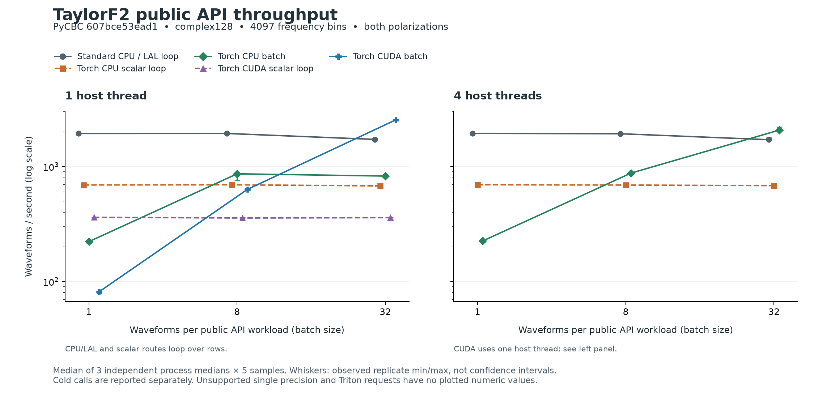

# TaylorF2 public API benchmark

Source: `607bce53ead14f12af32552a5b2441d3bc667267`.

Independent record verification: **passed**.

4097 frequency bins, both polarizations, the same deterministic BNS parameter rows across routes. CPU/LAL and native scalar routes loop through rows; native batch routes use one public batch call. Timing includes host parameter conversion and allocation. CUDA timed blocks are synchronized.

Throughput uses the median of three process medians, each calculated from five samples. Ranges are the observed min/max of the three replicate medians, **not confidence intervals**. A speedup below 1 means slower than the standard CPU/LAL baseline at the same batch size and host-thread count.

## Steady-state double precision

| Actual route | Host threads | Batch | Waveforms/s | Replicate range (waveforms/s) | Speedup vs CPU/LAL | Status |
| --- | ---: | ---: | ---: | --- | ---: | --- |
| Standard CPU / LAL loop | 1 | 1 | 1,940.61 | 1,939.09–1,946.93 | 1.000× | verified |
| Standard CPU / LAL loop | 1 | 8 | 1,941.62 | 1,936.69–1,941.90 | 1.000× | verified |
| Standard CPU / LAL loop | 1 | 32 | 1,724.38 | 1,715.09–1,764.18 | 1.000× | verified |
| Torch CPU scalar loop | 1 | 1 | 692.30 | 685.79–692.36 | 0.357× | verified |
| Torch CPU scalar loop | 1 | 8 | 694.68 | 688.22–697.40 | 0.358× | verified |
| Torch CPU scalar loop | 1 | 32 | 679.34 | 665.50–688.89 | 0.394× | verified |
| Torch CPU batch | 1 | 1 | 222.34 | 217.30–223.19 | 0.115× | verified |
| Torch CPU batch | 1 | 8 | 865.27 | 762.46–872.89 | 0.446× | verified |
| Torch CPU batch | 1 | 32 | 827.56 | 827.17–832.85 | 0.480× | verified |
| Torch CUDA scalar loop | 1 | 1 | 362.19 | 361.82–362.37 | 0.187× | verified |
| Torch CUDA scalar loop | 1 | 8 | 357.08 | 352.76–361.72 | 0.184× | verified |
| Torch CUDA scalar loop | 1 | 32 | 359.61 | 349.37–361.55 | 0.209× | verified |
| Torch CUDA batch | 1 | 1 | 81.59 | 79.40–81.72 | 0.042× | verified |
| Torch CUDA batch | 1 | 8 | 633.68 | 632.33–648.30 | 0.326× | verified |
| Torch CUDA batch | 1 | 32 | 2,549.45 | 2,546.23–2,552.44 | 1.478× | verified |
| Standard CPU / LAL loop | 4 | 1 | 1,944.33 | 1,934.82–1,945.19 | 1.000× | verified |
| Standard CPU / LAL loop | 4 | 8 | 1,931.18 | 1,926.12–1,932.78 | 1.000× | verified |
| Standard CPU / LAL loop | 4 | 32 | 1,714.65 | 1,711.77–1,778.51 | 1.000× | verified |
| Torch CPU scalar loop | 4 | 1 | 695.41 | 693.02–696.24 | 0.358× | verified |
| Torch CPU scalar loop | 4 | 8 | 691.25 | 690.98–701.31 | 0.358× | verified |
| Torch CPU scalar loop | 4 | 32 | 682.38 | 681.43–693.06 | 0.398× | verified |
| Torch CPU batch | 4 | 1 | 225.40 | 220.27–226.08 | 0.116× | verified |
| Torch CPU batch | 4 | 8 | 877.43 | 876.39–886.57 | 0.454× | verified |
| Torch CPU batch | 4 | 32 | 2,076.62 | 2,012.31–2,211.32 | 1.211× | verified |

## Cold calls, separately

Milliseconds for the first waveform call in each fresh process, after imports, capability discovery and scheme entry. These are not cold driver/OS-cache measurements and are excluded from throughput and speedup calculations.

| Actual route | Host threads | Batch | Replicate 1 (ms) | Replicate 2 (ms) | Replicate 3 (ms) |
| --- | ---: | ---: | ---: | ---: | ---: |
| Standard CPU / LAL loop | 1 | 1 | 0.8398 | 0.8506 | 0.8340 |
| Standard CPU / LAL loop | 1 | 8 | 4.9341 | 4.6463 | 4.7501 |
| Standard CPU / LAL loop | 1 | 32 | 19.7237 | 19.6374 | 19.5689 |
| Torch CPU scalar loop | 1 | 1 | 60.2640 | 60.3508 | 60.2067 |
| Torch CPU scalar loop | 1 | 8 | 70.0256 | 69.8045 | 70.1674 |
| Torch CPU scalar loop | 1 | 32 | 105.3730 | 108.2189 | 124.2548 |
| Torch CPU batch | 1 | 1 | 10.9391 | 11.0007 | 11.0619 |
| Torch CPU batch | 1 | 8 | 19.4564 | 19.1459 | 18.9437 |
| Torch CPU batch | 1 | 32 | 58.2359 | 56.6415 | 55.3403 |
| Torch CUDA scalar loop | 1 | 1 | 221.9824 | 220.8524 | 220.4987 |
| Torch CUDA scalar loop | 1 | 8 | 241.5213 | 241.5860 | 241.7343 |
| Torch CUDA scalar loop | 1 | 32 | 310.6785 | 308.3227 | 313.7274 |
| Torch CUDA batch | 1 | 1 | 401.4718 | 398.3800 | 401.9337 |
| Torch CUDA batch | 1 | 8 | 402.1596 | 402.3777 | 399.5229 |
| Torch CUDA batch | 1 | 32 | 400.8688 | 401.2967 | 402.6422 |
| Standard CPU / LAL loop | 4 | 1 | 0.8427 | 0.8452 | 0.8440 |
| Standard CPU / LAL loop | 4 | 8 | 6.0130 | 4.7186 | 4.7409 |
| Standard CPU / LAL loop | 4 | 32 | 19.5062 | 19.9253 | 19.7965 |
| Torch CPU scalar loop | 4 | 1 | 59.8527 | 59.0914 | 60.0092 |
| Torch CPU scalar loop | 4 | 8 | 70.1901 | 71.5682 | 69.3409 |
| Torch CPU scalar loop | 4 | 32 | 105.6396 | 104.3985 | 105.2160 |
| Torch CPU batch | 4 | 1 | 11.1683 | 11.2569 | 11.0799 |
| Torch CPU batch | 4 | 8 | 18.7232 | 18.5337 | 18.0520 |
| Torch CPU batch | 4 | 32 | 26.2834 | 27.3719 | 27.7459 |

## Unsupported, failed or unverified cells

No numeric zeros substitute for unsupported capabilities or missing results. The public CPU/CUDA API at this source SHA selects complex128 internally; it exposes no single precision selector or TaylorF2 Triton route. CUDA was requested with one host thread only.

| Request | Precision | Host threads | Batch | Status | Reason / verification errors |
| --- | --- | ---: | ---: | --- | --- |
| standard-cpu | single | 1 | 1 | unsupported | Public TaylorF2 CPU/CUDA outputs are complex128; no single precision selector |
| standard-cpu | single | 1 | 8 | unsupported | Public TaylorF2 CPU/CUDA outputs are complex128; no single precision selector |
| standard-cpu | single | 1 | 32 | unsupported | Public TaylorF2 CPU/CUDA outputs are complex128; no single precision selector |
| torch-cpu-scalar | single | 1 | 1 | unsupported | Public TaylorF2 CPU/CUDA outputs are complex128; no single precision selector |
| torch-cpu-scalar | single | 1 | 8 | unsupported | Public TaylorF2 CPU/CUDA outputs are complex128; no single precision selector |
| torch-cpu-scalar | single | 1 | 32 | unsupported | Public TaylorF2 CPU/CUDA outputs are complex128; no single precision selector |
| torch-cpu-batch | single | 1 | 1 | unsupported | Public TaylorF2 CPU/CUDA outputs are complex128; no single precision selector |
| torch-cpu-batch | single | 1 | 8 | unsupported | Public TaylorF2 CPU/CUDA outputs are complex128; no single precision selector |
| torch-cpu-batch | single | 1 | 32 | unsupported | Public TaylorF2 CPU/CUDA outputs are complex128; no single precision selector |
| torch-cuda-scalar | single | 1 | 1 | unsupported | Public TaylorF2 CPU/CUDA outputs are complex128; no single precision selector |
| torch-cuda-scalar | single | 1 | 8 | unsupported | Public TaylorF2 CPU/CUDA outputs are complex128; no single precision selector |
| torch-cuda-scalar | single | 1 | 32 | unsupported | Public TaylorF2 CPU/CUDA outputs are complex128; no single precision selector |
| torch-cuda-batch | single | 1 | 1 | unsupported | Public TaylorF2 CPU/CUDA outputs are complex128; no single precision selector |
| torch-cuda-batch | single | 1 | 8 | unsupported | Public TaylorF2 CPU/CUDA outputs are complex128; no single precision selector |
| torch-cuda-batch | single | 1 | 32 | unsupported | Public TaylorF2 CPU/CUDA outputs are complex128; no single precision selector |
| torch-cuda-triton-batch | double | 1 | 1 | unsupported | No public TaylorF2 Triton route exists at this SHA |
| torch-cuda-triton-batch | single | 1 | 1 | unsupported | No public TaylorF2 Triton route exists at this SHA |
| torch-cuda-triton-batch | double | 1 | 8 | unsupported | No public TaylorF2 Triton route exists at this SHA |
| torch-cuda-triton-batch | single | 1 | 8 | unsupported | No public TaylorF2 Triton route exists at this SHA |
| torch-cuda-triton-batch | double | 1 | 32 | unsupported | No public TaylorF2 Triton route exists at this SHA |
| torch-cuda-triton-batch | single | 1 | 32 | unsupported | No public TaylorF2 Triton route exists at this SHA |
| standard-cpu | single | 4 | 1 | unsupported | Public TaylorF2 CPU/CUDA outputs are complex128; no single precision selector |
| standard-cpu | single | 4 | 8 | unsupported | Public TaylorF2 CPU/CUDA outputs are complex128; no single precision selector |
| standard-cpu | single | 4 | 32 | unsupported | Public TaylorF2 CPU/CUDA outputs are complex128; no single precision selector |
| torch-cpu-scalar | single | 4 | 1 | unsupported | Public TaylorF2 CPU/CUDA outputs are complex128; no single precision selector |
| torch-cpu-scalar | single | 4 | 8 | unsupported | Public TaylorF2 CPU/CUDA outputs are complex128; no single precision selector |
| torch-cpu-scalar | single | 4 | 32 | unsupported | Public TaylorF2 CPU/CUDA outputs are complex128; no single precision selector |
| torch-cpu-batch | single | 4 | 1 | unsupported | Public TaylorF2 CPU/CUDA outputs are complex128; no single precision selector |
| torch-cpu-batch | single | 4 | 8 | unsupported | Public TaylorF2 CPU/CUDA outputs are complex128; no single precision selector |
| torch-cpu-batch | single | 4 | 32 | unsupported | Public TaylorF2 CPU/CUDA outputs are complex128; no single precision selector |

## Verification scope

The renderer independently recomputes sample normalization, each worker median, the median/range across exactly three distinct subprocesses, throughput and baseline ratios. It checks exact clean source SHA before/after successful workers, source/harness hashes, module origins, dtype/device, full row/polarization coverage, dispatch counts, recorded numerical parity metrics, statuses and equal physical inputs. All three replicates must pass before a cell is plotted. The original summary is compared against these computations.

Recorded parity metrics and gates are checked; waveform arrays are not stored, so this renderer does not rerun waveform generation.

Native scalar versus CPU/LAL requires complex relative L2 <1e-11, exact zero support and matching metadata. Batch versus same-device native scalar requires pointwise complex relative error ≤2e-10 with zero absolute tolerance; those scalar outputs are independently checked against CPU/LAL. Direct batch-to-LAL complex, amplitude and phase metrics are retained in raw records.

Runtime inventory and SHA256 hashes of every consumed raw record are in `waveform-summary.json`. Cold timing values remain separate. This bounded waveform workload does not establish end-to-end inference/search performance.
