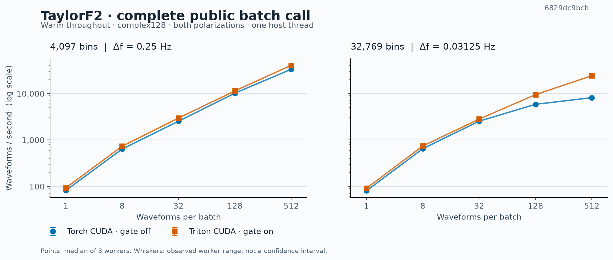
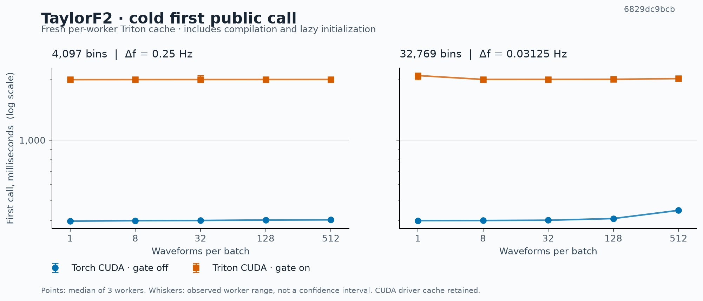

# TaylorF2 Triton qualification — 6 September 2026

The optional public CUDA batch route passed all 60 benchmark workers and was faster in all ten measured workloads. It is included in [PR #11](https://github.com/xangma/pycbc/pull/11), enabled with `PYCBC_TAYLORF2_TRITON=1`.

| Frequency bins | Batch | Torch CUDA, waveforms/s | Triton CUDA, waveforms/s | Throughput ratio |
|---:|---:|---:|---:|---:|
| 4,097 | 32 | 2,537 | 2,970 | 1.170× |
| 4,097 | 512 | 33,435 | 40,714 | 1.218× |
| 32,769 | 128 | 5,871 | 9,495 | 1.617× |
| 32,769 | 512 | 8,164 | 24,264 | 2.972× |

All ten ratios range from **1.109× to 2.972×**. The three observed worker throughput ranges do not overlap between routes in any workload. These ranges are not confidence intervals. The cold first call took **1.993–2.096 seconds** with Triton versus **0.397–0.451 seconds** without it. Each worker used an initially empty Triton cache; cold time includes compilation and lazy initialization, with the CUDA driver cache retained. The route remains opt-in because this startup cost and hardware-specific performance matter.

[Full tables and qualifications](report/report.md) include every workload and its observed range. These measurements cover complete `get_fd_waveform_batch` calls with argument validation, host input lists, coefficient preparation, allocations, both complex128 polarizations and CUDA synchronization. Device-to-host output copies are excluded. Larger batches repeat eight distinct BNS mass pairs. They establish waveform-generation gains on this RTX 4090; whole-search, inference, other GPU models and general parameter-space performance are not measured here.

## Source and validation

Both routes were measured at clean commit [`6829dc9bcba07ca7d3da44de7589cc4e9fb84da5`](https://github.com/xangma/pycbc/commit/6829dc9bcba07ca7d3da44de7589cc4e9fb84da5). The measured tree is byte-identical to assembled PR #15 commit [`d44ed6e2273488b0fcd52819f3a604ae38b8a79c`](https://github.com/xangma/pycbc/commit/d44ed6e2273488b0fcd52819f3a604ae38b8a79c). The four waveform implementation/test/user-documentation files belong to PR #11; two maintainer documentation files belong to PR #15. Other descendant feature patches are unchanged. [Construction audit](restack-audit.json) and [exact heads](candidate-stack.json) record the split.

All 60 workers checked every output bin and both polarizations for every row. Gate-on versus gate-off, and gate-off versus native scalar, require pointwise relative and relative-L2 errors at most `2e-10`; native scalar versus LAL requires relative L2 at most `1e-11`. Exact zeros, support metadata and finite values are required throughout. Separate probes prove an actual successful Triton kernel launch in each of the 30 gate-on workers and no such launch in the controls. The renderer independently recomputes timing estimates and verifies identities and numerical gates.

The kernel reuses the current Torch validation, PN coefficients, amplitude normalization, reference phase, polarization rotation and per-row cutoff metadata. FP64 math preserves the numerical contract. CPU, unavailable Triton, ROCm and inputs carrying reverse- or forward-mode gradients retain the Torch path. Selected kernel compilation or launch failures are reported. Edge-case tests additionally cover spins, tides, PN orders, reference frequencies, row cutoffs, gradients and 65,536-row launch indexing.

Fresh validation rebuilt native extensions and tested all eight updated PR heads: **1,006 passed, 43 skipped** across their owned selections. PR #11 recorded **245 passed, 32 skipped**. The assembled head separately passed **58 TaylorF2 tests, four skipped**, the exact CI F401 gate and the main-extension scope check. [Commands, counts and revisions](restack-validation.json) and [logs](validation-logs/) are retained. Qlty passed for all seven feature heads; the optional FFT formatting head reports the same eight previously audited findings, with the old and new SARIF retained. Skips are recorded in the JUnit files; comprehensive MPS qualification is not claimed.

## Reproduction and evidence

See [reproduction instructions](REPRODUCE.md), [harness documentation](harness/README.md), [raw successful workers](full-v3-clean/) and [source finalization](finalization.json). The host was `len`, using one host thread and CPUs 8–11; Python 3.11.9, Torch 2.13.0+cu130 and Triton 3.7.1. All eleven benchmark native-extension hashes remained unchanged. The host was shared.

`sealed-manifest.json` covers 335 original remote files, verified by size and SHA256 after download. The artifact's top-level `SHA256SUMS` includes the reports and local audit additions. Build trees, native binaries and compiler cache contents are omitted; source revisions, binary hashes and per-worker cache inventories are retained. `smoke-v2/` is an earlier successful two-worker smoke. `logs/tests-v1.log` records a corrected initial compiler error. `full-v3/` records a rejected attempt whose 60 workers stopped at clean-checkout preflight because Qlty left untracked symlinks; it contains no qualified performance measurements. Neither diagnostic attempt contributes to the final results.
